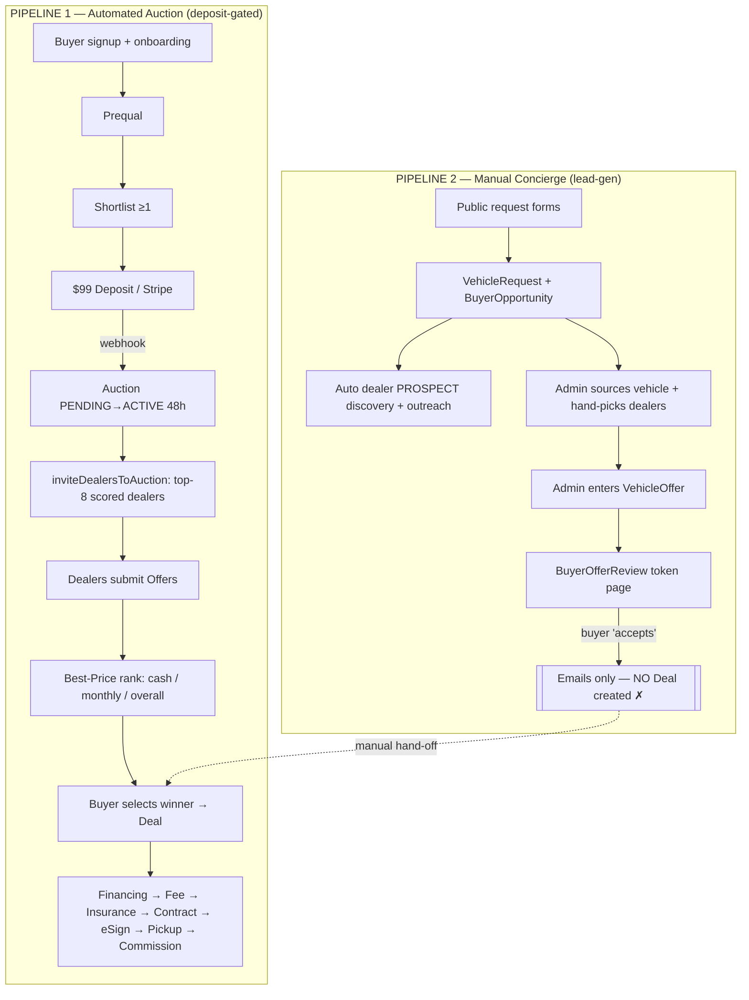
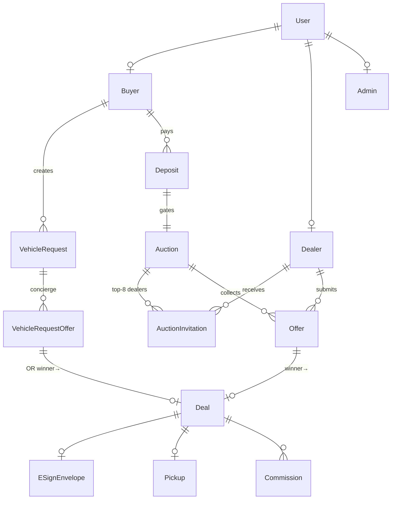

# AutoLenis — Platform Relationship Analysis & Fortune-500 Redesign (Phases 1–5)

**Scope:** Buyer ↔ Dealer ↔ Admin relationship, workflows, forms, automations, and the dealer discovery / offer / auction engine.
**Repo:** `AutolenisWebDeveloper/autolenisNewUpdatedfinal` · **Frontend root:** `frontend/` · **Base:** `main`
**Analysis type:** Assessment & design only — **no application code is modified by this deliverable.**
**Date:** 2026-07-11

## Evidence & method

- **Codebase:** every "exists" claim cites `file:line`; every "missing/absent" claim cites the search performed. Findings were produced by five independent domain sweeps (buyer, dealer+discovery, admin, offer/auction/automation, forms+architecture) plus direct verification of the core pipeline files.
- **Schema source of truth:** `frontend/prisma/schema.prisma` (`provider = "postgresql"`, Supabase pooled + direct URLs, `schema.prisma:6-10`).
- **Live infra:** Make.com org reachable (org **AutoLenis** `id 7865508`, **currently paused** — `isPaused: true`, `organizations_list`). Live **Supabase** and **Vercel** MCP calls required interactive approval unavailable in this non-interactive session, so DB/deploy claims are schema/code-derived and labelled where runtime state could not be confirmed. This is noted per finding rather than assumed.
- **Pre-existing audits** at repo root (`AUTOLENIS_FORTUNE500_AUDIT.md`, `AUTOLENIS_FORTUNE500_TRANSFORMATION.md`, `DEALER_ECOSYSTEM_AUDIT_2026-06.md`, etc.) were **not relied upon**; all findings here were re-derived from code.

**Resume line:** _All phases (1–5) complete in this document. If extending: next candidate sections are (a) live Supabase row-count validation of orphan models, and (b) a built `middleware-manifest.json` check to confirm the `proxy.ts` registration finding._

---

## Executive summary

AutoLenis is a **mature, largely-built concierge automotive marketplace** — not a blank slate. It runs on Next.js 16 / React 19 / Prisma 5 / PostgreSQL (Supabase), with **~205 Prisma models**, **536 API route files**, **44 Vercel cron jobs**, Stripe payments with idempotency, an Inngest + QStash durable-job layer, and a domain-event spine that forwards to Make.com. The core auction loop is genuinely automated and self-healing.

The central structural finding is that **two parallel marketplaces coexist and never converge**:

1. **Automated auction pipeline** (deposit-gated): buyer pays a **$99 deposit → Stripe webhook auto-launches an `Auction` and auto-invites the top-8 scored dealers** with zero admin involvement (`app/api/webhooks/stripe/route.ts:164-168`, `lib/services/auction/dealer-invitation.service.ts:62-182`). Offers are ranked by a best-price engine and the buyer self-selects a winner → `Deal`.
2. **Manual concierge pipeline** (lead-gen): public request forms create a `VehicleRequest`/`BuyerOpportunity`; an **admin manually sources the vehicle, hand-picks and emails dealers, and enters offers** (`app/admin/vehicle-requests/[id]/send-to-dealers/SendToDealersClient.tsx`, `app/api/admin/vehicle-offers/route.ts:71`). Buyer "acceptance" on this path (`app/api/public/buyer-offer-review/[reviewToken]/respond/route.ts:120-123`) **only sends emails and never creates a `Deal`** — it dead-ends into ops.

The redesign is therefore about **converging these two pipelines, closing three broken hand-offs, retiring dead/orphan code, and hardening the matching engine** — deltas on a real system, not a rebuild.

**Production-readiness score (justified in Phase 5): 6.5 / 10** — strong automation backbone and payment/idempotency discipline, held back by pipeline duplication, three broken buyer journeys, a matching engine with no vehicle-fit logic and 173-ZIP geo coverage, and a high-severity middleware-registration risk.

---
---

# PHASE 1 — CURRENT STATE ASSESSMENT

## 1.1 System architecture

| Layer | Technology | Evidence |
|---|---|---|
| Framework | Next.js **16.2.9**, React **19**, App Router | `frontend/package.json`; `app/` |
| API surface | **536** route handlers | `find app/api -name route.* \| wc -l` = 536 |
| ORM / DB | Prisma **^5.22.0** → **PostgreSQL** (Supabase pooled `DATABASE_URL` + `DIRECT_URL`) | `prisma/schema.prisma:6-10`; `lib/prisma.ts` |
| Data model | **~205 models** / ~80 enums | `grep -c "^model " prisma/schema.prisma` = 205 |
| Auth (3 separate systems) | **Buyer/affiliate:** Supabase Auth + Prisma role cross-check; **Dealer:** custom `jose` JWT (`dealer_token`), no MFA; **Admin:** custom JWT + **mandatory TOTP MFA**, AES-256-GCM secrets, bcrypt recovery, lockout | `lib/auth/session.ts:10-21`; `lib/dealer-auth.ts:36-55`; `lib/admin-auth.ts:56-171,258-321` |
| Payments | Stripe **^22**, lazy hard-fail getter, webhook idempotency | `lib/stripe.ts:9-20`; `app/api/webhooks/stripe/route.ts:42-63` |
| Background jobs | **44 Vercel crons** + Inngest + QStash/Upstash | `vercel.json`; `lib/inngest/*`; `lib/qstash/*` |
| Event/integration | Domain-event spine → contact timeline + **Make.com** (non-blocking) | `lib/events/emit.ts:78,147-217` |
| Edge middleware | `proxy.ts` (session refresh, guards, CSRF, redirects) — **registration in doubt (see 1.7 R-1)** | `frontend/proxy.ts`; no `middleware.ts` present |
| Notifications | Resend (email, ~60 templates), Twilio (voice + inbound SMS only), in-app `Notification`, GHL tags | `lib/services/email/*`; `app/api/twilio/*` |

## 1.2 Current workflow (the two pipelines)

## 1.3 User & database relationships

**Key relational facts (cited):**
- `Deal.offerId` **XOR** `Deal.vehicleRequestOfferId` — one Deal can originate from *either* pipeline (`schema.prisma:533-534`). This is the schema-level proof of the dual system.
- `Auction.depositId @unique` — an auction cannot exist without a paid deposit (`schema.prisma:402`).
- `AuctionInvitation @@unique([auctionId, dealerId])`, carries `invitationScore` (`schema.prisma:474-486`).
- `Offer` carries best-price outputs `bestPriceScore / rankCash / rankMonthly / rankBalanced` and manual-entry markers `submittedByAdminId`, `externalDealer*` (`schema.prisma:502-518`).

## 1.4 Automation status — cron inventory (44 registered, `vercel.json`)

| Automated & load-bearing | Schedule | Evidence |
|---|---|---|
| `auction-close` ("MOST CRITICAL") — close expired, idempotent post-close reconciler, **zero-offer auto-refund**, dealer reminders | `*/5` | `app/api/cron/auction-close/route.ts:25,35-46` |
| `deposit-activation-reconcile` — self-heals stranded deposit→auction activations | `*/5` | `lib/services/auction/deposit-activation.service.ts:110-182` |
| `workflow-automation` — nudge engine + `updateAllDealRisks()` | `*/5` | `app/api/cron/workflow-automation/route.ts:18-23` |
| `dlq-drain` — dead-letter retry | `*/15` | `vercel.json:16-17` |
| `dealer-invitation-reminder` (~6h pre-close, idempotent) | `0 * * * *` | `app/api/cron/dealer-invitation-reminder/route.ts:20-129` |
| `dealer-scorecard-snapshot`, `vehicle-offer-expire`, `holds`, `sla-check`, `trust-check`, `health-check`, `prequal-*` (6), `morning-briefing`, `analytics-snapshot`, + ~20 social/amips/content | various | `vercel.json`; `app/api/cron/*` |

## 1.5 Actor capability matrices

### Buyer
| Capability | Status | Evidence (file:line) | Manual? | Notes |
|---|---|---|---|---|
| Signup / onboarding | Built | `app/auth/signup/SignUpClient.tsx`; `app/api/buyer/onboarding/complete/route.ts:11` | N | |
| Prequalification | Built | `app/api/buyer/prequal/route.ts`; `PreQualification` `schema.prisma:288` | Partial | `MANUAL_REVIEW`/`OFAC_REVIEW` route to admin |
| Vehicle request (auction path) | Built | `app/buyer/requests/new/page.tsx`; `/api/buyer/requests` | N | |
| Vehicle request (concierge path) | Partial | `/api/public/request-vehicle/route.ts:717` | **Y** | Admin sources; no Deal |
| Shortlist + $99 deposit | Built | `app/api/buyer/deposit/create-intent/route.ts:115` | N | prequal+shortlist gated; **$99 hardcoded** |
| Auction participation | Built | `app/buyer/auction/[auctionId]/page.tsx:18` | N | |
| Offer review + select (auction) | Built | `app/api/buyer/auctions/[auctionId]/select-offer/route.ts:19,79` | N | creates `Deal(FINANCING_PENDING)` |
| Offer review (concierge) | **Broken** | `app/api/public/buyer-offer-review/[reviewToken]/respond/route.ts:120-123` | **Y** | accept → emails only, **no Deal** |
| Financing → Fee → eSign → Pickup | Built | `deal/financing/route.ts:23`; `service-fee.service.ts:28`; `esign/[dealId]/route.ts:56`; `pickup/[dealId]/route.ts:36` | N | staged gates |
| Insurance → Contract advance | **Broken/Manual** | `insurance/upload-proof/route.ts:96` | **Y** | upload sets `EXTERNAL_UPLOADED` but **does not advance stage**; only admin routes move `INSURANCE_PENDING→CONTRACT_PENDING` |

### Dealer
| Capability | Status | Evidence (file:line) | Manual? | Notes |
|---|---|---|---|---|
| Application intake | Built | `app/api/public/dealer-application/route.ts:82` | N | **two divergent forms → one endpoint** |
| Application approval | Manual | `app/api/admin/dealers/applications/[appId]/approve/route.ts:26-145` | **Y** | auto-approval path inert (`lib/services/dealer-recruitment/auto-approval.ts:57-63`) |
| Tier assignment | Manual | `app/api/admin/dealers/[dealerId]/tier/route.ts:36-40` | **Y** | computed scorecard tier **never writes back** to `Dealer.tier` |
| Auction matching / invite | **Automated** | `lib/services/auction/dealer-invitation.service.ts:62-182` | **N** | top-8; see 1.6 |
| Notifications | Built | in-app `:136`, email `:147`, QStash `:166`, GHL `:178` | N | **no SMS** in auction path |
| Offer submission | Built | `app/api/dealer/offers/route.ts:39`; `lib/services/offer/offer.service.ts:93` | N | serializable txn, budget/APR validation |
| Opportunities dashboard | Built | `app/dealer/opportunities/page.tsx:21-60` | N | |
| Inventory mgmt (manual + feed) | Built | `app/dealer/inventory/*`; `DealerFeedConfig` | N | |
| Outside/unregistered dealer offers | Manual | `lib/services/offer/outside-dealer.ts:24-70`; admin invite `admin/buyers/[buyerId]/invite-outside-dealers/route.ts:50` | **Y** | |

### Admin (manual intervention points — the priority)
| Manual point | Evidence (file:line) | Automatable? | Notes |
|---|---|---|---|
| Prequal manual-review decision | `app/admin/prequal/[id]/PrequalDetailClient.tsx:233-253` | Partial | queue is the fallback for ambiguous scores |
| **OFAC clearance** | `app/admin/manual-reviews/page.tsx:60-74`; 409-gate | **No** | legal — must stay human |
| Concierge vehicle sourcing + dealer curation | `SendToDealersClient.tsx:140-277` | **Yes** (auction path already does it) | duplicates automated capability |
| Manual vehicle-offer entry | `app/api/admin/vehicle-offers/route.ts:71` | Partial | concierge model choice |
| Insurance premium quote entry | `app/admin/insurance-requests/InsuranceRequestsClient.tsx:39` | **No today** | no carrier API — most clearly un-automated step |
| External pre-approval approve/reject | `components/admin/ExternalPreApprovalActionsClient.tsx:108-127` | **No** | OFAC attestation required |
| Money movement (concierge fee, refunds, affiliate payouts) | `AdminPaymentsClient.tsx:427,479,983-1059` | Partial | payouts off-platform (ACH/Zelle/check) |
| 8 exception queues + DLQ retry | `app/admin/queues/page.tsx:78-99`; `operations/page.tsx:201` | Partial | retry is mechanical |
| Manual auction launch / extend / remove-dealer | `app/api/admin/buyers/[buyerId]/launch-auction/route.ts:36-44`; `admin/auctions/[auctionId]/action/route.ts:43-67` | Override | discretionary |

## 1.6 The matching engine (verified in detail)

**Entry:** `inviteDealersToAuction(auctionId, buyerId)` — `lib/services/auction/dealer-invitation.service.ts:62`. **Fully automated**, triggered by the Stripe deposit webhook (`app/api/webhooks/stripe/route.ts:167`) and the activation reconciler (`deposit-activation.service.ts:144`). No admin in the loop.

Algorithm:
1. Buyer ZIP → coords via static `ZIP_COORDS` (`:73-74`).
2. Load `status:ACTIVE, isSystemPlaceholder:false` dealers (`:78-81`).
3. **Geo pre-filter** haversine ≤ `MAX_DISTANCE_MILES = 150` (`:13,85-91`).
4. **Score** (`scoreDealerForAuction:31-60`): base 50; tier `PLATINUM+30/GOLD+20/STANDARD+10/PROBATION-20`; `− load×5`; hard cap `load≥5 → 0`; `+ winRate×20 − junkFeeRatio×15` from latest scorecard snapshot.
5. Sort desc, **take top `MAX_INVITATIONS_PER_AUCTION = 8`** (`:12,103-106`); upsert `AuctionInvitation`, increment load, notify.

**Best-price ranking** (`lib/services/offer/best-price.service.ts:29-102`): admin-configurable weights `BestPriceWeightConfig` (fallback `otd .40 / monthly .25 / fees .20 / junk .15`), produces `bestCash / bestMonthly / bestOverall` at auction close.

## 1.7 Risks & failure points

| ID | Risk | Evidence | Severity |
|---|---|---|---|
| **R-1** | **`proxy.ts` may not be registered as Next middleware.** Next.js registers middleware only from a root `middleware.ts`; this file is `proxy.ts`, no `middleware.ts` exists, build is plain `next build` with no rename, and no re-export exists. Its own comment misstates that the `config` export drives registration. If inert, edge session-refresh + CSRF + route guards don't run. | `frontend/proxy.ts`; `find -name middleware.* → none`; `package.json:9`; **static-confirmed, not runtime-confirmed** (no `.next` build to inspect `middleware-manifest.json`) | **High** (mitigated: `next.config.mjs` sets headers+redirects; routes self-guard via `lib/auth/*`) |
| R-2 | **Matching ignores vehicle fit** — `vehicleTypes` passed `[]` and never read; a Ford-only dealer can be invited to a Toyota request | `dealer-invitation.service.ts:31,97` | High |
| R-3 | **Geo coverage = 173 ZIPs.** Any buyer/dealer ZIP outside the table bypasses the 150-mi filter entirely (`return true`), so radius is best-effort | `lib/utils/zip-coords.ts` (173 keys); service `:88,92` | High |
| R-4 | **Concierge acceptance dead-ends** (no Deal) and **insurance upload doesn't advance the deal** — two broken buyer journeys requiring manual admin rescue | `buyer-offer-review/.../respond/route.ts:120-123`; `insurance/upload-proof/route.ts:96` | High |
| R-5 | Rate-limiter **fails open** if Upstash env unset (auth+general); payment tier correctly fails closed | `lib/security/rate-limit.ts:99-108,31-56,158-170` | Medium |
| R-6 | CSRF double-submit **skipped for all `/api/{buyer,dealer,admin,affiliate,public,auth}`** prefixes | `proxy.ts:268-289` | Medium |
| R-7 | Make.com org **paused** — any workflow depending on it is currently dormant | `organizations_list` (`isPaused:true`) | Medium (unverified impact) |

## 1.8 Technical debt

| Item | Evidence | Severity |
|---|---|---|
| **Dead orphan models** (declared, zero code refs): `DealerDiscovery` (`schema.prisma:2084`), `VehicleMatchScore` (`:2585`), `DealerScorecardWeights` (`:2043`), `DealerCapacityConfig` (service exists, no callers), `AuctionExtensionLog` (only dead `auction-extension.service.ts` writes it), `BestPriceCalculationLog` (`:2520`, never written) | grep = schema-only / no callers | Med |
| **Three offer representations** for one concept: `Offer` vs `VehicleRequestOffer` vs `DealerOfferSubmission`/`VehicleOffer` | schema + route `create` calls | Med |
| **Legacy CRA tree** `src/components/ui/*.jsx` (46 files), `craco.config.js`, conflicting `@/*` alias (`jsconfig`→src vs `tsconfig`→root); unused `react-hook-form`/`@hookform/resolvers` | `grep` imports of `src/components/ui` → none | Med |
| Fee modelled twice: `Deal.feePaidAt/feeAmountCents` **and** `ServiceFeePayment` | `schema.prisma:538-539,2474` | Low |
| Free-text where enums belong: `VehicleRequestOffer.status`, `VehicleRequestFinancing.paymentMethod/preApprovalStatus` | `schema.prisma:919,842-847` | Low |
| Duplicate auction route trees; committed `generate-all.log` (49 KB); 11 root audit `.md` files | repo root; `app/buyer/auctions/[auctionId]/page.tsx:9` | Low |

---
---

# PHASE 2 — GAP ANALYSIS

**Missing functionality**
- **No vehicle/make/franchise/inventory match** in auction invitations (R-2).
- **No SMS** on the transactional auction path despite Twilio being present (`app/api/twilio/*` = voice + inbound only) — Phase-4 requirement #7 (email+SMS+dashboard) is only 2/3 met.
- **No automatic auction extension / anti-sniping** — extend is admin-only (`admin/auctions/[auctionId]/action/route.ts:43-67`).
- **No automated insurance quoting** — 100% manual admin entry.
- Computed **dealer scorecard tier never feeds** the invitation score (`Dealer.tier` only set by manual override).

**Workflow inefficiencies**
- Concierge sourcing + dealer curation is fully manual yet **duplicates** the automated auction capability.
- Invitation email hardcodes `vehicleMake:"Vehicle"/"Requested"` because invites fire pre-vehicle-selection (`dealer-invitation.service.ts:150-151`) — dealers must open the dashboard to know what they're bidding on.

**Broken user journeys** (each strands the buyer until an admin intervenes)
1. Concierge "accept" → no Deal (R-4).
2. Insurance upload → deal doesn't advance (R-4).
3. Concierge path has **no in-app route to contract/eSign/pickup** at all.

**Scalability**
- 173-ZIP static geo table (R-3) — will not scale nationally; needs real geocoding.
- Matching loads **all** active dealers then scores in-process (`:78-100`) — O(dealers) per auction, fine at low volume, needs a spatial index at scale.

**Security / compliance**
- Middleware registration risk (R-1); CSRF skip (R-6); fail-open rate limit (R-5).
- **Consent inconsistency:** dealer-application form A captures **no TCPA/TOS**, form B does — same endpoint, so compliance depends on which URL the dealer hit (`app/dealer/apply/page.tsx` vs `app/(public)/dealer-application/page.tsx:58-59`).

**Data quality**
- Three parallel offer models; SEO short form (8 fields) and long form (~40) hit the same endpoint/model, so records from the short funnel lack financing/trade-in data.
- Free-text status/enum fields permit invalid values.

**UX**
- No shared form/stepper/validation layer; every form hand-rolls state + validation (`zodResolver` grep = 0 in client code); mixed `fetch` vs `lib/api/client`; five request forms with three field models.

---
---

# PHASE 3 — FORTUNE 500 REDESIGN

Design principle: **one canonical pipeline, event-driven, admin-as-exception-handler.** Each change is tagged **[NEW]** or **[MODIFIES <cited file>]**.

## 3.1 Buyer — optimized workflow
1. **Request vehicle** — collapse 5 forms into one adaptive, resumable wizard. **[MODIFIES `components/public/RequestVehicleFormClient.tsx` + `app/buyer/requests/new/page.tsx`]** onto one schema + endpoint.
2. **Pay service fee** — keep $99 deposit gate but make the **amount config-driven, not hardcoded**. **[MODIFIES `app/api/buyer/deposit/create-intent/route.ts:115`]**
3. **Track auction status** — already real-time. **[MODIFIES `app/buyer/auction/[auctionId]` — keep]**
4. **Compare offers** — persist ranking + reason codes. **[MODIFIES `best-price.service.ts` + activate `BestPriceCalculationLog` `schema.prisma:2520`]**
5. **Select winning offer** — unify auction + concierge acceptance so **both create a `Deal`**. **[MODIFIES `buyer-offer-review/.../respond/route.ts:120-123`]**
6. **Schedule delivery** — auto-advance insurance→contract on verified upload. **[MODIFIES `insurance/upload-proof/route.ts:96`]**

## 3.2 Dealer — optimized workflow
1. **Receive invite** — add **make/model/inventory-fit scoring**; put vehicle details in the invite. **[MODIFIES `dealer-invitation.service.ts:31,97,150`]**
2. **Review opportunity** — keep opportunities dashboard. **[MODIFIES `app/dealer/opportunities/page.tsx` — keep]**
3. **Submit / update offer** — keep serializable submit + revisions. **[MODIFIES `offer.service.ts` — keep]**
4. **Track results** — wire won/lost + scorecard into one feed. **[MODIFIES `dealer-scorecard` cron to write `Dealer.tier`/`scorecardTier`]**
5. **Capacity** — honor `DealerCapacityConfig` instead of the hardcoded `≥5`. **[MODIFIES `dealer-invitation.service.ts:50` to call `auction-capacity.service.ts`]**
6. **Onboarding** — single application form with mandatory consent. **[MODIFIES: merge `app/dealer/apply` + `app/(public)/dealer-application` → one]**

## 3.3 Admin — optimized workflow
1. **Monitor operations** — keep ops/analytics dashboards. **[MODIFIES — keep]**
2. **Manage exceptions** — the 8 queues become the *primary* admin surface. **[MODIFIES `app/admin/queues`]**
3. **Analytics / audit** — keep snapshots + `AdminAuditLog`. **[MODIFIES — keep]**
4. **Override workflows** — retain manual launch/extend/refund as *explicit overrides*, not the default path. **[MODIFIES `admin/auctions/[auctionId]/action`]**
5. **Retire manual sourcing** — replace concierge hand-sourcing with the automated matcher + an admin *review/approve* step. **[MODIFIES `SendToDealersClient.tsx` → curated-review over auto-shortlist]**

---
---

# PHASE 4 — FULL AUTOMATION BLUEPRINT

Mapping each canonical step to **current reality → target**. "Built" = exists automated today.

| # | Step | Current | Target action | Tag |
|---|---|---|---|---|
| 1 | Buyer submits request | **Built** (`request-vehicle/route.ts:180`) | Keep; single wizard | MODIFIES |
| 2 | System validates request | **Built** (server zod, `unified-buyer-intake.service.ts:291`) | Keep | MODIFIES |
| 3 | Determine eligibility | Partial (prequal, manual-review fallback) | Auto-approve clean tiers; queue only ambiguous | MODIFIES `prequal` |
| 4 | Identify 5–8 qualified dealers | **Built, top-8** (`dealer-invitation.service.ts:103-106`) | **Add vehicle-fit + real geocode** | MODIFIES (R-2,R-3) |
| 5 | Verify dealer qualifications | Partial (ACTIVE + capacity hardcoded) | Honor `DealerCapacityConfig` + license/tier | MODIFIES |
| 6 | Send invitations | **Built** (`:109-117`) | Keep; include vehicle | MODIFIES |
| 7 | Email + SMS + dashboard | **2/3** (email+in-app; **no SMS**) | **Add Twilio SMS** on invite/won | NEW |
| 8 | Auction launches | **Built, auto** (`webhooks/stripe/route.ts:164`) | Keep | MODIFIES |
| 9 | Dealers submit offers | **Built** (`offer.service.ts:93`) | Keep | MODIFIES |
| 10 | Rank offers | **Built** (`best-price.service.ts:29`) | **Persist** to `BestPriceCalculationLog` | MODIFIES |
| 11 | Buyer real-time updates | **Built** (live-status route) | Keep + SMS push | MODIFIES |
| 12 | Buyer selects offer | **Built** (`select-offer/route.ts:79`) | Unify concierge accept → Deal | MODIFIES (R-4) |
| 13 | Notify winning dealer | **Built** (won/lost emails `:139,150`) | Keep + SMS | MODIFIES |
| 14 | Transaction status updates | **Built** (`advanceDealStatus` + `DealStatusHistory:114`) | **Auto insurance→contract** | MODIFIES (R-4) |
| 15 | Reporting/analytics update | **Built** (`analytics-snapshot` cron) | Keep | MODIFIES |

**Net:** 11/15 steps are already automated. The blueprint is **4 targeted deltas** (vehicle-fit + geocode, SMS channel, persisted ranking, and closing the two broken auto-advance hand-offs) plus **retiring the manual concierge duplicate** — not new infrastructure. Anti-sniping auto-extension is a recommended **[NEW]** addition using the already-declared `AuctionExtensionLog`.

---
---

# PHASE 5 — IMPLEMENTATION PLAN

## 5.1 Recommended architectures (deltas on what exists)

- **System:** keep Next 16 / Prisma / Supabase / Stripe / Inngest / QStash / Vercel cron. **Resolve R-1 first** — rename `proxy.ts` → `middleware.ts` (or add a re-exporting `middleware.ts`) and confirm the built `middleware-manifest.json`.
- **Database:** converge to **one request + one offer model**; deprecate `VehicleRequestOffer` and `DealerOfferSubmission` into `Offer` with a `source` enum; delete the 6 orphan models (1.8); convert free-text statuses to enums.
- **Workflow:** single event-driven state machine off `lib/events/emit.ts`; concierge becomes an admin-*curated* variant of the auction, not a separate code path.
- **Automation:** the 4 Phase-4 deltas; honor `DealerCapacityConfig`; wire scorecard tier → `Dealer.tier`.
- **Notification:** add Twilio SMS as a first-class channel alongside Resend + in-app + GHL; centralize channel fan-out in one dispatcher.
- **Dashboard:** admin = exception/override console (queues-first); dealer = fit-scored opportunities with vehicle detail; buyer = one journey tracker (delete duplicate auction route tree).

## 5.2 API requirements
- Consolidate `/api/public/request-vehicle` + `/api/buyer/requests` behind one intake contract.
- New `POST /api/dealer/offers/:id` update already exists; add `POST /api/admin/auctions/:id/auto-shortlist` (curated review) to replace manual `send-to-dealers`.
- Add SMS send in the notification dispatcher; persist ranking on close.

## 5.3 Scalability
- Replace static `ZIP_COORDS` with a geocoding service + PostGIS/`earthdistance` spatial query so matching is index-backed, not O(all dealers) in Node (`dealer-invitation.service.ts:78-100`).

## 5.4 Security
- Fix R-1 (middleware); extend CSRF to authenticated prefixes or document the SameSite reliance (R-6); make rate-limit fail-closed for auth (R-5); enforce consent at the dealer-application endpoint regardless of form (Phase 2).

## 5.5 Production-readiness score — **6.5 / 10**

| Dimension | Score | Justification (cited) |
|---|---|---|
| Core automation | 8.5 | Self-healing auction close + deposit reconciler + idempotent Stripe webhook (`auction-close/route.ts`, `deposit-activation.service.ts`, `webhooks/stripe/route.ts:42-63`) |
| Payments/idempotency | 8.5 | `PaymentProviderEvent` claim rows, Stripe `idempotencyKey`, serializable offer txns |
| Matching quality | 4.5 | No vehicle fit (R-2); 173-ZIP geo (R-3); capacity hardcoded; tier not fed |
| Journey completeness | 5.0 | Two broken auto-advance hand-offs (R-4); concierge dead-ends |
| Data model hygiene | 5.0 | 3 offer models; 6 orphan models; dual fee storage |
| Security | 6.0 | Strong admin MFA; but R-1/R-5/R-6 + consent gap |
| Notifications | 6.5 | Email+in-app+durable jobs solid; **no transactional SMS** |
| Forms/UX | 5.5 | No shared form layer; 5 forms/3 models; consent inconsistency |
| Observability/audit | 8.0 | `AdminAuditLog`, `DealStatusHistory`, event spine, DLQ, morning briefing |

**Verdict:** a strong, real automation core (justifying scores ≥8 on the backbone) sitting under a **pipeline-duplication + broken-hand-off + matching-fidelity** problem set that keeps overall readiness at **6.5/10**. The path to ~8.5 is the Phase-4 deltas + pipeline convergence + R-1 fix — **weeks of focused work on an existing system, not a rebuild.**

---

### Appendix — unverified / could-not-confirm this session
- Live Supabase row counts (orphan-model emptiness, actual dealer/ZIP coverage, non-STANDARD tiers) — MCP required interactive approval.
- Built `middleware-manifest.json` for R-1 — no `.next` build present; finding is static-evidence-based.
- Make.com scenario behavior — org is paused (`isPaused:true`); runtime effect unverified.
- Twilio SMS usage outside the auction/offer path (e.g. concierge voice agent) — not exhaustively traced.
