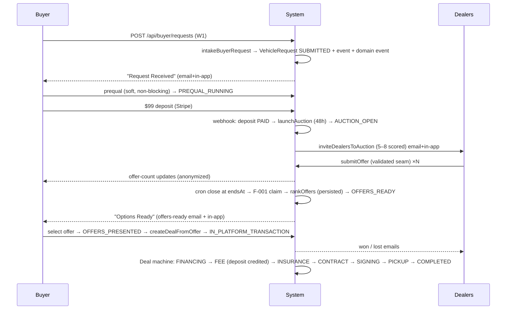
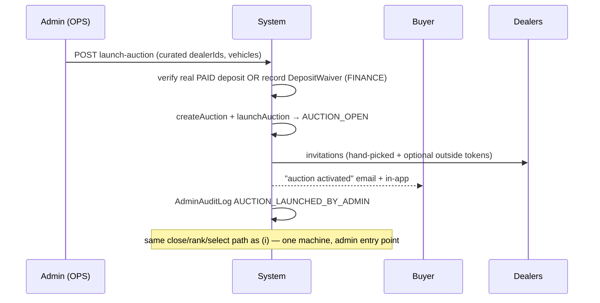
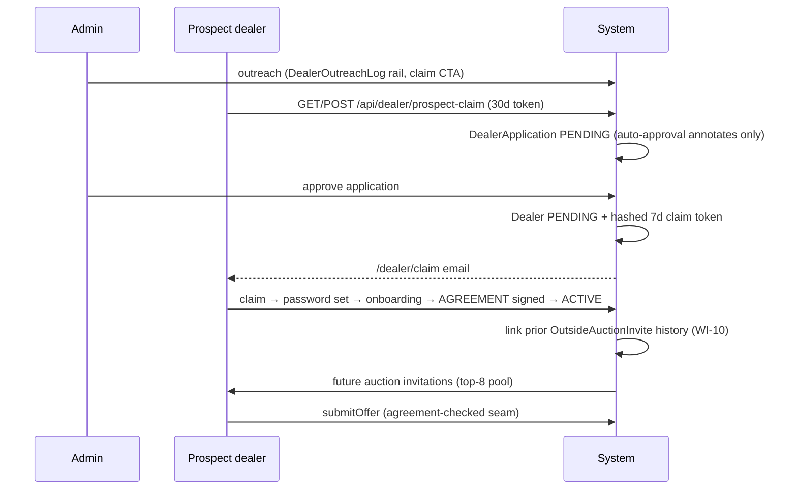
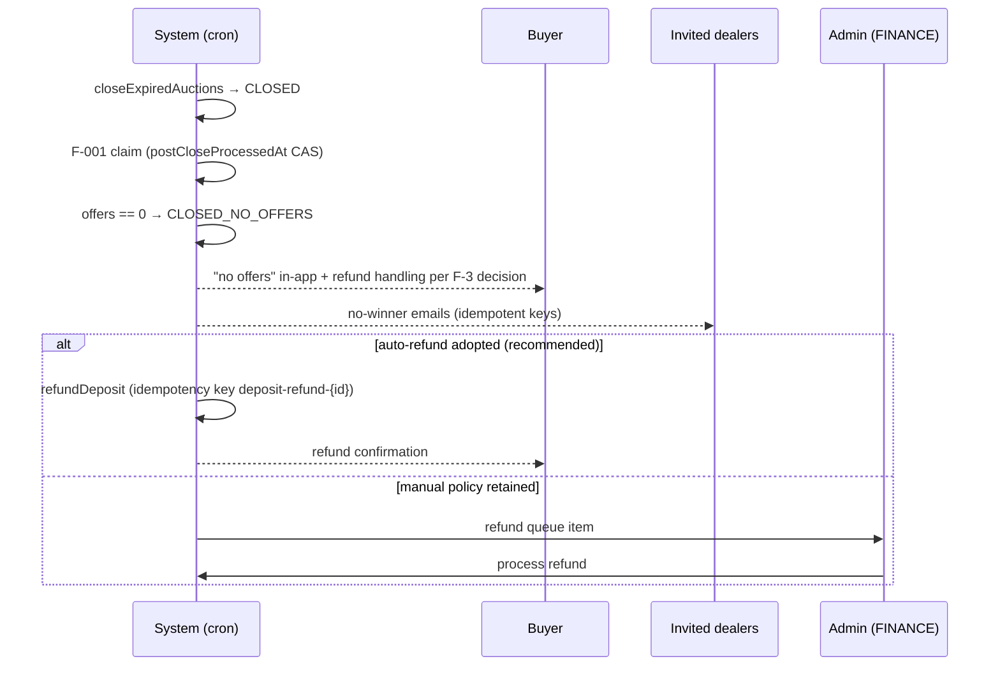

# AutoLenis Buyer–Dealer–Admin Relationship Audit & Workflow Redesign

**Engagement:** Read-only audit + design document (no code changes)
**Date:** 2026-07-02
**Scope:** All Buyer / Dealer / Admin flows from demand creation through deal completion, as implemented in `frontend/`
**Method:** Static inspection of the repository. Every claim carries a `file:line` citation (paths relative to `frontend/` unless prefixed otherwise). Every MISSING classification states the searches performed. **Zero files were modified, created, or deleted in the application codebase; the only artifact added is this document.**

---

## 0. Executive Summary

AutoLenis does not run one Buyer–Dealer–Admin workflow. It runs **three parallel request→offer pipelines** plus an AI-lead enrichment layer, each with its own entities, status vocabulary, offer records, and notification behavior:

| Pipeline | Entities | Automation posture |
|---|---|---|
| **A. Deposit-gated auction** | `Deposit` → `Auction` → `AuctionInvitation` / `OutsideAuctionInvite` → `Offer` → `Deal` (via `Deal.offerId`) | **Automated spine** — Stripe webhook launches, crons close/reconcile (`app/api/webhooks/stripe/route.ts:63-125`, `app/api/cron/auction-close/route.ts:16`) |
| **B. "Vehicle Offer" concierge** | `VehicleOffer` → `VehicleOfferDealerInvite` → `DealerOfferSubmission` → `BuyerOfferReview` | **Fully manual** — every transition is an admin click (`app/api/admin/vehicle-offers/route.ts:47` et seq.) |
| **C. VehicleRequest ("Request a Car", System 4C)** | `VehicleRequest` → due-diligence checkpoints → `VehicleRequestOffer` → `Deal` (via `Deal.vehicleRequestOfferId`) | **Fully manual**, checkpoint-gated (`lib/services/vehicle-request/vehicle-request-offer.service.ts:5-21`) |

`Deal` accepts input from two of these via two nullable foreign keys (`prisma/schema.prisma:533-534` — `offerId` and `vehicleRequestOfferId`), which is the structural root of the "fragmented ownership" the founder perceives. `BuyerOpportunity` (`prisma/schema.prisma:3299`) is a fourth, statusless lead entity created from six call sites feeding pipelines A–C unevenly.

**What is genuinely good and must be kept** (the redesign builds on these): the deposit-gated auction activation with its self-healing reconciler (`lib/services/auction/deposit-activation.service.ts`), the idempotent auction close (F-001 claim, `lib/services/auction/auction.service.ts:88-115`), the guarded deal-phase state machine (`lib/services/deal/deal.service.ts:11-134`), the idempotent email rail (`lib/services/email/resend.service.ts:124-204` + `EmailSendLog`), the webhook idempotency layer (`app/api/webhooks/stripe/route.ts:38-59`), the dealer recruitment funnel with hashed account-claim tokens (`lib/services/dealer-recruitment/account-claim.service.ts`), and the admin RBAC/MFA base (`lib/admin-auth.ts`).

**The worst findings** (full list in §A7): the outside-dealer token offer path bypasses every economic guard in `submitOffer` (F-1); the admin launch-auction route mints a synthetic PAID deposit with no Stripe charge (F-2); buyer-facing copy promises a refundable deposit while the backend policy is "never refunded automatically" (F-3); SUPPORT_ADMIN can drive the entire concierge pipeline and re-run Best Price (F-4); ~15 email senders and 2 of 4 SMS senders bypass the compliance/idempotency dispatch rail (F-8); and the buyer-facing 5-status tracker is a hardcoded decoration not driven by state (F-11).

---

# PHASE A — RELATIONSHIP + FLOW AUDIT

## A0. Data topology (grounding)

Core models and where they live in `prisma/schema.prisma`:

- `Buyer` :30, `Dealer` :142 (`DealerStatus PENDING/ACTIVE/SUSPENDED/TERMINATED` :1197-1202), `Admin` :251 (`AdminRole` :1184).
- Pipeline A: `Deposit` :383 (`DepositStatus` :1284), `Auction` :399 (`AuctionStatus PENDING/ACTIVE/CLOSED/EXPIRED/CANCELLED/REOPENED` :1222-1229), `AuctionInvitation` :474, `OutsideAuctionInvite` :431, `AuctionVehicle` :456, `Offer` :489 (`OfferStatus DRAFT/SUBMITTED/ACCEPTED/DECLINED/WITHDRAWN/EXPIRED` :1250-1257).
- Pipeline C: `VehicleRequest` :789 (`VehicleRequestStatus`, 11 values, :1365-1377), `VehicleRequestOffer` :911 (status is a **plain string**, `:914`), `VehicleRequestEvent` :928, `VehicleRequestBuyerUpdate` :942, `VehicleRequestFinancing` :831.
- Shared: `Deal` :530 (`DealStatus`, 16 values, :1231-1248) — **two FKs**: `offerId` :533 and `vehicleRequestOfferId` :534. `Notification` :689, `EmailSendLog` :1097, `PaymentProviderEvent` :649, `AdminAuditLog` :1138.
- Lead layer: `BuyerOpportunity` :3299 (**no status enum** — lifecycle is booleans `completed`/`founderNotified`/… :3365-3376), `DealerProspect` :3389.

### Divergence from the authoritative state machines (reported, not redesigned)

**Request phase.** The authoritative machine (SUBMITTED → PREQUAL_RUNNING → SOURCING → DEALER_INVITE_PENDING → AUCTION_OPEN → OFFERS_READY → OFFERS_PRESENTED → IN_PLATFORM_TRANSACTION; terminals CLOSED_NO_OFFERS / CLOSED_RESUBMIT / PREQUAL_FAILED) **does not exist as a single implemented machine**. Searched `PREQUAL_RUNNING|DEALER_INVITE_PENDING|AUCTION_OPEN|OFFERS_READY|OFFERS_PRESENTED|IN_PLATFORM_TRANSACTION|CLOSED_RESUBMIT|PREQUAL_FAILED|RequestPhase` across `frontend/` — no state-enum hits (only unrelated copy: `lib/services/email/templates/offers-ready.tsx`, prequal marketing text). Instead the request phase is **split across three entities**: `VehicleRequestStatus` (SUBMITTED, INTAKE, ACTIVE_SOURCING, OFFER_READY, OFFER_SENT, OFFER_ACCEPTED, OFFER_DECLINED, DEAL_CREATED, CLOSED_NO_MATCH, CANCELLED, EXPIRED — schema :1365-1377), `AuctionStatus`, and the CRM `LifecycleStage` (`lib/events/lifecycle-advance.ts:18-28`). §B2 maps the authoritative machine onto these existing entities instead of inventing a fourth vocabulary.

**Deal phase.** Implemented `DealStatus` (schema :1231-1248) diverges from the authoritative machine: no `SELECTED`, no `FINANCING_APPROVED`, no `INSURANCE_COMPLETE`; extra `PENDING`, `ACTIVE`, `PICKUP_COMPLETE`, `REFUNDED`. The implemented transition map is `lib/services/deal/deal.service.ts:11-30` with guards in `canTransition` (:59-66) and `advanceDealStatus` (:84-134); `CANCELLED` is reachable from any non-terminal state (:61-62), matching the authoritative rule. Insurance gates only the transition to `COMPLETED` (:102-107) — see §A6.10.

---

## A1. Demand creation paths

### Creation-function census

Two functions can create a `VehicleRequest`; **only one is live**:

| Function | Location | Status |
|---|---|---|
| `createVehicleRequest()` | `lib/services/vehicle-request/vehicle-request.service.ts:27-60` | **DEAD** — no callers (grep `createVehicleRequest(` returns only the definition; the buyer route imports only `checkRateLimit`/`toBuyerLabel` from this module, `app/api/buyer/requests/route.ts:8-11`) |
| `intakeBuyerRequest()` | `lib/services/acquisition/unified-buyer-intake.service.ts:210-470` | **LIVE / canonical** — creates `BuyerOpportunity` (:222-253) then `VehicleRequest` at `SUBMITTED` (:269, :288-294), links them (:280), runs enrichment/dealer-discovery/scoring in `after()` (:337-466) |

`intakeBuyerRequest` is called from exactly three places (grep `intakeBuyerRequest(`): `lib/voice/dispatch-request.ts:219`, `app/api/buyer/requests/route.ts:203`, `app/api/public/request-vehicle/route.ts:292`.

### Path-by-path

| # | Path | Entry (file:line) | Service | Writes | Initial status | Event ledger (`emitDomainEvent`) |
|---|---|---|---|---|---|---|
| 1 | Buyer dashboard wizard | `POST /api/buyer/requests` — `app/api/buyer/requests/route.ts:126`; buyer session auth :127-128; rate limit 3/hr :131-134 | `intakeBuyerRequest` (:203) | BuyerOpportunity + VehicleRequest + route re-adds `VehicleRequestEvent` "SUBMITTED" (:249-257) + buyer update (:259-265) + optional `VehicleRequestFinancing` (:242-243) | `SUBMITTED` | **ABSENT** — no `emitDomainEvent` in this route |
| 2 | Voice dispatch (Zura phone) | `dispatchVehicleRequest()` — `lib/voice/dispatch-request.ts:112` (from Twilio voice flow); provisions its **own** Supabase user + Buyer inline :130-176 | `intakeBuyerRequest` (:219) | BuyerOpportunity + VehicleRequest; **no** VehicleRequestEvent/BuyerUpdate | `SUBMITTED` | **ABSENT** — does its own CRM sync (`ContactService.upsertContact` + timeline row :266-297) instead |
| 3 | Zura web widget / concierge | `POST /api/concierge` — `app/api/concierge/route.ts` (~:80; session-keyed :88-99) | none (inline) | `buyerOpportunity.create` **only** (:102-109); **never creates a VehicleRequest** (grep `vehicleRequest.create|intakeBuyerRequest|createVehicleRequest` in file → 0 hits) | n/a (BuyerOpportunity has no status) | emits `zura_conversation_captured` (:494-510), not `vehicle_request_submitted` |
| 4 | Public landing wizard | `POST /api/public/request-vehicle` — `app/api/public/request-vehicle/route.ts` (~:200-223), public | `intakeBuyerRequest` (:292) | BuyerOpportunity + VehicleRequest; auto-advances clean submissions to `INTAKE` in `after()` (:307-310) via **ungated** status write + `AUTO_INTAKE` event (:313-320) | `SUBMITTED` → `INTAKE` | **PRESENT** — the only emitter of `vehicle_request_submitted` (:592-603) |
| 5 | Tool/lead-magnet forms | `app/api/tools/dealer-fee-lead/route.ts:106-120`; `app/api/leads/lead-magnet/route.ts:98-110` | none (inline) | `buyerOpportunity.create` only, divergent inline defaults (`leadTemperature` set directly :115 / :107) | n/a | `calculator_completed` (:168-169); `lead_magnet_downloaded` (:149-150) |
| 6 | Admin-created request | — | — | — | — | **MISSING** — searched `vehicleRequest.create|createVehicleRequest|intakeBuyerRequest|buyerOpportunity.create` scoped to `app/admin/**`, `app/api/admin/**`, `lib/services/admin/**`: zero creation calls (only report-count filters, e.g. `app/admin/reports/buyers/page.tsx:31`). `IntakeSource` includes `phone_intake` (`unified-buyer-intake.service.ts:43`) but no code passes it |
| 7 | Make.com-triggered | — | — | — | — | **MISSING** — `lib/events/make-webhook.ts` is outbound-only (:8-11, :43); inbound webhook routes (glob `app/api/{webhooks,make}/**/route.ts` → docusign, content-conversion, resend, microbilt, stripe, higgsfield, twilio/inbound) create no request/opportunity |

**Do all paths write the ledger identically? No.** `intakeBuyerRequest` itself writes no `VehicleRequestEvent`, no `VehicleRequestBuyerUpdate`, and no domain event; each caller re-adds a different subset (dashboard: both; public: `AUTO_INTAKE` only; voice: neither). `emitDomainEvent("vehicle_request_submitted")` fires on **one of three** VehicleRequest-creating paths (grep: single call site `app/api/public/request-vehicle/route.ts:592`), so dashboard and voice submissions are invisible to the CRM/Make funnel as vehicle requests.

### Request-phase transition enforcement

The **only** guarded transition map is inline in one admin route: `TRANSITIONS` at `app/api/admin/requests/[requestId]/route.ts:18-51`, enforced via `from.includes(req.status)` (:76-81), writing a `VehicleRequestEvent` (:90-98). Actions: INTAKE, ACTIVATE_SOURCING, CLOSE_NO_MATCH, REOPEN_SOURCING, CREATE_DEAL. Searched `TRANSITIONS|transitionTo|canTransition|VALID_TRANSITIONS|stateMachine` in `lib/services/vehicle-request/` — no service-layer guard exists.

**Ungated direct status writes bypassing that map** (all `prisma.vehicleRequest.update({ data: { status } })`):
1. `app/api/public/request-vehicle/route.ts:309` → `INTAKE`
2. `app/api/admin/buyers/[buyerId]/launch-auction/route.ts:178` → `ACTIVE_SOURCING`
3. `lib/services/vehicle-request/vehicle-request-offer.service.ts:17` → `OFFER_SENT`
4. `app/api/buyer/requests/[requestId]/offer/respond/route.ts:49` → accept/decline statuses
5. `app/api/buyer/requests/[requestId]/cancel/route.ts:28` → `CANCELLED`
6. `lib/auth/actions.ts:153` → `updateMany` (guest-claim reassignment)
7. `scripts/s4c_status_update.ts:10`, `scripts/find_or_seed_submitted.ts:16` → arbitrary

### Buyer-facing 5-status model

**UI-only decoration.** The "Request Received / Searching for Options / Options Ready / Selection Made / Deal in Progress" stepper is a hardcoded literal array on the submission success screen (`app/buyer/requests/new/page.tsx:1400-1417`) with stage index 0 always highlighted (:1407, :1412) — not wired to `req.status`. The real buyer surface uses `toBuyerLabel()` (`lib/services/vehicle-request/vehicle-request.service.ts:63-78`), an 11→11 relabel of `VehicleRequestStatus`, used by `app/buyer/requests/page.tsx:57`, `app/buyer/requests/[requestId]/page.tsx:58`. No internal→5-bucket mapping function exists (searched the five phrase literals plus `toBuyerLabel|statusLabel|phase` under `app/buyer/requests` — only the static stepper and marketing pages match).

---

## A2. Dealer invitation paths

Five distinct invitation/claim subsystems exist:

| # | Model (schema line) | Purpose | Token |
|---|---|---|---|
| 1 | `AuctionInvitation` :474 | Registered ACTIVE dealer → buyer auction | none (dealerId relation) |
| 2 | `OutsideAuctionInvite` :431 | Non-registered dealer → one auction | plaintext uuid :438 |
| 3 | `VehicleOffer`/`VehicleOfferDealerInvite`/`DealerOfferSubmission` :3136/:3199/:3224 | Admin one-off quote request (no auction) | plaintext uuid |
| 4 | `DealerInvitation` :3089 | Admin invites dealer to register | plaintext |
| 5 | `DealerProspect` → `DealerApplication` → `DealerAccountClaimToken` :3389/:3064/:3114 | Recruitment funnel → account claim | prospect plaintext / claim SHA-256-hashed |

### A2.a Registered dealer → auction invitation

- **Trigger — automatic on deposit payment.** `inviteDealersToAuction(auctionId, buyerId)` (`lib/services/auction/dealer-invitation.service.ts:62`) is invoked from: Stripe webhook `payment_intent.succeeded` type `deposit` (`app/api/webhooks/stripe/route.ts:124`, right after `launchAuction` :121, guarded by `!existingAuction`); `handleDepositPaid` (`lib/services/deposit/deposit.service.ts:47`); and the reconciler when an ACTIVE auction has zero invitations (`lib/services/auction/deposit-activation.service.ts:144`).
- **Selection:** pool = `dealer.findMany({ status: "ACTIVE", isSystemPlaceholder: false })` (:78-81); haversine ≤ `MAX_DISTANCE_MILES = 150` (:13, :85-92; dealers without coords are **not** excluded :88); score = base 50 + tier bonus (PLATINUM +30 / GOLD +20 / STANDARD +10 / PROBATION −20, :45) − `currentAuctionLoad*5` (:49), **hard-excluded at load ≥ 5** (:50), + `offerWinRate*20` − `junkFeeRatio*15` from latest scorecard snapshot (:53-57).
- **Count policy:** hard cap `MAX_INVITATIONS_PER_AUCTION = 8` (:12, applied :106). Verified `lib/services/auction/dealer-invitation.service.ts:12`. **No minimum, no configurability** (single const, no env override). The **configurable** per-dealer capacity (`DealerCapacityConfig.maxAuctionLoad`, `lib/services/auction/auction-capacity.service.ts:6-9`, model schema :2474) is **dead code relative to invitation** — `getDealerCapacity`/`isDealerAtCapacity` have no callers in the invite path; the selector hard-codes `>= 5` (:50). **Brand matching is dead too**: `scoreDealerForAuction` takes `vehicleTypes` but is always called with `[]` (:97); `DealerCapacityConfig.preferredMakes` is written, never read by the selector.
- **Transport:** in-app `Notification` type `AUCTION_STARTED` (:136-143); email via idempotent rail, key `dealer-auction-invitation-${auctionId}-${to}` (`lib/services/email/resend.service.ts:1581`); QStash reminder job (:166); GHL tag (:178). `currentAuctionLoad` incremented (:120-123), released at close (`auction.service.ts:118`).
- **Acceptance flow:** **none.** No accept/decline route exists (searched `app/api/dealer/**` and `app/dealer/**` for accept/decline/respond — only offer submit/revise). "Acceptance" is implicit: submitting an offer stamps `AuctionInvitation.respondedAt` (`lib/services/offer/offer.service.ts:142-145`). Decline is a silent no-op.
- **Expiry:** invitation rows have no expiry; bound only by auction `endsAt` (48h — `AUCTION_DURATION_HOURS = 48`, `lib/constants.ts:46`, applied `auction.service.ts:27`).
- **Enforcement that only invited dealers bid:** inside `submitOffer`'s Serializable transaction — `tx.auctionInvitation.findFirst({ auctionId, dealerId })`, throws "Dealer not invited to this auction" (`offer.service.ts:103-106`). **Outside dealers bypass this** via their own token endpoint (§A2.b1/§A4.1b).

### A2.b Non-registered dealer invitation

**B1 — Outside dealer into an existing auction (`OutsideAuctionInvite`).**
- Issuance: `app/api/admin/buyers/[buyerId]/invite-outside-dealers/route.ts` — SUPER_ADMIN/OPERATIONS_ADMIN only (:27), max 8 (:21), `createMany` (:50), plaintext uuid token (schema :438), no independent expiry (auction `endsAt` bounds it), email link `/dealer-offer-outside/${token}` (:84). Also creatable inside admin launch (`launch-auction/route.ts:205`).
- Token-holder scope: submit **one** offer for **one** auction (`app/api/public/outside-dealer-offer/[token]/route.ts` — invite exists :35-39, not already responded :41, auction ACTIVE and unexpired :44-49; atomic double-submit guard :58-101). Cannot revise, cannot log in, no portal access.
- Conversion to registered dealer: **none from this flow** — no Dealer account is ever created; identity lives in `Offer.externalDealer*` (schema :510-513) against the system placeholder dealer (`lib/services/offer/outside-dealer.ts:24`, placeholder permanently `TERMINATED` + `isSystemPlaceholder` :54-56).

**B2 — Recruitment funnel (prospect → application → account).**
- Pipeline: `DealerProspect` (schema :3389), status DISCOVERED→SCRIPTED→DRAFTED→CONTACTED→REPLIED→ONBOARDED/DEAD (:3527-3535); outreach logged in `DealerOutreachLog` (`lib/services/dealer-recruitment/dealer-email-send.service.ts:282`) with suppression + rate limits 50/hr, 200/day (:53-54); day-0/3/8 follow-up cadence (`dealer-followup.service.ts:22-27`).
- Prospect claim token: `issueProspectClaimToken` (`prospect-claim.service.ts:23`) — `randomBytes(32)` base64url stored **plaintext** (:35-42), 30-day TTL (:13), reused if unexpired (:31). Claim route `app/api/dealer/prospect-claim/route.ts` (GET prefill :18, POST convert :38) → `claimProspectToApplication` requires `licenseNumber` (`prospect-claim.service.ts:86`), creates **PENDING `DealerApplication`** (:110-127), prospect → `ONBOARDED` (:132). No account yet.
- Auto-approval: `evaluateDealerApplicationAutoApproval` (`lib/services/dealer-recruitment/auto-approval.ts:39`) is **triage annotation only** (:2-12); `autoApprovable` requires `verifiedPlaceId` (:58) and is env-flag-gated by callers (:11, :29). No route auto-creates an account (verified by caller search).
- Admin approval → account: `app/api/admin/dealers/applications/[appId]/approve/route.ts` — Supabase user with random unstored password (:40), `User` `requiresPasswordChange` (:75), `Dealer` at `PENDING` (:86); then `issueClaimToken` (`account-claim.service.ts:28`) — `randomBytes(32)` hex, **stored SHA-256-hashed** (:14, :37-45), 7-day TTL (:12), single-use; email `/dealer/claim?token=…` (:132).
- Account claim: `app/api/dealer/claim/route.ts` — atomic consume (`consumeClaimToken`, conditional `updateMany` where `consumedAt: null`, `account-claim.service.ts:79-85`), password set (:130), audit `DEALER_ACCOUNT_CLAIMED` (:149), redirect to `/dealer/onboarding` (:171). Dealer → `ACTIVE` only when the AGREEMENT onboarding step completes (`app/api/dealer/onboarding/route.ts:154-160`).
- **After claiming, can they bid on the auction that invited them? No.** Recruitment prospects carry no auction linkage (`buyerOppId` nullable, schema :3396); a new ACTIVE dealer only becomes eligible for **future** auctions via the top-8 scoring pool. There is no bridge from `OutsideAuctionInvite` → registration either.
- **Agreement gate finding:** neither `agreedToTermsAt` nor `marketplaceAgreementSignedAt` is checked at offer submission (`submitOffer` checks only invitation + auction-active + budget; searched the submit path for `agreedToTermsAt|marketplaceAgreement|agreementSignature` — no references). The DocuSign send is post-hoc fire-and-forget (`dealer/onboarding/route.ts:167-176`).

### A2.c Individual offer request outside an auction — EXISTS (Pipeline B)

Admin can request a one-off quote from one dealer: create `VehicleOffer` (`app/api/admin/vehicle-offers/route.ts:71`, token link `/dealer-offer/${token}` :126), then `send-to-dealers` creates 1–20 per-dealer `VehicleOfferDealerInvite` rows with optional `expiresAt` (`app/api/admin/vehicle-requests/[id]/send-to-dealers/route.ts:29`, :23, :47) and emails each dealer (:79). Dealer submits via `app/api/public/dealer-offer/[token]/route.ts` (invite or generic token :110-124, expiry check :126-132, rich zod validation :71-102) creating `DealerOfferSubmission` (:179), linked to a registered dealer when `contactEmail` matches (:218-230). A `dealers.length === 1` call is a valid single-dealer solicitation. *(Naming trap: `app/api/admin/requests/[requestId]/offer/route.ts` is the opposite direction — admin sends a finished offer TO the buyer in Pipeline C, checkpoint-gated at `vehicle-request-offer.service.ts:10-11`.)*

### A2.d Admin-initiated auction on behalf of a buyer — EXISTS (complete)

1. **Rich path** `POST app/api/admin/buyers/[buyerId]/launch-auction/route.ts:48` (SUPER/OPS :52-54): blocks duplicate open auction (:81-91); admin hand-picks `dealerIds` min 1 (:37), validated ACTIVE (:94) — **no scoring/geo/8-cap applied**; **deposit-gate bypass** — reuses an unattached PAID deposit or **creates a synthetic `Deposit { status: "PAID" }` with no Stripe payment** (:107-116, verified); `createAuction` + `launchAuction` (:119-120), optional custom duration (:124); `createMany` invitations (:134) + load increment (:144); optional `AuctionVehicle`s (:186) and outside dealers (:205); audit `AUCTION_LAUNCHED_BY_ADMIN` (:280).
2. **Minimal path** `POST app/api/admin/auctions/route.ts:25`: requires an existing PAID `depositId` (:36-37, no bypass), creates auction `ACTIVE` (:46-54) — **invites no dealers**; this is where the partial path stops.
3. Admin close/extend/reopen/etc. via `app/api/admin/auctions/[auctionId]/action/route.ts` — manual close calls the same `processAuctionClose` as cron (:33-42), so the two never diverge.

---

## A3. Admin involvement inventory (request submission → offer selection)

Pipeline A's happy path requires **zero** admin action: Stripe webhook launches + invites (`webhooks/stripe/route.ts:63-125`), reconciler self-heals every 5 min (`vercel.json:11-13`; `deposit-activation.service.ts:110-240`), cron closes/ranks/notifies every 5 min (`vercel.json:7-9`; `auction.service.ts:97-194`), the buyer selects. Pipelines B and C are 100% manual. Inventory with dispositions (dispositions carried into §B1):

| # | Action | Route / service | UI | Classification |
|---|---|---|---|---|
| 1 | Prequal manual decision (APPROVE/DECLINE/OVERRIDE incl. OFAC) | `app/api/admin/prequal/[id]/decide/route.ts:53` (SUPER/COMPLIANCE/OPS :55); actionable states :77-84; atomic w/ audit + ComplianceEvent :117-159 | `app/admin/prequal/[id]/PrequalDetailClient.tsx`, `app/admin/manual-reviews/page.tsx` | **GENUINE-JUDGMENT** (OFAC hard gate is legally required — `lib/services/prequal/prequal.service.ts:3-4`, auto-routing to review :163-199) |
| 2 | Prequal manual override (no bureau pull) | `app/api/admin/buyers/[buyerId]/prequal/manual-override/route.ts:46` (OPERATIONAL_ROLES :48 — note FINANCE included); OFAC hard gate kept :80-92 | prequal pages | **GENUINE-JUDGMENT** |
| 3 | Admin-run iPredict | `run-ipredict/route.ts:99` (SUPER/COMPLIANCE :101); consent certification :69-81 | prequal pages | **GENUINE-JUDGMENT** |
| 4 | Prequal resend-email | `resend-email/route.ts:37` | — | **MISSING-AUTOMATION** (mechanical) |
| 5 | Manual auction launch w/ hand-picked dealers | `launch-auction/route.ts:48` | `app/admin/auctions/StartAuctionButton.tsx` | **GENUINE-JUDGMENT** for curation; **DEFECT-WORKAROUND** for the synthetic PAID deposit (:111-116) |
| 6 | Auction actions: early close / extend / remove-dealer / invite-dealer / refund / reopen | `app/api/admin/auctions/[auctionId]/action/route.ts:32-187` (SUPER/OPS :17-19; mandatory reason :25) | `app/admin/auctions/[auctionId]/page.tsx` | Early close = **MISSING-AUTOMATION** (cron closes at `endsAt`); extend/reopen/invite/remove/refund = **GENUINE-JUDGMENT** |
| 7 | Best-Price manual re-run | `best-price/run/route.ts:13` — **no role gate** (`getAdminFromRequest` only, :15-16) | auction detail | **MISSING-AUTOMATION** + RBAC defect; also the only path that **persists** ranks (:26-37) — see F-9 |
| 8 | Invite outside dealers | `invite-outside-dealers/route.ts:24` (SUPER/OPS :27-29) | buyer command center | **GENUINE-JUDGMENT** |
| 9 | Buyer journey unlock/skip/reopen/complete | `lib/services/admin/buyer-journey-admin.service.ts:43-57`; routes `app/api/admin/buyers/[buyerId]/journey/*` | buyer command center | **GENUINE-JUDGMENT**; prequal-skip is compliance-sensitive (:52) |
| 10 | Buyer workflow pause/resume/cancel/move + manual reminder | `admin-buyer-command-center.service.ts:838,872,904,954,760`; `reminder/route.ts:18` | buyer command center | move/cancel = **GENUINE-JUDGMENT**; manual reminder = **MISSING-AUTOMATION** (nudge engine cron overlaps — `app/api/cron/workflow-automation/route.ts:18`) |
| 11 | Pipeline B: create `VehicleOffer` (hand-transcribe request) | `app/api/admin/vehicle-offers/route.ts:47` — **any admin incl. SUPPORT** (:48) | `app/admin/vehicle-offers/new/VehicleOfferCreateClient.tsx` | **MISSING-AUTOMATION** (manual transcription of form data) |
| 12 | Pipeline B: send-to-dealers fan-out | `send-to-dealers/route.ts:29-30` — any admin | `SendToDealersClient.tsx` | Dealer choice = **GENUINE-JUDGMENT**; fan-out mechanics = **MISSING-AUTOMATION** |
| 13 | Pipeline B: admin submits offer on dealer's behalf | `submit-offer/route.ts:34-35` — any admin | detail client | **DEFECT-WORKAROUND** (stand-in for dealers not self-submitting, per header comment :1-3) |
| 14 | Pipeline B: reject submission | `reject-submission/route.ts:16-17` — any admin; reuses wrong "acceptance" email template (:42-44) | detail client | **GENUINE-JUDGMENT** + template **DEFECT** |
| 15 | Pipeline B: send curated offers to buyer | `send-to-buyer/route.ts:27-28` — any admin | `VehicleOfferDetailClient.tsx` | Curation = **GENUINE-JUDGMENT**; packaging/notify = **MISSING-AUTOMATION** |
| 16 | Pipeline B: manual status string maintenance | `app/api/admin/vehicle-requests/[id]/status/route.ts:22` (values list :8-18) | — | **MISSING-AUTOMATION** (no state machine; string field) |
| 17 | Pipeline C: complete due-diligence checkpoint | `checkpoints/[checkpointId]/complete/route.ts:9` — any admin | `app/admin/requests/[requestId]/page.tsx` | **GENUINE-JUDGMENT** |
| 18 | Pipeline C: create+send offer to buyer | `app/api/admin/requests/[requestId]/offer/route.ts:11` → `createAndSendOffer` (checkpoint-gated, `vehicle-request-offer.service.ts:10-11`) | request detail | Gate = **GENUINE-JUDGMENT**; send = **MISSING-AUTOMATION** |
| 19 | Queue resolve (PREQUAL_MANUAL / OFAC_ALERT) | `lib/services/admin/admin-queue.service.ts:41-106` — **keyword-parses free text** ("APPROVE"/"DECLINE"/"CLEAR"/"CONFIRM") :44-84; audit row written even when the underlying update silently no-ops (:74-78, TODO :92) | `app/admin/queues`, `app/admin/manual-reviews` | **GENUINE-JUDGMENT** + **DEFECT** (audit/DB divergence) |

### Admin RBAC / auth base (to extend, not replace)

- Flat 5-role enum: SUPER_ADMIN, OPERATIONS_ADMIN, COMPLIANCE_ADMIN, FINANCE_ADMIN, SUPPORT_ADMIN (`lib/admin-auth.ts:344-350`); no permission table — authorization is per-route allow-lists.
- Mandatory MFA + soft-delete rejection (`lib/auth/admin-session.ts:15,18-22`); JWT 24h (`admin-auth.ts:33-34,207-214`); MFA lockout (:251-311). Enforcement helpers: `getAdminFromRequest` (any admin, `lib/auth/admin-api.ts:15`), `getAdminWithRole` (:78-86), `requireAdminRole` (pages, `admin-session.ts:35-41`), `OPERATIONAL_ROLES` (`admin-api.ts:92-97`).
- **RBAC gap:** `best-price/run` and all Pipeline-B routes use `getAdminFromRequest` only → SUPPORT_ADMIN can execute them (citations in table above).
- Audit logging: `writeAdminAuditLog`/`logAdminAction` (`admin-audit.service.ts:19-32`), request-aware `createAuditLog` (`admin-api.ts:43-71`). Coverage is good on pipeline actions (each route in the table audits) but writes are frequently `.catch(()=>{})` best-effort (e.g. `launch-auction/route.ts:300`), and the queue-resolve divergence above.

### Cron/scheduled automation (request→offer relevant, from `vercel.json`)

| Job | Route | Schedule | Role |
|---|---|---|---|
| auction-close | `app/api/cron/auction-close/route.ts:16` | `*/5 * * * *` (vercel.json:8-9) | close expired, run post-close reconciler, last-call reminders (:50-88) |
| deposit-activation-reconcile | `deposit-activation-reconcile/route.ts:16` | `*/5 * * * *` (:11-13) | converge stranded PAID deposits → ACTIVE or terminal CLOSED |
| dealer-invitation-reminder | `dealer-invitation-reminder/route.ts:20` | hourly (:56-58) | remind non-responding invited dealers 5–7h before deadline |
| vehicle-offer-expire | `vehicle-offer-expire/route.ts:8` | hourly (:120-122) | only cron touching Pipeline B — expires invites past `expiresAt` (:16-22) |
| prequal-sla-escalation / ibv-reminders / message-delivery / cleanup | various | daily/4-hourly (:52-74) | prequal support |
| workflow-automation | `workflow-automation/route.ts:10` | `*/5 * * * *` (:104-106) | nudge engine + deal risk |
| sla-check | `sla-check/route.ts:6` | `*/30 * * * *` (:96-98) | generic SLA monitor |

Inngest functions are all marketing/lifecycle (`lib/inngest/functions.ts:90-1076`); none drive the auction/offer/prequal core. QStash is transport (`lib/qstash/*`), not a scheduler.

---

## A4. Offer lifecycle

### A4.1 Submission — five offer-creating routes

| Route | System | Creates | Cite |
|---|---|---|---|
| `POST /api/dealer/offers` | A | `Offer` | `app/api/dealer/offers/route.ts:39` |
| `POST /api/public/outside-dealer-offer/[token]` | A | `Offer` | `app/api/public/outside-dealer-offer/[token]/route.ts:22` |
| `POST /api/public/dealer-offer/[token]` | B | `DealerOfferSubmission` | `app/api/public/dealer-offer/[token]/route.ts:106` |
| `POST /api/admin/vehicle-offers/[id]/submit-offer` | B | `DealerOfferSubmission` | `app/api/admin/vehicle-offers/[id]/submit-offer/route.ts:34` |
| `POST /api/admin/requests/[requestId]/offer` | C | `VehicleRequestOffer` | `app/api/admin/requests/[requestId]/offer/route.ts:11` |

**A4.1a Registered dealer (`submitOffer`, `lib/services/offer/offer.service.ts:85`).** Auth: `dealer_token` JWT (`app/api/dealer/offers/route.ts:40-41`; `lib/auth/dealer-api.ts:17`). Route-level zod (:9-15). Inside a **Serializable** transaction (:102-148): invitation membership (:103-106), auction ACTIVE + unexpired (:108-110), one-SUBMITTED-offer-per-dealer (:112-121). Pre-transaction assertions: OTD components sum within 1¢ (`assertOtdComponentsMatch` :18-35, called :89), financing consistency (APR 0–50, term 6–96, :37-52, :91), buyer budget vs `PreQualification.maxOtdAmountCents` (:54-70, :93), APR > 29 → `SUSPICIOUS_APR` flag (:14, :96). **Not wired:** `junk-fee.service.ts` (`detectJunkFees` :6) and `offer-validation.service.ts` (`validateOffer` :7) are never called on this path — junk-fee items are stored as-is (:131).

**A4.1b Outside dealer token route.** No session; scope = `OutsideAuctionInvite.token` (:35-39). Minimal zod (:10-16). **Does not converge on `submitOffer`** — writes `Offer` directly (:71-99) against the placeholder dealer. Divergence table (each "MISSING" verified against the route source):

| Guard | `submitOffer` | token route |
|---|---|---|
| OTD component reconciliation | `offer.service.ts:89` | **MISSING** |
| Buyer-budget enforcement | :93 | **MISSING** |
| Financing consistency / APR flag | :91, :96 | **MISSING** (fields not accepted) |
| Membership | invitation :103 | invite token :35 |
| Duplicate guard | :112-121 | `respondedAt` single-use :41, :62-69 |
| Isolation | Serializable :148 | default :58 |

### A4.2 Revision / withdrawal

`PATCH /api/dealer/offers/[offerId]/revise` (`app/api/dealer/offers/[offerId]/revise/route.ts:27`) → `reviseOffer` (`offer.service.ts:262`): owner + `SUBMITTED` only (:263), max 1 revision (:265), auction still ACTIVE and unexpired (:268-272). Mechanism: atomic create-new (version+1, `originalOfferId`) + flip old to `WITHDRAWN` (:292-320). **No standalone withdrawal endpoint** — `WITHDRAWN` exists only as a revision artifact. `offer-revision.service.ts` (`submitRevision`) is an unused wrapper (route calls `reviseOffer` directly). Outside dealers cannot revise at all (single-use token).

### A4.3 Auction close and race handling

Vercel cron every 5 min (`vercel.json:8-9`; auth `x-vercel-cron`/`CRON_SECRET`, `auction-close/route.ts:17-22`). Step 1 `closeExpiredAuctions()` bulk-flips ACTIVE+expired → CLOSED (`auction.service.ts:197-204`). Step 2 reconciler processes every `{CLOSED, postCloseProcessedAt: null}` (state-based, not windowed — `cron:35-46`). **Idempotency (F-001):** compare-and-set claim via conditional `updateMany` on `postCloseProcessedAt` NULL→now, proceed iff `count === 1` (`auction.service.ts:88-90, 109-115`); claim released on side-effect failure for retry (:180-193); locked by test `__tests__/auction-close-idempotency.test.ts:14-46`. Admin manual close calls the same `processAuctionClose` (`action/route.ts:33-42`) — no divergence.

### A4.4 Best-price

`rankOffers(auctionId, termMonths=60)` (`lib/services/offer/best-price.service.ts:29`): loads SUBMITTED offers (:30-34), computes amortized monthly (:23-27, :44-46), junk-fee totals (:48-49), three ranks (:60-62), weighted `overallScore` with admin-configurable `BestPriceWeightConfig` defaults 0.4/0.25/0.2/0.15 (:39-40, :65-68), `selectTopOffers` (:93-102). **Persistence divergence:** the close-time invocation discards the result (`auction.service.ts:121` fire-and-forget); only the admin route persists ranks to `Offer` (`best-price/run/route.ts:26-37`). Buyer read: `GET /api/buyer/auctions/[auctionId]/best-price` (`route.ts:8`), buyer-owned (:16), preliminary on ACTIVE (:22-27), three cards (:77-124).

**Dealer anonymity pre-selection — holds, but fragile.** The buyer route's query does `include: { dealer: true }` (loads `dealershipName`, :18) and anonymity survives only because serialization hand-picks `dealer.tier` (:85, :104, :117; policy comment :39-40). Live-status route exposes counts only (`live-status/route.ts:8, 44`). `RankedOffer` type carries no name (`best-price.service.ts:7-21`). Identity first reaches the buyer on the post-selection receipt (`buyer/deals/[dealId]/receipt/route.ts:15,21`).

### A4.5 Selection

`POST /api/buyer/auctions/[auctionId]/select-offer` (`route.ts:19`): buyer-owned (:21-22); not CANCELLED (:37-39); **F-007 early-accept block** unless `forceEarly` (:46-57, audited :90-100); anti-double-deal — reject if any offer `ACCEPTED` (:64-70); chosen offer must be `SUBMITTED` (:72-75). Atomic commit (:79-86): `Deal { status: FINANCING_PENDING }` + offer→`ACCEPTED` + auction→`CLOSED`. **Duplication:** this inlines what `createDealFromOffer` (`deal.service.ts:136`) already does, and the initial `deal.create` bypasses the state-machine seam (`advanceDealStatus`) entirely — the deal is born at `FINANCING_PENDING`, skipping `PENDING→ACTIVE`. Notifications: buyer in-app + email (:102-113), winner email (:139-147), loser emails with rank (:150-158), outside dealers via `externalDealerEmail` (:135), CRM `offer_selected` (:165-187).

### A4.6 Decline-and-replace

- **Decline-all (exists):** `POST /api/buyer/auctions/[auctionId]/decline` (`route.ts:13`) — auction→CLOSED (:31-34), SUBMITTED offers→DECLINED (:37-40), **no auto-refund** — manual refund request + admin alert (:45-57), buyer told to start a new request (:66-69). Terminal.
- **Admin reopen (defective):** `AUCTION_REOPENED` (`action/route.ts:172-184`) sets status `REOPENED` with fresh `endsAt` — but `submitOffer` accepts only `ACTIVE` (`offer.service.ts:109`) and the buyer best-price route only ACTIVE/CLOSED (`best-price/route.ts:22-27`), so a REOPENED auction **can neither receive offers nor be ranked/selected**. Dead-end status.
- **Decline a selected offer / pick another — MISSING.** No buyer-facing route cancels a deal or re-selects. Searched `re-present|represent|resubmit|declineSelected|declineOffer|pick another|cancelDeal|reopen.*auction` (case-insensitive) across `app/**` and glob `**/{select,accept,decline}*/route.ts`: `cancelDeal` exists only as a service function (`deal.service.ts:169-180`) with no invoking route for this purpose; `select-offer` hard-blocks once any offer is `ACCEPTED` (:64-70).
- Pipeline C decline (separate): `offer/respond` with DECLINE → request `OFFER_DECLINED`, "request another vehicle" (`app/api/buyer/requests/[requestId]/offer/respond/route.ts:71-78`).

---

## A5. Notification + status propagation

### Three disconnected planes

1. **CRM domain-event plane** — `emitDomainEvent` (`lib/events/emit.ts:74`): contact upsert (:87), forward-only lifecycle advance (:101-124; policy `lib/events/lifecycle-advance.ts:18-98`), timeline row (:147-151), lead scoring (:160-172), interest tags (:177-196), non-blocking Make forward (:203-217; single `MAKE_WEBHOOK_URL` router, HMAC-signed, `lib/events/make-webhook.ts:43-92`). Catalog: `WorkflowTriggerType` union, **28 literals** (`lib/types/crm.ts:339-376`) → **27 emittable** (`DomainEventType`, `emit.ts:46`). *(The "90+ types" in the engagement brief was not found; searched the union and `EVENT_TO_STAGE` — 27/28 is the real count.)* No consumer turns a domain event into an in-app notification row — the planes are decoupled.
2. **Transactional email plane** — canonical `sendIdempotent` (`resend.service.ts:124-204`): `EmailSendLog` dedupe by caller-constructed key (:136-145), every attempt logged (:191-199), **fail-open** on lookup error (:139-142). Compliance (consent, CAN-SPAM address, suppression) lives **only** in the dispatch route `app/api/crm/dispatch/email/route.ts:35-85`, not in `sendIdempotent` (:206-212 comment). Some keys embed `Date.now()` — intentionally non-idempotent (e.g. `resend.service.ts:1044`, :1076).
3. **In-app plane** — direct `prisma.notification.create` at ~40 sites (e.g. `auction.service.ts:125,153`; `offer.service.ts:156`; `select-offer/route.ts:102`; `webhooks/stripe/route.ts:114`). The `BuyerTriggers`/`DealerTriggers` helpers in `notification.service.ts:9-56` are **dead code** (no importers); only `markAllRead`/`getUnreadCount` are live (:58-68) and both are hardcoded to `buyerId` (:59-60, :67) despite dealer/affiliate routes existing. **No polling bell**: sidebars fetch unread count once on mount, with a comment forbidding `setInterval` (`components/buyer/BuyerSidebar.tsx:119-140`; dealer equivalent :125-128); cross-component invalidation via browser CustomEvent (`lib/events/notifications.ts:3-9`).

### Bypasses of the canonical email rail (raw `new Resend()` + `resend.emails.send`, no `EmailSendLog`, mostly no suppression)

`lib/services/email/buyer-notifications.service.ts:34,60-66` (buyer "dealers contacted"/"first offer" — no idempotency/suppression); `lib/services/email/vehicle-offers.email.ts:17,22-33`; `lib/services/email/dealer-agreement-confirmation.service.ts:32`; `lib/services/dealer-recruitment/dealer-email-send.service.ts:94` (own `DealerOutreachLog` rail :104-137 + suppression, but no `EmailSendLog`); `lib/qstash/notify.ts:34,136-172` (suppression yes :148, idempotency no); `lib/inngest/functions.ts:26`; `app/api/dealer/pickup/scan/route.ts:19`; `app/api/cron/prequal-ibv-reminders/route.ts:54`; `app/api/twilio/voice/status/route.ts:44,63`; `app/api/public/contact/route.ts:13`; `app/api/public/feedback/route.ts:12`; `app/api/admin/dealer-outreach/compose/route.ts:48`; `app/api/admin/auth/setup-mfa/send-email/route.ts:18`; `app/api/admin/buyers/[buyerId]/invite/route.ts:51`; `app/api/cron/morning-briefing/route.ts:40`.

### SMS: four uncoordinated senders

| Path | Consent/TCPA | Suppression | Quiet hours |
|---|---|---|---|
| `lib/services/sms/crm-sms.ts:56-120` | YES :76-78 | YES :86 | YES :95 |
| `lib/qstash/notify.ts:103-134` | YES :109 | YES :116 | NO |
| `lib/services/acquisition/twilio.service.ts` (`sendSms` :38-50) | **NO** on low-level send; hot-lead wrapper checks suppression :165 | partial | NO |
| `lib/services/sms/twilio.service.ts:25-39` | **NONE** (comment :5-7 delegates to caller) | NO | NO |

`gateMarketingSms` (`lib/crm/sms-gate.ts:24-55`, fails closed :45-48) exists but the generic sender does not call it. (`lib/social/sms-distribution.service.ts` named in the brief does not exist — searched `lib/social/` listing.)

### Transition matrix (E = domain event, 🔔 = in-app, 📧 = email; "BYPASS" = off the idempotent rail)

| Transition | Buyer | Dealer | Admin | Gaps |
|---|---|---|---|---|
| Request submitted | 📧 `request-received-${requestId}` (`resend.service.ts:951-953`) | — | 📧 BYPASS (`vehicle-offers.email.ts`) | E only on public path (`request-vehicle/route.ts:592`); no 🔔 |
| Prequal outcome | 🔔 (`cron/prequal-message-delivery/route.ts:15`) + 📧 approved/adverse (`resend.service.ts:418,671`) | — | 📧 alert (:473) | **No domain event** for outcome — CRM stage never reflects it |
| Deposit paid | 🔔 (`stripe/route.ts:114`) + 📧 `deposit-confirmed-${depositId}` (:739-747) + E `deposit_paid` (`stripe/route.ts:183`) | — | — | — |
| Sourcing started (`ACTIVE_SOURCING`) | — | — | — | **NO notification on any plane** |
| Auction activated | 🔔 + 📧 `auction-activated-${auctionId}` (`resend.service.ts:395-398`) + E `auction_started` (`auction.service.ts:44`) | 🔔 + 📧 invitation (`dealer-invitation.service.ts:136,147`) | — | — |
| Offer submitted | 🔔 (`offer.service.ts:156`) + 📧 BYPASS first-offer (`buyer-notifications.service.ts:134`) + E `offer_received` (`offer.service.ts:238`) | 📧 confirmation | — | buyer email off-rail |
| Auction closed w/ offers | 🔔 + 📧 `offers-ready-${auctionId}` (`auction.service.ts:125-140`; `resend.service.ts:406-410`) | — | — | **No `auction_closed` domain-event type exists** in the 27-type union |
| Auction closed zero offers | 🔔 "no offers" (`auction.service.ts:153-160`) | 📧 no-winner (:162-176) | — | no E |
| Offer selected | 🔔 + 📧 `deal-selected-${dealId}` (`select-offer/route.ts:102-113`; `resend.service.ts:707-711`) + E `offer_selected` (:168) | 🔔 + 📧 won/lost (:139-158) | — | — |
| Deal stage advance | ad-hoc 🔔 only (`deal-risk.service.ts:85`) | — | — | no per-stage E; `DealerTriggers.dealStageChanged` dead |
| Contract/e-sign | 🔔 (`esign.service.ts:97,113`) + 📧 (`resend.service.ts:758-767,934`) + E `docusign_signed` (`esign.service.ts:155`) | 📧 | — | — |
| Pickup/completion | 🔔 + 📧 + E `purchase_completed` (`pickup/scan/route.ts:112`; `resend.service.ts:719-721,861-870`) | 📧 BYPASS (`pickup/scan/route.ts:19`) | — | — |
| Cancel/refund | 🔔 (`refund.service.ts:13`; `stripe/route.ts:309,340`) + 📧 (:826-839) | — | — | **No domain event** — CRM never sees cancellation |

### Status surfaces

Three non-unified vocabularies: `VehicleRequestStatus` via `toBuyerLabel` (buyer dashboard); CRM `LifecycleStage` (9 stages, `lifecycle-advance.ts:18-28`); `DealStatus` pipeline + admin journey derivations (`buyer-journey-admin.service.ts:117-132`). `VehicleRequestStatus.DEAL_CREATED`, `DealStatus`, and CRM `purchase_completed` describe overlapping reality and are updated independently. No shared 5-status mapper (searches in §A1).

### Messaging

`lib/services/messaging/messaging.service.ts`: threads keyed on `dealId` (:50-59); `sendMessage` (:22-48) applies **regex-only** anti-circumvention (`CIRCUMVENTION_PATTERNS` :6-11 — phone/email/venmo/paypal/zelle/off-platform phrases), redacts on hit (:29-33), flags thread (:40-41), admin SYSTEM_ALERT (:42-44, error-swallowed, untargeted). Read side verifies participancy (`messaging-data.service.ts:71-74`). **`ai-moderation.service.ts` has zero importers** (grep) — AI moderation unwired. No buyer↔admin thread type.

---

## A6. Exception paths

| # | Path | Automatic? | Idempotent? | Evidence |
|---|---|---|---|---|
| 1 | Zero-offer close | Close+notify automatic (cron); **refund manual by policy** | YES (F-001 claim) | `auction.service.ts:147-177` (branch), :148-152 ("NO AUTO-REFUND… non-refundable access fee"), buyer 🔔 :153-160, dealer 📧 :162-176 |
| 2 | Deposit + Stripe webhook | Automatic | YES — atomic claim on `PaymentProviderEvent.eventId` (`stripe/route.ts:38-59`, processed :442-445); auction create guarded by unique `depositId` (:98-110); parallel guard in `deposit.service.ts:29-64` | Amount server-side only (`deposit.service.ts:12`); `launchAuction`/invite errors **swallowed** (`stripe/route.ts:120-127` `.catch(log)`) — healed by #7 |
| 3 | Buyer cancellation | Pre-auction: buyer route, from SUBMITTED/INTAKE/ACTIVE_SOURCING only (`app/api/buyer/requests/[requestId]/cancel/route.ts:19-32`). During auction: decline-all (#6). Post-selection: **no buyer route** — only service `cancelDeal` (`deal.service.ts:169-180`); searched `cancel|CANCELLED|withdraw` in `app/api/buyer/**/route.ts` → no deal-cancel route | status-guarded | refunds all manual (`payment/refund.service.ts`, `deposit.service.ts:66-70`) |
| 4 | Dealer non-response | Automatic reminders: hourly cron 5–7h before deadline (`dealer-invitation-reminder/route.ts:16-30,77-115`) + last-call ≤2h in close cron (`auction-close/route.ts:50-88`); auction proceeds with any offer count (`auction.service.ts:120`) | YES — email key `dealer-auction-reminder-{auctionId}-{email}` | Scorecard: response rate = offers/invitations (`dealer-scorecard.service.ts:36`); `avgResponseHours` **hardcoded 8** (:51) |
| 5 | Expired invitations | Claim-time enforcement only; **no cleanup cron** (searched `cron/**/route.ts` for `claimToken|prospect.*expir|cleanup|purge` → only prequal jobs) | account-claim consume is atomic single-use (`account-claim.service.ts:79-85`) | account tokens 7d hashed (:12-45); prospect tokens 30d plaintext (`prospect-claim.service.ts:35-42`); auction invites: no independent expiry |
| 6 | Declined-all-offers | Buyer-triggered close automatic; refund manual (admin alert `SYSTEM_ALERT`, `decline/route.ts:45-57`) | status-guarded 409 on repeat (:26-28) | no re-auction path; buyer told "start a new request" (:66-69) |
| 7 | Deposit-paid-but-auction-failed | **Automatic reconciler** every 5 min — state-based sweep (PAID w/o auction; PENDING auctions; ACTIVE w/ zero invites) (`deposit-activation.service.ts:189-224`; policy `deposit-activation-policy.ts:30-42`) | YES — `acquireIdempotencyGuard('deposit-activation:{id}')` (:110-114, released in finally :178-181); atomic conditional `updateMany` for launch/close (:134-138, :155-159); contract test `__tests__/deposit-activation.test.ts:26-60` | converges to CLOSED, never refunds (policy :11, :24) |
| 8 | Webhook idempotency | — | Stripe: above. DocuSign: `docusign:{envelopeId}:{event}` key + HMAC `timingSafeEqual`, fail-closed (`webhooks/docusign/route.ts:25-114`). Make inbound: `authorizeDispatch` HMAC + 5-min skew + `idempotency_keys` sha256 w/ replay semantics (`lib/crm/dispatch-auth.ts:59-232`). QStash: **signature-only**, no payload dedupe (`lib/qstash/verify.ts:7-20`, `receiver.ts:8-23`); dead-letter capture (`dispatch.ts:28-42`). Inngest: `idempotency_keys` guard (`lib/inngest/idempotency.ts:25-36`) | shared Supabase `idempotency_keys` table (`idempotency.ts:5-11`) |
| 9 | Auction extension | Manual admin-only (`auction-extension.service.ts:5-11` → `auction.service.ts:74-82`, logged) | **NO** — repeated calls stack hours | no anti-sniping auto-extend |
| 10 | Insurance gating | Correct — single hard gate on transition to `COMPLETED` only (`deal.service.ts:102-107`, `INSURANCE_SATISFIED` :37-41); `INSURANCE_PENDING` sits post-fee (:16-17); zero insurance references in auction/deposit/invitation services | — | matches the locked constraint; admin `force` can override (:103) |

---

## Capability classification table

| Capability | Classification | Anchor evidence |
|---|---|---|
| A1 Buyer dashboard request creation | EXISTS-CORRECT (canonical: `intakeBuyerRequest`) | `app/api/buyer/requests/route.ts:126,203` |
| A1 Public landing request creation | EXISTS-CORRECT (only path emitting the domain event) | `request-vehicle/route.ts:292,592` |
| A1 Voice-dispatch request creation | EXISTS-DEFECTIVE (own buyer provisioning; no ledger event, no request events) | `lib/voice/dispatch-request.ts:130-176,219` |
| A1 Zura widget → request | EXISTS-DEFECTIVE (creates statusless BuyerOpportunity only; never converts to VehicleRequest) | `app/api/concierge/route.ts:102-109` |
| A1 Admin-created request | MISSING (searches in §A1 row 6) | — |
| A1 Make.com-triggered creation | MISSING (outbound-only; searches in §A1 row 7) | `lib/events/make-webhook.ts:8-11` |
| A1 Unified creation function | EXISTS-DEFECTIVE (live canonical exists but callers re-add ledger writes divergently; dead twin `createVehicleRequest`) | `unified-buyer-intake.service.ts:210`; `vehicle-request.service.ts:27` |
| A1 Request-phase state machine | EXISTS-DEFECTIVE (guard in one admin route; 7 ungated writes) | `admin/requests/[requestId]/route.ts:18-51` vs §A1 list |
| A1 Buyer 5-status surface | EXISTS-DEFECTIVE (hardcoded stepper; 11-state relabel elsewhere) | `app/buyer/requests/new/page.tsx:1400-1417` |
| A2a Registered-dealer auto-invitation | EXISTS-CORRECT (trigger/scoring/cap/transport/idempotent email) | `dealer-invitation.service.ts:62-178` |
| A2a Invitation acceptance/decline | MISSING (implicit-only; searches in §A2.a) | `offer.service.ts:142-145` |
| A2a 5–8 configurable invitation policy | EXISTS-DEFECTIVE (hard cap 8, no min, not configurable; capacity config dead) | `dealer-invitation.service.ts:12,50`; `auction-capacity.service.ts:6-9` |
| A2a Invited-only bid enforcement (registered) | EXISTS-CORRECT | `offer.service.ts:103-106` |
| A2b Outside-dealer auction invite + quick offer | EXISTS-DEFECTIVE (works, but bypasses submitOffer guards; no conversion path) | §A4.1b |
| A2b Prospect pipeline + outreach log | EXISTS-CORRECT | `dealer-email-send.service.ts:282`; `dealer-followup.service.ts:22-27` |
| A2b Claim/complete + admin approval gate | EXISTS-CORRECT (hashed single-use token; PENDING→ACTIVE gates) | `account-claim.service.ts:12-85`; `applications/[appId]/approve/route.ts:33-132` |
| A2b Agreement gate on participation | EXISTS-DEFECTIVE (agreement never checked at offer submission) | §A2.b |
| A2c Individual offer request (one dealer, no auction) | EXISTS-CORRECT (Pipeline B triad) — but manual + RBAC-ungated | §A2.c |
| A2d Admin-initiated auction | EXISTS-DEFECTIVE (works end-to-end, but synthetic PAID deposit bypass) | `launch-auction/route.ts:107-116` |
| A4 Structured submission + validation | EXISTS-CORRECT for registered path; EXISTS-DEFECTIVE for token path | §A4.1 |
| A4 Revision rules | EXISTS-CORRECT | `offer.service.ts:262-320` |
| A4 Close race handling | EXISTS-CORRECT (F-001) | `auction.service.ts:88-115` |
| A4 Best-price handoff | EXISTS-DEFECTIVE (close-time result discarded; only admin run persists) | `auction.service.ts:121`; `best-price/run/route.ts:26-37` |
| A4 Buyer presentation w/ anonymity | EXISTS-CORRECT (fragile serialization-level enforcement) | `best-price/route.ts:18,85-117` |
| A4 Selection → deal | EXISTS-DEFECTIVE (inline duplication; bypasses state-machine seam) | `select-offer/route.ts:79-86` vs `deal.service.ts:136` |
| A4 Decline-and-replace post-selection | MISSING (searches in §A4.6) | — |
| A5 Event ledger | EXISTS-CORRECT (27 types; well-factored) — coverage gaps per matrix | `lib/events/emit.ts:74`; `lib/types/crm.ts:339-376` |
| A5 Email dispatch idempotency | EXISTS-CORRECT (rail) / EXISTS-DEFECTIVE (≈15 bypasses; fail-open) | §A5 |
| A5 SMS TCPA gating | EXISTS-DEFECTIVE (2 of 4 senders ungated) | §A5 SMS table |
| A5 In-app notifications + bell | EXISTS-DEFECTIVE (dead trigger helpers; buyer-only count helpers; fetch-once bell) | `notification.service.ts:9-68` |
| A5 Messaging + moderation | EXISTS-DEFECTIVE (regex-only; AI moderation unwired) | `messaging.service.ts:6-44` |
| A6.1–2, 4, 7, 8, 10 | EXISTS-CORRECT (see §A6 table) | — |
| A6.3 Post-selection buyer cancellation | MISSING (route level; service exists) | §A6.3 |
| A6.5 Token cleanup job | MISSING | §A6.5 |
| A6.6 Re-auction after decline-all | MISSING | §A6.6 |
| A6.9 Idempotent extension | EXISTS-DEFECTIVE | §A6.9 |

---

## A7. Fragmentation findings (numbered, evidenced, severity-ranked)

**P0 — money/auth/compliance**

- **F-1. Offer-submission validation fork.** Two paths mutate `Offer` with divergent guards: `submitOffer` (`offer.service.ts:85-148`, full economic validation) vs the outside-dealer token route (`public/outside-dealer-offer/[token]/route.ts:53-99`, none of: OTD reconciliation, budget cap, financing consistency, APR flag — table §A4.1b). A token holder can place an over-budget, arithmetically inconsistent offer into the same auction, ranking pool, and selection surface.
- **F-2. Deposit-gate bypass via synthetic deposit.** The locked invariant "auction never activates without confirmed deposit" is enforced by `classifyActivation` (`deposit-activation-policy.ts:31`) and the Stripe webhook — but `launch-auction/route.ts:111-116` mints `Deposit { status: "PAID" }` with no `stripePaymentIntentId`. Two paths create PAID deposits with divergent semantics (one is money, one is a flag).
- **F-3. Deposit refundability copy vs. policy.** Buyer-facing copy: "$99 … refundable if no valuable offer is received" (`app/buyer/deposit/page.tsx:109,134`). Backend policy: "never refunded automatically … manually requested … manually processed" (`deposit.service.ts:66-70`); zero-offer close explicitly non-refundable (`auction.service.ts:148-152`). The locked business constant says refundable + credited; the credit half is implemented (`service-fee.service.ts:9,29`; `PREMIUM_FEE_CENTS = 49900`, `lib/constants.ts:7`), the refund half is a manual admin queue with no SLA. Divergent promise vs. behavior on a money path.
- **F-4. RBAC fork on privileged actions.** Auction actions gate SUPER/OPS (`action/route.ts:17-19`) while the equally consequential Best-Price re-run (`best-price/run/route.ts:15-16`) and the entire Pipeline-B concierge flow (`vehicle-offers/route.ts:48` et al.) accept **any** admin including SUPPORT_ADMIN. Same class of action, two authorization standards.

**P1 — lifecycle integrity**

- **F-5. Three request→offer pipelines.** Auction (A), VehicleOffer concierge (B), VehicleRequest 4C (C) — three offer record types (`Offer`, `DealerOfferSubmission`, `VehicleRequestOffer`), two Deal FKs (schema :533-534), three status vocabularies, three dealer-solicitation mechanisms. B's lifecycle is a hand-maintained string (`status/route.ts:8-18`). Same business capability ("collect dealer offers for a buyer"), three divergent implementations.
- **F-6. Request creation divergence.** One live creator (`intakeBuyerRequest`) but per-caller ledger behavior: dashboard writes SUBMITTED event + buyer update (`buyer/requests/route.ts:249-265`), public writes AUTO_INTAKE (`request-vehicle:313-320`), voice writes neither; domain event on one path of three (§A1). Plus dead twin `createVehicleRequest` and six inline `buyerOpportunity.create` sites with divergent defaults.
- **F-7. Deal creation fork.** `select-offer/route.ts:79-86` inlines deal creation; `createDealFromOffer` (`deal.service.ts:136`) implements the same transition and is unused by the route; both bypass `advanceDealStatus` for the birth state. Pipeline C creates deals via the admin `CREATE_DEAL` transition into the same `Deal` table through the other FK.
- **F-8. Communication-plane fork.** Canonical idempotent+suppressed rail exists (`sendIdempotent` + `/api/crm/dispatch/email`) alongside ≈15 raw Resend senders and 2 ungated SMS senders (§A5) — two-plus paths sending outbound comms with divergent compliance behavior. TCPA/CAN-SPAM exposure on the ungated paths.
- **F-9. Best-price dual execution.** Close-time compute discards results (`auction.service.ts:121`); admin route persists (`best-price/run/route.ts:26-37`). The buyer surface recomputes its own view (`buyer/auctions/[auctionId]/best-price/route.ts:77-140`). Three evaluations of "which offer is best" with different persistence and freshness.
- **F-10. Request state-machine bypass.** One guarded transition map (`admin/requests/[requestId]/route.ts:18-51`) vs 7 ungated writes (§A1) — two mutation disciplines on the same entity.

**P2 — hygiene**

- **F-11. Buyer status theater.** Hardcoded 5-step stepper (`app/buyer/requests/new/page.tsx:1400-1417`) always highlighting step 0; real surface is an 11-state relabel; CRM stage is a third vocabulary. Buyers can see three different "statuses" for one request.
- **F-12. Dead machinery.** `createVehicleRequest`, `offer-validation.service.ts`, `junk-fee.service.ts` (unwired at submission), `offer-revision.service.ts` wrapper, `BuyerTriggers`/`DealerTriggers`, `ai-moderation.service.ts`, `DealerCapacityConfig` (vs hard-coded 5), brand matching (`vehicleTypes: []`), `REOPENED` status (dead-end per §A4.6), `avgResponseHours` hardcoded 8 (`dealer-scorecard.service.ts:51`).
- **F-13. Dealer anonymity enforced at serialization, not query.** `include: { dealer: true }` + hand-picked fields (`best-price/route.ts:18,85-117`) — one field spread away from leaking `dealershipName` pre-selection.

---

# PHASE B — REDESIGN

Design principles: **map onto the authoritative machines** (report divergence, never invent a fourth vocabulary); **reuse the verified machinery** (§0 list); new services only where Phase A proved MISSING; System owns automation, Admin intervenes on exception.

## B0. Canonical state mapping (authoritative ↔ implemented)

The authoritative request-phase machine becomes the **single derived source of truth**, computed from existing entities (no new parallel lifecycle). A new pure function `getRequestPhase()` (proposed home: `lib/services/vehicle-request/request-phase.ts`) derives it:

| Authoritative state | Derivation from existing entities |
|---|---|
| SUBMITTED | `VehicleRequest.status = SUBMITTED` |
| PREQUAL_RUNNING | `PreQualification` in progress / MANUAL_REVIEW / OFAC_REVIEW (`prequal.service.ts:163-199`) |
| PREQUAL_FAILED (terminal) | `PreQualDecision` declined |
| SOURCING | `VehicleRequest.status ∈ {INTAKE, ACTIVE_SOURCING}` |
| DEALER_INVITE_PENDING | `Auction.status = PENDING` or ACTIVE with zero `AuctionInvitation`s (reconciler's own eligibility state, `deposit-activation.service.ts:189-224`) |
| AUCTION_OPEN | `Auction.status = ACTIVE` with invitations |
| OFFERS_READY | `Auction.status = CLOSED`, `postCloseProcessedAt` set, offers > 0 |
| OFFERS_PRESENTED | buyer notified (post-close notification already exists, `auction.service.ts:125-140`) / Pipeline C `OFFER_SENT` |
| IN_PLATFORM_TRANSACTION | `Deal` exists (either FK) and non-terminal |
| CLOSED_NO_OFFERS (terminal) | closed auction with zero offers (`auction.service.ts:147`) |
| CLOSED_RESUBMIT (terminal) | decline-all (`decline/route.ts:31-40`) / `OFFER_DECLINED` / `CLOSED_NO_MATCH` |

The buyer-facing 5-status model is then a fixed collapse of the derived phase (replacing the hardcoded stepper, F-11):

| Buyer-facing | Authoritative states |
|---|---|
| Request Received | SUBMITTED, PREQUAL_RUNNING |
| Searching for Options | SOURCING, DEALER_INVITE_PENDING, AUCTION_OPEN |
| Options Ready | OFFERS_READY, OFFERS_PRESENTED |
| Selection Made | deal at birth (offer ACCEPTED) |
| Deal in Progress | IN_PLATFORM_TRANSACTION |

Internal states and dealer identities never leak: the collapse function is the only status export to buyer surfaces; dealer anonymity moves from serialization to query level (`select: { tier: true }` — F-13 fix, WI-13). Deal phase: keep the implemented `DealStatus` machine (`deal.service.ts:11-30`) and **report** its naming divergence from the authoritative machine (SELECTED ≈ deal creation at offer-accept; FINANCING_APPROVED ≈ `FINANCING_PENDING→FEE_PENDING` edge; INSURANCE_COMPLETE ≈ `INSURANCE_PENDING→CONTRACT_PENDING` edge; PICKUP_COMPLETE extra granularity). Renaming enum values is schema-impacting and delivers no behavior; it is deliberately **not** in the backlog.

## B1. Relationship map & ownership

| Lifecycle stage | Owner (acts) | Observes | Can override |
|---|---|---|---|
| Demand creation | Buyer (System for voice/widget) | Admin (command center) | Admin (new: create-on-behalf, WI-5) |
| Prequal | System (MicroBilt auto) | Buyer, Admin | Admin (COMPLIANCE: decide/override — keep) |
| Sourcing | System (enrichment + dealer discovery, `unified-buyer-intake.service.ts:337-466`) | Admin | Admin (research logs, checkpoints) |
| Deposit | Buyer (Stripe) | Admin (payments) | Admin (FINANCE: refund only — never synthetic PAID, WI-2) |
| Auction activation + invitation | **System** (webhook + reconciler + `inviteDealersToAuction`) | Buyer (counts only), Admin | Admin (SUPER/OPS: curated launch, extend, close-early, outside invites) |
| Offer collection | Dealer | Buyer (anonymized), Admin | Admin (transcribe phoned offer — keep, but into pipeline A path, WI-9) |
| Ranking + presentation | System (close-time rank, persisted — WI-8) | Buyer, Admin | Admin (re-run, SUPER/OPS-gated — WI-3) |
| Selection | **Buyer** | Dealers (win/lose), Admin | Admin (journey override — keep, audited) |
| Deal phase | System state machine + respective actor per gate | All | Admin (`force`, audited — keep) |
| Exceptions | System first (reconciler, crons) | Admin queues | Admin (judgment calls per §A3) |

**Disposition of every A3 manual step:** #1,2,3 prequal judgment → **KEEP-MANUAL** (FCRA/OFAC). #4 resend-email → **AUTOMATE** (fold into prequal-message-delivery cron). #5 manual launch → **KEEP-MANUAL** for curation, **fix** deposit bypass (require real PAID deposit or explicit `FINANCE`-approved waiver record — WI-2). #6 early close/extend/reopen/refund → **KEEP-MANUAL**; make reopen functional or remove (WI-12); make extend idempotent (WI-16). #7 best-price re-run → **KEEP-MANUAL** but role-gate + make close-time run persist (WI-3, WI-8). #8 outside invites → **KEEP-MANUAL**. #9 journey overrides → **KEEP-MANUAL** (audited). #10 manual reminder → **ELIMINATE** (nudge engine covers). #11 VehicleOffer transcription → **ELIMINATE** via auto-intake from public form into Pipeline B or its merger into A/C (WI-18). #12 send-to-dealers → **KEEP-MANUAL** choice, **AUTOMATE** fan-out mechanics (already mostly mechanical). #13 submit-on-behalf → **KEEP-MANUAL** (legitimate concierge stand-in) but route through the canonical validated path (WI-9). #14 reject → **KEEP-MANUAL**, fix template (WI-19). #15 send-to-buyer → **KEEP-MANUAL** curation, **AUTOMATE** packaging/notification. #16 manual status string → **ELIMINATE** (state machine, WI-18). #17,18 checkpoints/offer-send → **KEEP-MANUAL** gate, automate the send mechanics. #19 queue resolve → **KEEP-MANUAL**, replace keyword parsing with explicit decision enum (WI-15).

## B2. Canonical workflows

Each workflow lists: trigger → preconditions → owning service → transitions (authoritative machine) → notifications (all via §B4 rails) → audit events → failure/compensation.

**W1. Buyer-initiated request.** Trigger: dashboard/public wizard POST. Preconditions: session or public rate limit (`buyer/requests/route.ts:131-134`). Owner: `intakeBuyerRequest` — **extended** to internally write `VehicleRequestEvent(SUBMITTED)`, `VehicleRequestBuyerUpdate`, and `emitDomainEvent("vehicle_request_submitted")` so every caller is identical (WI-4); callers stop re-adding. Transitions: → SUBMITTED (→ PREQUAL_RUNNING when buyer starts prequal; prequal stays non-blocking per `buyer/requests/route.ts:125`). Notifications: buyer email `request-received-${requestId}` (existing key), admin via ops digest (not per-request email). Audit: `VehicleRequestEvent`. Failure: P2022 retry already handled (`unified-buyer-intake.service.ts:296-308`).

**W2. Admin-initiated request (new — was MISSING).** Trigger: admin command-center "Create request for buyer". Preconditions: SUPER/OPS; existing or new Buyer. Owner: **the same `intakeBuyerRequest`** with `source: "phone_intake"` (the enum value already exists, `unified-buyer-intake.service.ts:43`) — an entry point into the machine at SUBMITTED, not a parallel lifecycle. Route: new `POST /api/admin/buyers/[buyerId]/requests` (WI-5). Transitions/notifications/audit identical to W1 plus `AdminAuditLog` via `createAuditLog` (`admin-api.ts:43-71`). This replaces Pipeline-B manual transcription as the admin demand entry.

**W3. Registered-dealer auction invitation.** Keep as-is (EXISTS-CORRECT trigger + transport + idempotent email). Changes: policy constants move to `SystemConfig` (`lib/services/system/system-config.service.ts`) as `auction.invitations.max` (default 8) and new `auction.invitations.minTarget` (default 5); `inviteDealersToAuction` enforces both — when the scored pool < 5, emit an `ADMIN` queue item (existing `admin-queue.service.ts` types) prompting outside-dealer solicitation instead of silently launching thin (WI-6). Wire `isDealerAtCapacity` (replacing the hard-coded `>= 5`, `dealer-invitation.service.ts:50`) and pass real `vehicleTypes` from the request (WI-7). Add explicit accept/decline: `POST /api/dealer/invitations/[id]/respond` stamping `respondedAt` with a response value, feeding the scorecard's real response metrics (WI-14).

**W4. Non-registered dealer invitation → onboarding → participation.** Keep the recruitment funnel and claim flows as-is (EXISTS-CORRECT). Additions: (i) hash the prospect claim token at rest like the account token (WI-17); (ii) **bridge**: when an `OutsideAuctionInvite` respondent's email matches a later-registered dealer, or a claimed prospect had an originating auction, link participation history to the new `Dealer` (extend `account-claim.service` claim step; schema: nullable `dealerId` on `OutsideAuctionInvite` — WI-10). Participation still gates on admin approval + onboarding AGREEMENT step (existing). Add the agreement check at offer submission (`submitOffer` precondition: `agreedToTermsAt` set — WI-11).

**W5. Individual offer request (one dealer, no auction).** Keep Pipeline B's triad as the mechanism (EXISTS-CORRECT capability), with: role gate SUPER/OPS (WI-3), status string → explicit enum with a transition map mirroring the `admin/requests` pattern (WI-18), and offers flowing to the buyer through the same anonymized presentation component. Long-term (flagged, not scheduled): converge Pipeline B into Pipeline C's `VehicleRequest` + `VehicleRequestOffer` so `Deal` needs only two sources.

**W6. Auction activation (incl. admin-initiated).** Canonical trigger: Stripe webhook → `launchAuction` + `inviteDealersToAuction`, healed by the reconciler (keep, EXISTS-CORRECT). Admin-initiated: keep `launch-auction` curated flow but **remove the synthetic deposit** — require `deposit.status = PAID` with a real `stripePaymentIntentId`, or record an explicit `DepositWaiver` (admin id + reason, FINANCE/SUPER role) so the invariant "no activation without confirmed deposit (or auditable waiver)" is machine-checkable (WI-2). Transitions: DEALER_INVITE_PENDING → AUCTION_OPEN. Notifications: existing buyer + dealer sets. Audit: existing `AUCTION_LAUNCHED_BY_ADMIN`. Failure: reconciler (unchanged).

**W7. Offer collection.** Single validation seam: refactor the outside-dealer token route to call `submitOffer` with an `actor` parameter (`{ kind: "dealer", dealerId }` | `{ kind: "outside", inviteToken }` | `{ kind: "admin", adminId }`), so OTD reconciliation, budget, financing, APR, and Serializable isolation apply to every entrant (WI-1); wire `detectJunkFees` inside the same seam (WI-12). Admin transcription (A3 #13) becomes `actor: admin` through the same function with `submittedByAdminId` (field exists, schema :515). Transitions: none (AUCTION_OPEN). Notifications: existing buyer in-app + first-offer email moved onto the idempotent rail (WI-13/WI-20). Audit: `offer_received` domain event (exists).

**W8. Offer review & selection.** Close (cron, F-001) → `rankOffers` **persisting** ranks at close (WI-8) → buyer presentation (existing best-price route reading persisted ranks) → selection via `select-offer` refactored to call `createDealFromOffer` (WI-9). Transitions: AUCTION_OPEN → OFFERS_READY → OFFERS_PRESENTED → (buyer selects) → IN_PLATFORM_TRANSACTION. Notifications: existing offers-ready/won/lost set. Audit: existing + `auction_closed` domain event added to the union (WI-20).

**W9. Transition to deal phase.** Deal born via `createDealFromOffer`/`createDealFromVehicleRequestOffer` only (WI-9); all subsequent movement through `advanceDealStatus` (keep). Insurance gate stays exactly where it is (`deal.service.ts:102-107`). New buyer-facing decline-and-replace: `POST /api/buyer/deals/[dealId]/cancel` (allowed until `FEE_PAID`) → `cancelDeal` → offer back to `DECLINED`, sibling SUBMITTED offers re-presentable for 48h (re-uses persisted ranks; auction stays CLOSED — no reopen needed), buyer may select another or close as CLOSED_RESUBMIT (WI-12). Compensation: if fee paid, refund via existing `refund.service` path with admin approval.

## B3. Permission matrix (extends the existing 5-role RBAC + buyer/dealer session auth; S = System/cron)

| Entity × action | Buyer | Dealer | SUPPORT | OPS | FINANCE | COMPLIANCE | SUPER | System |
|---|---|---|---|---|---|---|---|---|
| Request: create | own | — | — | ✔ (W2) | — | — | ✔ | ✔ (voice/widget) |
| Request: view | own (5-status only) | — | ✔ | ✔ | ✔ | ✔ | ✔ | ✔ |
| Request: edit/transition | cancel pre-auction | — | — | ✔ (guarded map) | — | — | ✔ | ✔ (auto-intake) |
| Prequal: decide/override | — | — | — | decide only | — | ✔ | ✔ | ✔ (auto) |
| Auction: start | via deposit | — | — | ✔ (real deposit/waiver) | waiver approve | — | ✔ | ✔ (webhook) |
| Auction: extend/close-early/cancel | decline-all | — | — | ✔ | — | — | ✔ | ✔ (close at endsAt) |
| Invitation: create | — | — | — | ✔ (curated + outside) | — | — | ✔ | ✔ (auto top-8) |
| Invitation: respond | — | ✔ (WI-14) | — | — | — | — | — | — |
| Offer: submit | — | ✔ (invited) / token (scoped) | — | ✔ (transcribe, same seam) | — | — | ✔ | — |
| Offer: revise/withdraw | — | own, ≤1, pre-close | — | — | — | — | — | — |
| Offer: view pre-selection | anonymized | own | ✔ | ✔ | ✔ | ✔ | ✔ | ✔ |
| Best-price: run/persist | — | — | — | ✔ | — | — | ✔ | ✔ (at close) |
| Offer: select | ✔ | — | — | journey override | — | — | ✔ | — |
| Deal: advance | gate-specific | doc/pickup steps | — | ✔ | fee/refund | contract review | ✔ (`force`) | ✔ |
| Deal: cancel | ✔ until FEE_PAID (WI-12) | — | — | ✔ | refund approve | — | ✔ | — |
| Refund: execute | request | — | — | — | ✔ | — | ✔ | — |
| Dealer app: approve/suspend | — | — | — | ✔ | — | ✔ | ✔ | annotation only |

Read-only is SUPPORT_ADMIN's ceiling — closing F-4 means adding `getAdminWithRole` to `best-price/run` and all `vehicle-offers`/`requests` mutating routes (WI-3).

## B4. Notification & communication design

Rails (all existing): **email** = `sendIdempotent` + `EmailSendLog`, compliance-gated via `/api/crm/dispatch/email` policy (`email-dispatch-policy.ts`); **SMS** = `crm-sms.ts` (consent + suppression + quiet hours) as the only sender — `sms/twilio.service.ts` and acquisition `sendSms` become internal to it or gain the same gates (WI-13); **in-app** = one `notify()` helper wrapping `prisma.notification.create` with a dedupe key convention mirroring the email keys (revive `notification.service.ts` as the wrapper, WI-21). Per-transition matrix (fills every gap flagged in §A5):

| Transition | Buyer | Dealer | Admin |
|---|---|---|---|
| Request submitted | ✉ + 🔔 "Request Received" | — | digest |
| Prequal outcome | ✉ + 🔔 (soft-prequal language: "Soft prequalification — no impact to your credit"; adverse action stays FCRA §615 template) | — | queue item (existing) |
| Sourcing started | 🔔 "Searching for Options" (**new** — closes the silent transition) | — | — |
| Deposit paid / auction activated | ✉ + 🔔 (existing keys) | ✉ + 🔔 invitation (existing) | — |
| Offer submitted | 🔔 + first-offer ✉ (moved on-rail) | ✉ confirmation (existing) | — |
| Auction closed (offers) | ✉ `offers-ready-*` + 🔔 "Options Ready" | — | — |
| Auction closed (zero) | ✉ + 🔔 w/ refund-request CTA (copy fixed per F-3 resolution) | ✉ no-winner (existing) | queue item |
| Selection | ✉ + 🔔 "Selection Made" | won/lost ✉ (existing) | — |
| Each deal-stage gate | 🔔 + stage-specific ✉ (template set exists under `lib/services/email/templates/`) | pickup/contract ✉ | exception queues (existing) |
| Cancel/refund | ✉ + 🔔 (existing) + **new domain events** `deal_cancelled`/`deposit_refunded` (WI-20) | ✉ where affected | queue |

Copy constraints (locked): buyer-facing prequal copy never uses lender-approval language; "No Dealer Fees — the concierge fee is buyer-side; dealers never collect it" on all dealer-facing offer surfaces (existing copy at `app/(public)/for-dealers/page.tsx` is the reference); dealer outreach remains on the `DealerOutreachLog` rail with suppression + rate caps (existing) and gains `EmailSendLog` mirroring for cross-rail dedupe (WI-13). Dealer names never appear in any buyer-facing template pre-selection (existing rule, `buyer-notifications.service.ts:12-15`).

## B5. Exception handling design

| Path | Design | Idempotency primitive |
|---|---|---|
| Zero-offer close | Keep F-001 flow. Resolve F-3 by decision: either (a) auto-refund on zero-offer close inside `processAuctionClose` post-claim, or (b) change buyer copy to match manual policy. **Recommendation: (a)** — the copy and locked business constant both promise it; implement via `refundDeposit` called once, guarded by the existing F-001 claim + `feeRefundedAt`-style marker | F-001 claim (`postCloseProcessedAt`) + Stripe refund idempotency key = `deposit-refund-${depositId}` |
| Buyer cancellation pre-auction | keep route as-is | status-guarded transition |
| Buyer cancellation post-selection | WI-12 route → `cancelDeal`; refund path per fee state | `advanceDealStatus` same-state no-op (`deal.service.ts:93-96`) |
| Dealer non-response | keep reminder crons; add real response metrics from WI-14; invitation expiry stays auction-bound | email idempotency keys (existing) |
| Expired tokens | keep claim-time enforcement; add weekly cleanup cron for expired/consumed tokens (WI-17) | delete-by-state, naturally idempotent |
| Declined-all | keep; refund per the F-3 decision above; offer re-auction as one-click resubmit (new request pre-filled, linking `originalAuctionId` — relation exists, schema :421) | status guard (409 on repeat) |
| Deposit-paid-but-stranded | keep reconciler untouched (exemplary) | `idempotency_keys` guard + conditional updateMany |
| Duplicate webhooks | keep Stripe/DocuSign/dispatch patterns; **add per-job dedupe to QStash job routes** using the shared `idempotency_keys` table keyed on QStash message id (WI-16) | `acquireIdempotencyGuard` |
| Auction extension | make idempotent: extension request carries a client key; `AuctionExtensionLog` unique on (auctionId, key) (WI-16) | unique constraint |
| Insurance | no change — gate is correct | — |

## B6. Process diagrams

### (i) Buyer-initiated happy path



### (ii) Admin-initiated auction



### (iii) Non-registered dealer onboarding-to-offer



### (iv) Zero-offer close



### (v) Buyer decline-and-replace

```mermaid
sequenceDiagram
    participant B as Buyer
    participant S as System
    participant D as Dealers
    B->>S: POST /api/buyer/deals/{id}/cancel (allowed until FEE_PAID)
    S->>S: cancelDeal → Deal CANCELLED; accepted offer → DECLINED
    S->>S: sibling SUBMITTED offers re-presentable 48h (persisted ranks; auction stays CLOSED)
    S-->>B: "your options are available again"
    alt buyer selects another
        B->>S: select-offer → new Deal (same seam)
        S-->>D: updated won/lost
    else buyer declines all
        S->>S: CLOSED_RESUBMIT + one-click resubmit (originalAuctionId link)
        S-->>B: resubmit CTA / refund path
    end
```

## B7. Gap-to-implementation register (dispatch backlog)

Ordered by suggested dispatch sequence; each item is independently shippable. Risk class: **M** money/auth, **L** lifecycle, **H** hygiene.

| WI | Fixes | Scope | Files likely touched | Schema? | Risk | Order |
|---|---|---|---|---|---|---|
| WI-1 | F-1 | Route outside-dealer token offers through `submitOffer` actor seam (OTD/budget/financing/isolation for all entrants) | `lib/services/offer/offer.service.ts`, `app/api/public/outside-dealer-offer/[token]/route.ts` | No | M | 1 |
| WI-2 | F-2 | Remove synthetic PAID deposit; require real deposit or explicit `DepositWaiver` (role-gated, audited) | `app/api/admin/buyers/[buyerId]/launch-auction/route.ts`, `lib/services/deposit/*` | **Yes** (waiver table or deposit fields) | M | 2 |
| WI-3 | F-4 | Add `getAdminWithRole` gates to `best-price/run` + all Pipeline-B mutating routes | `app/api/admin/auctions/[auctionId]/best-price/run/route.ts`, `app/api/admin/vehicle-offers/**`, `app/api/admin/vehicle-requests/**`, `app/api/admin/requests/**` | No | M | 3 |
| WI-4 | F-6 | Move `VehicleRequestEvent`/`BuyerUpdate`/`emitDomainEvent` inside `intakeBuyerRequest`; delete dead `createVehicleRequest`; callers stop duplicating | `lib/services/acquisition/unified-buyer-intake.service.ts`, 3 caller routes, `lib/services/vehicle-request/vehicle-request.service.ts` | No | L | 4 |
| WI-5 | A1 MISSING | Admin create-request-on-behalf route (W2) using `intakeBuyerRequest(source: phone_intake)` | new `app/api/admin/buyers/[buyerId]/requests/route.ts`, command-center UI | No | L | 5 |
| WI-6 | 5–8 policy | `SystemConfig` keys `auction.invitations.{max,minTarget}`; thin-pool admin queue item | `lib/services/auction/dealer-invitation.service.ts`, `lib/services/system/system-config.service.ts` | No | L | 6 |
| WI-7 | F-12 | Wire `isDealerAtCapacity` + real `vehicleTypes`/`preferredMakes` into invitation scoring | `dealer-invitation.service.ts`, `auction-capacity.service.ts` | No | L | 6 |
| WI-8 | F-9 | Persist ranks at close (move admin-route persistence into `processAuctionClose` post-claim) | `lib/services/auction/auction.service.ts`, `lib/services/offer/best-price.service.ts` | No | L | 7 |
| WI-9 | F-7 | `select-offer` calls `createDealFromOffer`; admin offer transcription through the same seam (`submittedByAdminId`) | `app/api/buyer/auctions/[auctionId]/select-offer/route.ts`, `lib/services/deal/deal.service.ts` | No | L | 7 |
| WI-10 | A2.b | Outside-invite → registered-dealer linkage on claim | `account-claim.service.ts`, schema `OutsideAuctionInvite.dealerId` | **Yes** | L | 8 |
| WI-11 | agreement gate | Check `agreedToTermsAt` in `submitOffer` precondition | `offer.service.ts` | No | M | 8 |
| WI-12 | A4.6 MISSING, F-12 | Buyer deal-cancel + re-present flow (W9); retire dead-end `REOPENED` or make it accept offers; wire `detectJunkFees` at the seam | new `app/api/buyer/deals/[dealId]/cancel/route.ts`, `deal.service.ts`, `offer.service.ts`, `admin .../action/route.ts` | No | L | 9 |
| WI-13 | F-8, F-13 | Migrate bypass email senders onto `sendIdempotent`; gate remaining SMS senders; query-level dealer anonymity (`select: {tier}`) | files listed in §A5; `buyer/auctions/[auctionId]/best-price/route.ts` | No | M | 10 |
| WI-14 | A2.a MISSING | Dealer invitation respond route + real response-time metrics (replace hardcoded `avgResponseHours`) | new `app/api/dealer/invitations/[id]/respond/route.ts`, `dealer-scorecard.service.ts` | No (uses `respondedAt`) | H | 11 |
| WI-15 | A3 #19 | Queue resolve: explicit decision enum instead of keyword parsing; fail loudly on no-op | `lib/services/admin/admin-queue.service.ts`, queue routes/UI | No | M | 11 |
| WI-16 | A6.8/9 | QStash job-route dedupe via `idempotency_keys`; idempotent auction extension (unique client key) | `app/api/jobs/**`, `auction-extension.service.ts` | **Yes** (unique index on extension log) | L | 12 |
| WI-17 | A6.5 | Hash prospect claim tokens; weekly expired-token cleanup cron | `prospect-claim.service.ts`, new cron route, `vercel.json` | No | H | 12 |
| WI-18 | F-5 | Pipeline B status enum + transition map (mirror of `admin/requests` guard); auto-intake from public form (kill manual transcription) | `app/api/admin/vehicle-requests/[id]/status/route.ts`, `vehicle-offers` routes, schema enum | **Yes** | L | 13 |
| WI-19 | A3 #14 | Dedicated rejection email template | `lib/services/email/templates/`, `reject-submission/route.ts` | No | H | 13 |
| WI-20 | A5 gaps | Add `auction_closed`, `deal_cancelled`, `deposit_refunded`, prequal-outcome domain events; emit at the cited transition points | `lib/types/crm.ts`, `lib/events/lifecycle-advance.ts`, emit call sites | No | L | 14 |
| WI-21 | F-11 | `getRequestPhase()` + 5-status collapse; wire the buyer stepper + dashboards to it; revive `notification.service` as the in-app wrapper w/ dedupe keys | new `lib/services/vehicle-request/request-phase.ts`, buyer pages, `notification.service.ts` | No | H | 14 |
| WI-22 | F-3 | Deposit refundability decision (recommend auto-refund on zero-offer/decline-all close) + copy alignment | `auction.service.ts`, `deposit.service.ts`, `app/buyer/deposit/page.tsx` | No | **M — requires founder decision** | founder gate, then 2 |

Dependencies: WI-1 before WI-9 (shared seam); WI-4 before WI-5 (canonical creator); WI-8 before WI-12 (re-present uses persisted ranks); WI-22 blocks final copy in WI-21's buyer surfaces.

---

## Closing statement

**Zero application files were modified, created, or deleted during this engagement.** The audit was performed by static read-only inspection; this document is the sole artifact added to the repository. Every EXISTS claim above carries a file:line citation; every MISSING claim states the search patterns and paths that failed to find it. The two authoritative state machines were treated as fixed: divergences are reported in §A0/§B0 and the redesign maps existing entities onto them rather than introducing new lifecycles.
