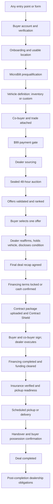

# AutoLenis — Complete End-to-End Car Transaction Flow

**Status:** Definitive implementation specification
**Supersedes:** *AutoLenis Final End-to-End Transaction Specification* and *AutoLenis Final Transaction Operating Manual*
**Scope:** Every buyer-facing entry point through final vehicle possession and transaction closure, plus every adjacent flow that feeds or exits the transaction
**Rule of construction:** Where the written flow defined a required process, it is specified here. Where the platform already contains a stronger process, safeguard, or piece of operational logic, it is preserved here and made part of the flow. Nothing valuable is discarded.

---

## 0. How to use this document

This is the single source of truth for what the AutoLenis transaction is. It is written to be read straight through by a person and implemented section by section by an engineer.

Every stage in Part C follows the same six-line structure so nothing can be skipped:

| Line | Meaning |
|---|---|
| **Entry** | The exact condition that allows this stage to begin |
| **Who does what** | System actions, buyer actions, dealership actions, AutoLenis staff actions |
| **Recorded** | What must be written and to which record |
| **Buyer sees** | What the buyer's dashboard shows while this stage is open |
| **Exit** | The exact condition that closes the stage and opens the next |
| **If it fails** | Owner, buyer-visible status, required action, deadline, return point |

Notation used throughout:

- **[BUILT]** — the capability exists in the platform today and is carried forward as-is.
- **[BUILT — EXTEND]** — the capability exists and needs specific additions named here.
- **[NEW]** — the capability does not exist yet and must be built.
- **[RETIRE]** — the capability exists but must be removed from the transaction path.

Evidence basis: the written transaction flow and operating manual as supplied, plus direct inspection of the live production database (project `aieybibvewmvrubcpthm`) — tables, columns, enumerations, and record volumes. Repository file contents were not readable in this session (private repository), so code-behavior statements carried forward from the earlier audit against commit `12be724` are marked where they matter.

---

## 1. What this transaction is

AutoLenis reproduces the complete car-buying process on the website. A buyer arrives, qualifies, defines a vehicle, pays $99, receives sealed competitive offers from real dealerships, picks one, agrees final numbers, completes financing outside the platform, signs the dealership's contract inside the platform, and takes delivery — with AutoLenis tracking every checkpoint and every responsible party from first click to final possession.

Three sentences govern everything below:

1. **There is one transaction.** Every entry point, every form, and every marketing page funnels into the same fulfillment record, the same payment gate, the same auction, and the same deal.
2. **AutoLenis coordinates; the dealership sells.** AutoLenis never takes title, never lends, never underwrites, never appraises, never taxes, and never titles.
3. **Nothing advances on assumption.** Every stage advances only on recorded evidence, and every stall has a named owner and a way back.

---

## 2. Responsibility boundary

### AutoLenis performs

- Visitor capture, registration, verification, onboarding, and the buyer's transaction file.
- Non-SSN MicroBilt prequalification, OFAC screening, FCRA consent capture, and adverse-action handling.
- Inventory search, shortlisting, and custom Vehicle Requests.
- The $99 platform payment and, where elected, the Premium fee.
- Dealer sourcing across registered and outside rooftops, contact enrichment, and validation.
- Sealed auction administration, invitation delivery, offer validation, and ranking.
- Buyer offer comparison and selection, and winning-dealer reaffirmation.
- Final deal recap agreement between buyer and dealership.
- External-financing coordination, completion verification, and funding clearance tracking.
- Insurance document collection and verification.
- Contract-to-offer comparison through Contract Shield.
- Buyer and co-buyer electronic signature inside AutoLenis.
- Pickup or delivery scheduling, secure release, possession confirmation, and completion.
- All transactional communication, audit history, exception handling, and recovery.
- Anti-circumvention monitoring and identity protection between buyer and dealer.

### The dealership performs

- Vehicle availability, condition disclosure, and the sale itself.
- Trade-in inspection, appraisal, payoff verification, title handling, and acquisition.
- Collection of the down payment and every amount payable to the dealership.
- Lender submission and financing coordination when dealer-arranged.
- Taxes, title, registration, temporary tags, and all governmental filings.
- Preparation and legal sufficiency of the complete contract package.
- Dealer execution of the contract.
- Vehicle preparation, buyer identity verification, release, and delivery.
- Post-sale obligations: title and registration delivery, trade payoff, due-bill work.

### AutoLenis never

- Sells or takes title to a vehicle.
- Collects a Social Security number anywhere in the buy transaction.
- Accepts, submits, or underwrites a lender credit application.
- Approves, funds, or disburses financing.
- Appraises, guarantees, or purchases a trade-in.
- Calculates, collects, or remits vehicle sales tax.
- Issues titles, registrations, or temporary tags.
- Releases a vehicle or substitutes for the dealership's delivery obligations.

**Retirement required.** The platform contains an internal credit-application model that stores encrypted SSN, income, employment, and date of birth, along with lender decision fields (`credit_applications`). It holds no production records. **[RETIRE]** — no route in the buy transaction may read or write it. It is frozen, excluded from all transaction code paths, and scheduled for removal after legal sign-off on retention obligations. Its presence is the single largest contradiction between what AutoLenis says it does and what the platform is capable of doing.

---

## 3. The transaction spine



### One lineage, never broken

```
Buyer
  -> Prequalification
    -> Vehicle Request (the fulfillment record)
      -> $99 Payment
        -> Sourcing Case
          -> Auction
            -> Invitations
              -> Offers
                -> Deal
                  -> Recap / Financing / Fee / Insurance / Contract / Signatures / Funding / Pickup
                    -> Completion
                      -> Post-completion obligations
```

Every record locates its parent by stored reference. Never by name, email, or phone. A payment, auction, offer, deal, contract, or pickup that cannot resolve its parent is an orphan: it raises an Operations exception and is never silently re-parented or duplicated into a parallel transaction.

---

## 4. Canonical objects

The platform already contains the right objects. They are not replaced; they are connected and completed.

### 4.1 The fulfillment record is `vehicle_requests` **[BUILT — EXTEND]**

Both entry methods — selecting an inventory vehicle and submitting a custom request — create or attach to exactly one `vehicle_requests` row. It already carries the buyer, status lifecycle, budget, criteria, assigned admin, cancellation, coverage hold, and full marketing attribution (`utm_source`, `utm_medium`, `utm_campaign`, `source_url`, `referrer`, `landing_source`, `ip_address`, `buyer_opportunity_id`). The auction already references it. It is the natural convergence point and no new fulfillment table is introduced.

Additions required:

| Field | Purpose |
|---|---|
| `entry_type` | `INVENTORY_SELECTION` or `CUSTOM_REQUEST` |
| `inventory_item_id` | Binds the selected vehicle when entry is inventory |
| `deposit_id` | **The $99 attaches to the request, not only to the buyer** |
| `pre_qualification_id` | The approval governing this request |
| `co_buyer_id` | Optional co-buyer |
| `trade_in_submission_id` | The trade attached to this request |
| `city`, `state`, `zip`, `latitude`, `longitude` | Location snapshot used for sourcing |
| `authorized_max_radius_miles` | Buyer-authorized ceiling; server-enforced |
| `down_payment_cents` | Expected down payment |
| `delivery_preference` | `PICKUP` or `DELIVERY` |
| `body_type`, `drivetrain`, `exterior_colors`, `interior_colors`, `max_mileage`, `condition_preference`, `required_features`, `preferred_features`, `purchase_timeframe` | Complete criteria used in invitations, offer validation, and mismatch detection |

Status additions: `DRAFT`, `PAYMENT_REQUIRED`, `RADIUS_AUTHORIZATION_REQUIRED`. Existing values (`SUBMITTED`, `INTAKE`, `ACTIVE_SOURCING`, `OFFER_READY`, `OFFER_SENT`, `OFFER_ACCEPTED`, `OFFER_DECLINED`, `DEAL_CREATED`, `CLOSED_NO_MATCH`, `CANCELLED`, `EXPIRED`) are retained.

### 4.2 The lead record is `buyer_opportunities` **[BUILT]**

Every capture from any surface writes a `buyer_opportunities` row: session, conversation, contact details, ZIP, budget, timeline, trade indication, financing need, consent, lead score and temperature, and source. It already holds intake processing state. It remains the pre-transaction lead object and the parent of the Vehicle Request.

### 4.3 The offer record is `offers` **[BUILT — EXTEND]**

`offers` is the canonical offer: auction-scoped, dealer-scoped, versioned (`version`, `original_offer_id`), scored and ranked three ways, with junk-fee itemization and an APR flag. That structure is strong and is kept.

Additions required so an offer can support selection, Contract Shield, and release:

`vin`, `stock_number`, `vehicle_year`, `vehicle_make`, `vehicle_model`, `vehicle_trim`, `vehicle_condition`, `odometer`, `exterior_color`, `interior_color`, `availability_confirmed`, `doc_fee_cents`, `title_registration_cents`, `add_on_items` (itemized), `incentive_items` (with eligibility conditions), `delivery_terms`, `delivery_fee_cents`, `out_of_state_registration_supported`, `expires_at`, `required_feature_matches`, `required_feature_mismatches`, `condition_report_url`, `vehicle_history_report_url`, `photo_urls`.

`vehicle_offers` (the admin-curated concierge offer surface, 6 records) is **[BUILT — EXTEND]**: it remains as an intake tool for staff-entered offers, but it must write a canonical `offers` row rather than acting as a parallel offer model. Buyer criteria and trade data duplicated onto it are read from the Vehicle Request, not re-keyed.

### 4.4 The invitation record is `auction_invitations` **[BUILT — EXTEND]**

Three invitation surfaces exist: `auction_invitations` (registered dealers, scored, no token), `outside_auction_invites` (outside dealers, tokenized, with embedded offer fields), and `dealer_invitations` (dealer *onboarding* — a different purpose, unchanged).

Consolidate the first two into `auction_invitations`, adding: `rooftop_id`, `dealership_name`, `contact_name`, `email`, `phone`, `token_hash`, `expires_at`, `status`, `queued_at`, `delivered_at`, `bounced_at`, `declined_at`, `is_registered_dealer`. Every invitation — registered or outside — receives a unique, expiring, auction-and-rooftop-bound link. Offer fields embedded on `outside_auction_invites` move to `offers`.

### 4.5 The deal record is `deals` **[BUILT — EXTEND]**

`deals` carries status, financing path, insurance status, fee fields, Contract Shield score and status, and risk tier. It cannot presently identify which vehicle, which VIN, which dealership, which auction, or which request it belongs to.

Additions required:

`vehicle_request_id`, `auction_id`, `deposit_id`, `dealer_id`, `rooftop_id`, `vin`, vehicle snapshot (`year`, `make`, `model`, `trim`, `odometer_at_offer`), `co_buyer_id`, `trade_in_submission_id`, `otd_cents_confirmed`, `down_payment_cents`, `plan_snapshot`, `recap_confirmed_by_buyer_at`, `recap_confirmed_by_dealer_at`, `vehicle_hold_until`, `condition_disclosure_acknowledged_at`, `financing_terms_locked_at`, `financing_completed_at`, `funding_cleared_at`, `dealer_executed_contract_id`, `pickup_ready_at`, `possession_confirmed_at`, `completed_at`.

### 4.6 The exception record is `queue_items` **[NEW]**

The platform defines `QueueItemType` (`OFAC_ALERT`, `CONTRACT_FAIL`, `INSURANCE_EXCEPTION`, `ESIGN_EXCEPTION`, `PICKUP_EXCEPTION`, `PREQUAL_MANUAL`, `SUPPORT_TICKET`, `SYSTEM_ALERT`) and `QueueItemStatus` (`OPEN`, `ASSIGNED`, `RESOLVED`, `ESCALATED`, `CLOSED`) but has no table to hold them. Every exception in Part D §26 writes here with: type, status, transaction reference, owner role, assigned admin, buyer-visible status, required action, deadline, return point, resolution, and timestamps. Without this table the flow has no operational floor.

### 4.7 Supporting records carried forward **[BUILT]**

| Record | Role in the flow |
|---|---|
| `pre_qualifications`, `prequal_consents` | Approval, ceiling, expiry; FCRA consent persisted before the pull |
| `deposits` | The $99 — extended with `vehicle_request_id` |
| `service_fee_payments` | Premium balance with deposit credit already modeled |
| `auctions` | Already references both `vehicle_request_id` and `deposit_id` |
| `auction_extension_logs` | Anti-snipe extension audit |
| `best_price_weight_configs`, `best_price_calculation_logs` | Reproducible ranking |
| `financing` | Deal-level financing checkpoint — extended in §21 |
| `external_pre_approvals`, `external_pre_approval_documents` | External lender evidence — extended in §21 |
| `vehicle_request_financing` | Pre-deal financing preference and pre-approval intake |
| `insurance_policies`, `insurance_quotes`, `insurance_providers` | Insurance evidence and optional quote assistance |
| `trade_in_submissions`, `trade_in_valuations` | Trade packet |
| `contract_versions`, `contract_scans`, `contract_scan_rules`, `junk_fee_patterns` | Contract Shield |
| `e_sign_envelopes`, `e_sign_envelope_history` | Hash-bound signing with consent snapshot, IP, certificate |
| `pickups` | Turn-taking scheduling with counters and reminders |
| `comms_outbox` | Durable transactional dispatch |
| `document_requests`, `documents`, `document_versions` | Deal document requests with due dates |
| `circumvention_attempts` | Anti-circumvention monitoring |
| `identity_firewall_entries` | Buyer identity protection before award |
| `dealer_scorecard_snapshots`, `sla_violations` | Dealer performance consequences |
| `buyer_request_claim_tokens` | Guest capture to account claim |
| `vehicle_request_due_diligence_checkpoints` | Named, ordered, owner-stamped checkpoints |
| `deal_status_history`, `deal_timeline`, `audit_logs`, `admin_audit_logs` | Audit spine |
| `idempotency_keys`, `webhook_events`, `payment_provider_events`, `jobs_dead_letter` | Replay and delivery integrity |

---

# Part B — Every entry point and every form

The written flow began at account creation. In reality the transaction begins much earlier, on a marketing page, a search result, a social post, or an affiliate link. This part makes every one of those surfaces a defined, connected entrance to the same transaction.

## 5. The universal intake rule

Every form on the AutoLenis website, without exception, resolves to exactly one of four lanes.

| Lane | Meaning | Terminal object |
|---|---|---|
| **Lane 1 — Buy** | The visitor wants a vehicle | `vehicle_requests` (via `buyer_opportunities`) |
| **Lane 2 — Refinance** | The visitor wants a better rate on a car they already own | `refinance_applications` → OpenRoad handoff |
| **Lane 3 — Supply** | A dealership or affiliate wants to join | `dealer_applications` / `affiliates` |
| **Lane 4 — Support** | Contact, help, testimonial, unsubscribe | `conversations` / `testimonials` / preference records |

**Rules that apply to every form in every lane:**

1. **One endpoint.** All Lane 1 forms post to a single intake handler. No page implements its own capture logic.
2. **Attribution is mandatory.** `utm_source`, `utm_medium`, `utm_campaign`, `utm_content`, `source_url`, `referrer`, `landing_source`, `affiliate_id`, and `ip_address` are written on every submission. A submission with no attribution is recorded as `direct`, never as null.
3. **Location is captured at first opportunity.** ZIP is requested on every Lane 1 form and written to both the lead and the Vehicle Request. *This closes the live defect in which a buyer with null city, state, and ZIP produced an auction that received zero dealer invitations and closed early.*
4. **Consent is captured and timestamped.** Email consent, SMS consent, and terms acceptance are stored with version and timestamp. No marketing or transactional SMS is sent without a stored consent record.
5. **One open request per buyer.** If a buyer already has an open Vehicle Request, a new Lane 1 submission attaches to it and updates it. It never creates a second open request and never creates a second buyer record. *This closes the live defect in which a duplicate buyer record was created after the intended fix.*
6. **Incomplete is a draft, never a dead end.** Partial submissions persist as `DRAFT` with whatever was captured, and enter the recovery sequence in §6.4.
7. **No spend before payment.** Draft storage, lead scoring, and internal notification are free actions. Paid enrichment, external discovery, contact reveal, and dealer outreach never occur before the $99 settles.

## 6. Lane 1 — the buy lane, surface by surface

Every surface below produces the same result: a `buyer_opportunities` lead and a `vehicle_requests` record, drafted or complete, carrying attribution and location.

### 6.1 Surface map

| Surface | Form | Captures | Produces | Entry type |
|---|---|---|---|---|
| Homepage hero | "Find my car" / start request | Vehicle interest, ZIP, contact | Lead + Vehicle Request draft | `CUSTOM_REQUEST` |
| Inventory search results | Every listing shown with distance; shortlist enabled in radius only | Selected `inventory_item_id`, ZIP, contact | Lead + Vehicle Request | `INVENTORY_SELECTION` |
| Vehicle detail page | "Start my request" | Same, with the specific vehicle | Lead + Vehicle Request | `INVENTORY_SELECTION` |
| Shortlist | Up to five in-radius vehicles as one request | `shortlists` / `shortlist_items` | One Vehicle Request carrying up to five candidates | `INVENTORY_SELECTION` |
| Find one like this | Out-of-radius listing used as a specification template | Year, make, model, trim, mileage and price bands | Pre-filled Vehicle Request | `CUSTOM_REQUEST` |
| AMIPS / programmatic SEO pages | Page CTA | Vehicle context from page, ZIP, contact | Lead + Vehicle Request draft, page attribution | `CUSTOM_REQUEST` |
| Blog and content articles | In-article CTA | Contact, interest | Lead + Vehicle Request draft | `CUSTOM_REQUEST` |
| Social posts and campaigns | Landing form | Platform, campaign, hook, contact | `social_leads` → lead → Vehicle Request | `CUSTOM_REQUEST` |
| Affiliate referral link | Any Lane 1 form | Affiliate attribution on click | Lead + Vehicle Request with `affiliate_id` | Either |
| Conversational intake / concierge chat | Guided questions | Full criteria, budget, trade, timeline | Lead + Vehicle Request | `CUSTOM_REQUEST` |
| Call-back / "talk to a human" | Callback request | Contact, reason | Lead with `call_reason`, staff task | `CUSTOM_REQUEST` |
| Trade-in valuation | Trade form | Trade details | `trade_in_submissions` **attached to a Vehicle Request** | Either |
| Prequalification | Application | Non-SSN application | `pre_qualifications` attached to buyer | n/a |
| Buyer dashboard | New request | Full criteria | Vehicle Request | Either |
| Premium upgrade page | Plan election | Plan | Plan on buyer and Deal snapshot | n/a |

### 6.2 The trade-in form must attach

Trade submissions currently live at buyer level only. **[BUILT — EXTEND]** — `trade_in_submissions` gains `vehicle_request_id` and `deal_id`. A trade submitted standalone from a marketing page creates a lead and a draft Vehicle Request, then attaches. A trade never floats unattached: an unattached trade is invisible to the dealership and produces the single most common real-world deal collapse.

Trade packet fields required beyond what exists: `lienholder_name`, `payoff_good_through_date`, `title_in_hand`, `title_state`, `has_second_key`, `photo_urls`, `bringing_to_pickup`.

### 6.3 Guest capture and account claim **[BUILT]**

A visitor may complete a Lane 1 form without an account. The platform supports this: `buyers.is_guest` and `buyer_request_claim_tokens` (token hash, buyer, vehicle request, expiry, consumption) already exist.

Flow: guest submits → guest buyer and draft Vehicle Request created → claim token issued and emailed → buyer sets a password and verifies → the same buyer and the same Vehicle Request are claimed, never duplicated. Resending the claim link never creates a second buyer or a second request.

### 6.4 Draft recovery sequence

Applies to any incomplete Lane 1 capture.

| Touch | Timing | Content |
|---|---|---|
| 1 | Immediately | What was captured, what remains, resume link |
| 2 | 1 hour | Resume link |
| 3 | 24 hours | Resume link plus a short explanation of what happens after |
| 4 | 72 hours | Final reminder |

Mark the draft abandoned after 14 calendar days. Never delete: the lead, attribution, and audit history are retained for reactivation and for marketing performance measurement.

### 6.5 Attribution and affiliate credit **[BUILT]**

`affiliate_clicks`, `affiliate_referrals`, `affiliates`, `commissions`, and `revenue_attributions` exist. The rule: attribution is captured at click, stamped on the lead, carried onto the Vehicle Request, inherited by the Deal, and settled into a commission at Deal completion — not at payment, and not at offer selection. Commission reverses if the Deal is cancelled or the $99 is refunded or charged back.

## 7. Lane 2 — refinance

Refinance is a real, live surface with production volume and its own compliance posture. It is **not** a purchase transaction and must never be merged into one.

**Flow:** visitor completes the refinance form → `refinance_applications` written with consent, timestamp, IP hash, state, and source → state eligibility evaluated (`EXCLUDED_STATE` where AutoLenis does not operate) → qualified applicants are redirected to OpenRoad Lending with partner attribution → `redirected_at` recorded → `refinance_compliance_logs` written.

**AutoLenis is a lead generator here.** It does not quote a rate, does not take an application, does not underwrite, and does not service a loan. Every buyer-facing screen says so.

**Crossover rule [NEW].** A refinance applicant who indicates interest in buying, or who later submits a Lane 1 form with the same verified email or phone, generates a Lane 1 lead and Vehicle Request. The two records are linked for attribution and support context. Neither status ever drives the other: a redirected refinance application does not advance a purchase, and a completed purchase does not close a refinance lead.

**Reconciliation.** The OpenRoad reconciliation key must be confirmed with the partner and stored on the application so redirected leads can be matched to partner outcomes. Until confirmed, redirected leads are unmatchable and the channel cannot be measured.

## 8. Lane 3 — supply

### 8.1 Dealer application **[BUILT]**

Public dealer signup → `dealer_applications` → review → approval creates `dealers`, `dealer_rooftops`, and a `dealer_agreement_signatures` record. Verified rooftops enter the registered sourcing pool.

An outside dealership that wins an auction enters the same path mid-transaction: rooftop claim, account verification, dealer agreement, and business verification (`dealer_verifications`, `dealer_licenses`) before the Deal advances past reaffirmation.

### 8.2 Affiliate application **[BUILT]**

Public affiliate signup → `affiliates` and `affiliate_profiles` → onboarding review, compliance acknowledgment, tax and payout profile → active affiliate with referral links. Commission settles at Deal completion per §6.5.

### 8.3 Dealer prospecting **[BUILT]**

`dealer_prospects`, `dealer_discoveries`, and `dealer_outreach_log` support proactive recruitment. This is a supply-side pipeline, separate from a buyer's transaction, but it feeds the registered pool that Stage 6 sources from. Outreach channel must match the contact data actually held: phone coverage across prospects is near-complete while email coverage is not, so the outreach log and outreach channel must support SMS and calls, not email alone.

## 9. Lane 4 — support

Contact forms, help requests, testimonials, and preference changes create support records and, where a buyer is identified, a timeline entry on the buyer. They never create or advance a transaction. A support form submitted by a buyer with an open Vehicle Request links to it for context.

---

# Part C — The transaction, stage by stage

## Stage 1 — Account and verification

**Entry.** A Lane 1 capture exists, or a visitor registers directly.

**Who does what.**
System captures legal name, email, phone, password, plan election (Standard at $99, or Premium at $499), terms and privacy acceptance, email and SMS consent, and referral or affiliate attribution. System sends a verification link. Buyer verifies.

**Recorded.** One `buyers` record. `accepted_terms` with version and timestamp. Consent records. Attribution carried from the lead. The verification link creates or confirms exactly one buyer — resending never creates a second.

**Buyer sees.** "Verify your email to continue."

**Exit.** Email verified and one buyer record confirmed. Any draft Vehicle Request is attached to it.

**If it fails.** Owner: system. Reminders at 1 hour, 24 hours, and 72 hours. Abandon the draft after 14 days, preserving history. Return point: the verification link may be reissued at any time.

---

## Stage 2 — Onboarding and usable location

**Entry.** Verified buyer.

**Who does what.**
System collects complete address, city, state, ZIP, communication preferences, and initial vehicle preferences. System geocodes the address and stores latitude and longitude. Buyer corrects anything unusable.

**Recorded.** `buyers` address fields populated and geocoded. The location is mirrored onto the Vehicle Request when the request is created.

**Buyer sees.** Progress toward "ready to request offers," with the exact missing field named.

**Exit.** A usable, geocoded location exists.

**If it fails.** Owner: buyer, with a correction task for Operations if geocoding repeatedly fails. An unusable address blocks every location-dependent stage — sourcing, distance disclosure, and offer distance ranking. The buyer is returned to the specific field with a specific message, not a generic error.

> **Why this is a hard gate.** A live auction received zero dealer invitations and closed after roughly two hours of a forty-eight-hour window because the buyer record carried null city, state, and ZIP. Location is not profile data. It is transaction data, and the transaction cannot be sourced without it.

---

## Stage 3 — MicroBilt prequalification

**Entry.** Verified buyer with usable location.

**Who does what.**
Buyer completes the non-SSN application: legal name, date of birth, address, income, employment, housing status and cost, monthly debt, budget, expected down payment, co-buyer election, and FCRA consent.

System persists FCRA consent **before** the MicroBilt request **[BUILT]**, claims the pull to prevent concurrent duplicates **[BUILT]**, runs the pull, runs OFAC screening, and returns exactly one truthful outcome: `APPROVED`, `DECLINED`, `MANUAL_REVIEW`, `OFAC_REVIEW`, or provider delay.

An approval requires an affirmative OFAC clear. Missing or indeterminate screening cannot produce an approval **[BUILT]**.

**Recorded.** `pre_qualifications` with a server-controlled approved amount, tier, and expiry. `prequal_consents`. Compliance events. An administrative receipt for every submitted application — reference, summary, submission time, current outcome, and an authenticated admin link — excluding SSN, raw bureau data, raw OFAC data, and raw provider responses **[NEW: currently sent only on manual review or provider error]**.

**Buyer sees.** The applicable decision communication: approval with amount and expiration; manual review with honest status; OFAC or compliance review without exposing restricted information; provider delay; correction required; or decline with applicable adverse-action information.

**Exit.** Approved and unexpired. The buyer is taken to qualified results — vehicles within 100 miles matching their approved amount and criteria, found automatically.

**If it fails.** Manual review and OFAC review route to the responsible reviewer with an owner and a deadline. Decline sends the decision and adverse-action notice, and delivery outcome is recorded as sent, duplicate, or failed **[BUILT]**. Provider delay retries and notifies. Approaching expiry warns the buyer; expiry requires renewal before the transaction advances.

**Approval is rechecked** — not merely at the payment gate, but at offer selection and again at contract request. An approval that expires mid-transaction pauses the Deal and asks the buyer to renew rather than silently proceeding on a stale ceiling.

---

## Stage 4 — Vehicle definition, co-buyer, and trade

**Entry.** Current approval.

### 4a. The vehicle

The system presents **qualified results** automatically. The buyer either **deliberately adds up to five of them to a shortlist** or **submits a custom request** where results are thin or absent. The system never saves a vehicle into the shortlist on the buyer's behalf. Both write the same Vehicle Request; only `entry_type` differs. An out-of-radius listing cannot be shortlisted; it offers to seed a custom request instead. See §22a.

Each shortlisted candidate is revalidated for price, availability, VIN, location and listing freshness before the transaction continues, and carries its distance from the buyer. A vehicle that fails revalidation returns the buyer to search with an explanation, and the request remains open.

A custom request records: new or used preference, year range, make, model, trim, body type, drivetrain, exterior and interior color preferences, required features, preferred features, acceptable mileage, acceptable condition, purchase timeframe, approved budget, expected down payment, financing preference, pickup or delivery preference, and buyer notes.

These criteria travel into dealer invitations, offer validation, and buyer comparison. **A vehicle missing a required criterion is flagged as a mismatch, never ranked as equivalent.**

### 4b. The co-buyer **[NEW]**

No co-buyer record exists anywhere in the platform today. It must be built, and it must be simple.

Record: full legal name, email, phone, address, stated role in the purchase, the primary buyer's request to include the person, consent to share the submitted information with the winning dealership, and whether the co-buyer is a required contract signer.

AutoLenis does not collect the co-buyer's SSN, does not pull the co-buyer's credit, does not submit a lender application, and never represents that a co-buyer is approved for financing. The co-buyer's information reaches the winning dealership through the secure Deal handoff at dealer reaffirmation; the dealership and the external lender obtain everything further outside AutoLenis.

If the co-buyer is a required signer, the Deal cannot reach signed status without their signature at the signing stage.

### 4c. The trade **[BUILT — EXTEND]**

Trade information is preserved as one packet attached to the Vehicle Request and carried onto the Deal: year, make, model, trim, VIN, mileage, condition, photos, notes, ownership and lien status, lienholder name, estimated payoff, payoff good-through date, title availability and title state, second key, and whether the buyer will bring the trade to pickup.

AutoLenis does not appraise, guarantee value, verify payoff, transfer title, or take possession. Every buyer-facing trade screen states that the dealership performs the appraisal and that any AutoLenis-displayed estimate is not an offer.

**Exit.** Complete criteria, co-buyer election recorded, trade election recorded.

**If it fails.** The request remains a draft. Drafts do not enroll payment reminders, do not spend on enrichment, do not contact dealerships, and do not create auctions.

---

## Stage 5 — Eligibility recheck and the $99 gate

### 5a. Eligibility recheck

Before payment is offered, confirm: active and verified account; completed onboarding; usable geocoded location; approved and unexpired prequalification; complete vehicle criteria; co-buyer and trade elections recorded; no conflicting open request; and acceptance of the payment and distance disclosures.

Any failure returns the buyer to the exact missing requirement — named, not generic.

### 5b. The payment

**Entry.** Eligibility passes. Vehicle Request enters `PAYMENT_REQUIRED`. *This transition currently does not exist for dashboard Vehicle Requests: creating one neither creates nor reuses a PaymentIntent nor returns a payment step.* **[NEW]**

Create or reuse **one** Stripe PaymentIntent tied to **that Vehicle Request** — not merely to the buyer. `deposits` gains `vehicle_request_id`.

**Disclosed at checkout:**
- The $99 amount and what it activates. This is the Standard plan in full, not a deposit against a larger fee.
- That Premium may be added for a $400 balance at any point until funding clears.
- That dealer sourcing may automatically extend from 100 to 150 and then 250 miles.
- That participating dealerships may be located in another state.
- That expansion beyond 250 miles requires the buyer's explicit authorization.
- That payment does not obligate the buyer to purchase.
- The published refund policy, including that refunds are reviewed manually and are not automatic.

### 5c. Reminder sequence

One six-touch series: immediately, 1 hour, 6 hours, 24 hours, 72 hours, day seven. Every message carries the Vehicle Request reference, the request summary, a secure checkout link, and support contact. Each send rechecks live payment and request status before dispatching.

Cancel all remaining touches on payment, cancellation, closure, refund, dispute hold, suspension, or do-not-contact.

### 5d. Payment integrity **[BUILT — EXTEND]**

Before creating another intent, query Stripe for an existing succeeded or in-flight obligation. **A buyer is never charged twice because local webhook state is stale.** Provider-side duplicate-charge checking already exists and is preserved.

On settlement, atomically: record the payment and Stripe object; attach it to the Vehicle Request; mark the request fulfillment-unlocked; cancel reminders; queue the receipt; **open the sourcing case**.

A reconciliation job recovers succeeded payments whose webhook never arrived. It exists but is disabled by default — **it must be validated, enabled, monitored, and alerted on every recovered gap**. A confirmed payment matching no known obligation raises an immediate Finance exception rather than being absorbed **[BUILT]**.

**Exit.** Payment settled and attached to the Vehicle Request.

**If it fails.** Payment failure preserves the request and permits safe retry. Dispute or refund places fulfillment on hold and stops all unsent outreach. Reconciliation gaps alert Finance with the Stripe reference.

> **Nothing costly happens before this point.** Market enrichment, external discovery, contact enrichment, script drafting, dealer outreach, invitations, and auctions all sit behind this gate. Draft storage, lead scoring, and internal notification are the only free actions permitted before it.

---

## Stage 6 — Dealer sourcing

**Entry.** Settled, undisputed payment attached to the request. Request status `ACTIVE_SOURCING`.

**Important change from current behavior.** A successful deposit today creates and immediately launches an auction, then invites registered dealers. **Settlement must instead open a sourcing case. The auction launches only when the invitation field is ready** (§7).

### 6a. The sourcing ladder — server-enforced

0. Each candidate resolves to its holding rooftop, where mapped and in radius, plus rooftops holding the comparable unit. Sets are unioned across candidates and deduped by rooftop.
1. Registered dealerships within 100 miles.
2. Outside dealerships within 100 miles.
3. Additional dealerships in the 100–150 mile band.
4. Additional dealerships in the 150–250 mile band.
5. Beyond 250 miles **only** after the buyer records an explicit maximum distance.

Each expansion searches only the new band and reuses valid candidates already found. The buyer-authorized maximum is never exceeded. Radius is a server-side policy on the Vehicle Request, never a client-controlled parameter.

### 6b. Dealer validation

A rooftop becomes invitation-ready only when confirmed to have: a real physical rooftop; a known location and calculated distance; make or inventory fit; active operating status; no duplicate or suppression; a deliverable contact; and a relevant sales, Internet Sales, BDC, or management role.

Stored contacts are used first. Paid enrichment runs only after payment and only when stored and public paths fail. Where a rooftop has a contact profile with better addressability than the prospect record, join to it before spending — a material share of the prospect base is reachable at no cost this way.

### 6c. Sourcing outcome

| Invitation-ready rooftops | Action |
|---|---|
| 5–8 | Launch automatically |
| More than 8 | Rank and invite the best eight |
| 3–4 | Limited auction, only with audited Operations approval |
| 1–2 | Continue expansion, source manually, or close after review |
| 0 | Close as no coverage after Operations review |

A limited auction requires a completely searched permitted radius, documented scarcity or urgency, disclosure of the field size to the buyer, and an audited approval.

**Recorded.** Sourcing case with band, candidates, validation outcomes, enrichment spend, and readiness state. `vehicle_request_due_diligence_checkpoints` carries the named, ordered readiness checkpoints with completion owner and timestamp **[BUILT]**.

**Buyer sees.** "Finding dealerships" with band progress and honest expectations.

**Exit.** Invitation-ready field meets the threshold, or Operations approves a limited auction.

**If it fails.** At 250 miles without coverage, the request enters `RADIUS_AUTHORIZATION_REQUIRED`, and the buyer is asked for a maximum additional distance. Remind at 24 and 72 hours. Close as abandoned after 14 days, preserving history. Zero coverage creates an Operations case and a buyer notice; closure and refund are separate decisions.

---

## Stage 7 — Auction launch and invitations

**Entry — launch readiness.** Confirm every item before launch: the $99 is settled and undisputed; the prequalification and approved ceiling are attached; vehicle criteria are complete; the required dealer count or an approved exception exists; every contact is send-safe against suppression and opt-out lists; every rooftop is within the permitted distance; and the auction and per-dealer invitation references exist.

Any failure keeps the auction pending and shows the exact missing prerequisite. The auction never launches half-ready.

**Who does what.**
System launches a **48-hour sealed auction** and issues each rooftop a unique, expiring, auction-and-rooftop-bound invitation link. Registered and outside dealerships receive the same class of secure invitation — registered dealers no longer receive a generic dashboard link.

Each invitation carries: the full vehicle criteria, the required-versus-preferred feature distinction, the buyer's general location and distance, the trade indication, the pickup or delivery preference, the submission deadline, and the offer submission link. **It carries no buyer identity.** See §25.

**Tracked per invitation.** Queued, sent, delivered, opened, bounced, declined, responded, offer submitted.

**Recovery inside the window.** An undeliverable contact or rooftop is replaced early in the auction window where possible. Nonresponders are reminded at 50% and 90% of the window.

**Recorded.** `auctions` linked to the Vehicle Request and the deposit. `auction_invitations` per rooftop with token hash, expiry, and delivery state.

**Buyer sees.** "Your 48-hour auction is live," the number of dealerships invited, the close time, and the offer count as it grows — never competing prices.

**Exit.** Auction closes at deadline, or all invited dealers have responded.

**If it fails.** A bounced invitation creates an Operations contact-replacement exception. A launch that cannot reach readiness holds and surfaces the blocker with an owner.

---

## Stage 8 — Offers

**Entry.** Active auction.

### 8a. What an offer must contain

- VIN and stock number.
- Year, make, model, trim, condition, and odometer.
- Exterior and interior color.
- Current availability confirmation.
- Vehicle price.
- Discounts and incentives, each with its eligibility conditions.
- Documentation fee.
- Dealer-provided taxes.
- Dealer-provided title and registration charges.
- Itemized add-ons, each separately named and priced.
- **Total out-the-door amount.**
- Offered financing terms, when applicable.
- Pickup or delivery terms, and any delivery fee.
- **Whether the dealership can process registration for the buyer's home state.**
- Condition report, vehicle history report, and photographs.
- Offer expiration.
- Required-feature matches and mismatches.
- An explicit confirmation that the dealership can complete this sale for this buyer.

> The out-of-state registration field is not optional. Sourcing reaches 250 miles and crosses state lines by design. A dealership that cannot title and register in the buyer's home state creates a stranded buyer, and that must be visible before selection, not after.

> The condition report, history report, and photographs are required because this is frequently a remote purchase. A buyer selecting a vehicle up to 250 miles away needs disclosed condition before committing, not at the moment of handover.

### 8b. What AutoLenis validates

Component arithmetic against the stated total; compliance with the buyer's approved budget; VIN and vehicle match against the request criteria; internal consistency; one live offer per rooftop per candidate, capped at three offers per rooftop; and all required fields present. Junk-fee patterns and APR flags are evaluated **[BUILT]**.

AutoLenis records dealer-provided taxes and governmental charges. It does not calculate them and does not warrant their legal correctness.

Offer submission rechecks that the buyer's approval is current, unexpired, and sufficient — on submit, on revision, on selection, and at dealer confirmation.

### 8c. Auction operation and close

- Dealers never see competing offers, counts, or rankings.
- Dealers may revise before the deadline; every version is retained.
- Every offer binds to the candidate it answers, or to the criteria set on a custom request.
- A bid inside the final five minutes extends the auction by five minutes, capped at six extensions **[BUILT]**.
- Auction close processing runs exactly once under an atomic claim, and any closed auction with unfinished side effects is reprocessed **[BUILT]**.
- Ranking within a candidate covers cash total, monthly payment, fees, overall value, vehicle match, mileage, distance, and offer expiration. Ranking across candidates uses discount to the listed market price and monthly payment, because out-the-door is not comparable between different vehicles. Ranking inputs and weights are persisted for reproducibility **[BUILT]**.
- **Ties break deterministically** — lowest out-the-door, then best required-feature match, then shortest distance, then earliest submission. Equal-value results are presented honestly as equal, never ordered by incidental query sequence.
- The buyer receives the Best Price Report, presented with the second light Premium mention.

**Exit.** Auction closed with at least one valid offer; request status `OFFER_READY`.

**If it fails.** Zero offers creates a buyer notice **and an owned Operations case**. Operations may source manually, relaunch once without a second $99, or close the request. No refund is automatic. All offers exceeding the approved budget are never presented as qualified; they route to recovery. An auction trending toward zero offers alerts Operations before close, not after.

---

## Stage 9 — Buyer selection

**Entry.** Offers ready.

**Who does what.**
The buyer compares out-the-door amount, vehicle and feature match, VIN and mileage, distance, fees and optional products, offered financing terms, pickup or delivery terms, out-of-state registration capability, condition and history disclosure, and offer expiration.

The buyer **explicitly selects one valid offer**, which resolves the shortlist to a single vehicle. Every non-selected candidate closes and the rooftops that bid on them receive non-award notices. No system, algorithm, or administrator selects on the buyer's behalf.

The selection is serialized under a database lock guaranteeing exactly one winner **[BUILT]**.

### 9a. The Premium invitation

This is the primary Premium conversion moment. The buyer has just chosen their car, and everything Premium does still lies ahead of them.

A full-screen invitation is shown **once**, on the confirmation screen, before the dealer-confirmation view. It frames Premium against this buyer's actual remaining path, shows $499 less the $99 already paid, and introduces the concierge by role. It is declinable in one action, it never blocks the transaction, and **it never delays the reaffirmation request to the dealership**. It is suppressed where the buyer is already Premium, carries a do-not-contact flag, or has a dispute or cancellation in progress.

If the invitation is declined or dismissed, one follow-up email goes out an hour later, and a second and final one at reaffirmation or recap. After that AutoLenis stops asking. The full sequence and its guardrails are §23.2a and §23.2b.

**Recorded.** One `deals` row created at `DEALER_CONFIRMATION`, carrying the full lineage: Vehicle Request, auction, selected offer, deposit, buyer, co-buyer, trade, dealership, rooftop, VIN, vehicle snapshot, out-the-door amount, and the locked plan snapshot.

**Buyer sees.** Selection confirmed; the winning dealership is confirming availability; expected response time.

**Exit.** Deal created at dealer-confirmation pending.

**If it fails.** Offers carry an expiration. Remind the buyer before offers expire. Non-selection triggers revalidation with the dealerships or closure of the request, with the buyer informed either way. A closed request with no selection does not automatically refund.

---

## Stage 10 — Dealer reaffirmation, vehicle hold, and disclosure

This stage does not exist in the platform today — offer selection currently creates a Deal directly at financing-pending with no winning-dealer response captured. It is the most important missing link in the flow, because it is the point where a real dealership confirms it can actually do the deal.

**Entry.** Deal at `DEALER_CONFIRMATION`.

**Who does what.**
Within **24 hours**, the winning dealership confirms:

- The vehicle remains available.
- VIN and current mileage.
- The out-the-door amount.
- Every fee, incentive, and add-on.
- Pickup or delivery terms.
- Out-of-state registration handling for this buyer.
- Ability and willingness to proceed.
- That the trade remains subject to its own inspection and appraisal.
- **A vehicle hold-until date and time.**
- Condition report, history report, and current photographs.

Remind the dealership at 12 hours.

**At this moment and not before, the identity firewall lifts**: the dealership receives the buyer's and co-buyer's contact information, the trade packet, and the secure Deal handoff.

**The buyer acknowledges the condition disclosure** before the transaction proceeds to recap. This is a single explicit acknowledgment, not a stack of screens.

### 10a. Material changes

Buyer approval is required for any of: an out-the-door increase; a different VIN; any new fee or add-on; any change to APR, term, or payment; odometer more than 500 miles above the confirmed offer; delivery more than seven days later than confirmed; or the loss of a required year, trim, condition, drivetrain, or feature.

A **lower** out-the-door amount with everything else unchanged applies automatically in the buyer's favor. A change that pushes the deal above the approved ceiling cannot be accepted at all.

Material changes are presented side by side — confirmed versus proposed — with a single accept or reject action.

### 10b. Outside winning dealership

An outside winner completes rooftop claim, account verification, dealer agreement signature, and required business verification before the Deal advances past this stage **[BUILT — sequence it here]**.

### 10c. Vehicle hold

The hold-until timestamp is stored on the Deal. If the contract has not been requested before the hold expires, the dealership is asked to extend or release. A released hold returns the buyer to the remaining valid offers.

**Recorded.** Reaffirmation with all confirmed values, hold-until, disclosure artifacts, and buyer acknowledgment. Any material change and its buyer decision.

**Buyer sees.** "Dealership confirmed — review your vehicle and condition report," or the specific change awaiting a decision.

**Exit.** Dealership reaffirms, buyer acknowledges disclosure, no unresolved material change.

**If it fails.** Rejection, timeout, failed verification, unavailable inventory, or an unaccepted material change returns the buyer to the remaining valid offers with the reason stated. The failure is recorded on the dealership's scorecard and affects future invitation ranking **[BUILT — connect]**. Repeated failures trigger an SLA violation and review.

---

## Stage 11 — Final deal recap

**Entry.** Dealership reaffirmed.

**Who does what.**
One consolidated recap is presented to both buyer and dealership — the platform equivalent of the worksheet a desk manager and a customer agree on before paperwork:

- Buyer and co-buyer.
- Dealership and rooftop.
- Vehicle, VIN, mileage, and condition.
- Confirmed out-the-door amount, itemized: vehicle price, discounts and incentives, documentation fee, taxes, title and registration, add-ons, delivery fee.
- Each optional product, separately named, priced, and **explicitly accepted or declined**.
- Trade year, make, model, mileage, condition, and VIN.
- Dealer-provided preliminary trade allowance, when available.
- Verified payoff and payoff good-through date, when available.
- **Net trade equity or negative equity, stated plainly**, and whether negative equity is being rolled into the amount financed.
- Down payment amount and method.
- Cash purchase or external financing path.
- Expected amount financed.
- Estimated monthly payment, when financed, shown alongside the out-the-door total so the two reconcile.
- Pickup or delivery terms and location.
- Standard or Premium obligation.

Buyer confirms. Dealership confirms.

### 11a. Optional products rule

Every warranty, service contract, GAP product, maintenance plan, protection package, or other dealer product is separately named, separately priced, and separately accepted or declined by the buyer at this stage. **An optional product may never first appear in the contract.** If one does, Contract Shield holds the contract at Contract Shield.

### 11b. Money and timing rule

**No funds pass from the buyer to the dealership before the contract is executed.** No holding deposits, no "hold it for me" payments, no card on file. Every amount payable to the dealership is collected at or after contract execution, at handover.

**Recorded.** Recap version with both confirmations and timestamps. Any later change produces a revised recap, disclosed and audited — settled figures are never silently rewritten.

**Buyer sees.** The complete recap with a single confirm action, and a plain-language summary of what happens next.

**Exit.** Both parties confirmed.

**If it fails.** A disputed figure returns to the dealership for correction and produces a new recap version. Repeated failure escalates to Operations with the Deal frozen at recap.

---

## Stage 12 — Financing terms locked, or cash confirmed

**All financing happens outside AutoLenis.** Whether the dealership arranges it, the buyer brings it, or AutoLenis assists in finding it, the loan is obtained and completed with an external lender. AutoLenis refers, coordinates, follows up, and verifies — and does nothing else.

AutoLenis does not collect an SSN, does not accept a lender application, does not pull lender credit, does not underwrite, does not issue lender disclosures, and does not disburse funds.

### 12a. Why financing is two checkpoints, not one

A real deal cannot record financing as *completed* before the contract exists, because in dealer-arranged and most bank-arranged financing the signed contract **is** the instrument the lender funds against. Requiring completion before contract preparation would stall every financed transaction permanently.

The flow therefore splits financing into two checkpoints that are both mandatory:

| Checkpoint | When | What it means | Blocks |
|---|---|---|---|
| **Terms locked** | Before the contract package is requested | The path is chosen and the terms are known well enough to write a contract: lender or cash, approved amount, down payment, APR, term, payment, expiry | Contract request |
| **Financing completed** | After signing, before vehicle release | The external lender has approved the final contract and committed to fund, or cash is confirmed received by the dealership | Vehicle release and Deal completion |

**The owner's rule is fully satisfied: a Deal can never be marked complete unless financing status is `COMPLETED` or `NOT_REQUIRED_CASH`, and funding is cleared.**

### 12b. Financing status model **[BUILT — EXTEND]**

The `financing` record on the Deal currently supports only `PENDING`, `SELECTED`, `APPROVED`, `DECLINED`. It must support the full checkpoint:

`NOT_STARTED` → `IN_PROGRESS` → `TERMS_LOCKED` → `COMPLETED` | `FAILED` | `EXPIRED` | `NOT_REQUIRED_CASH`

Path remains `DEALER`, `EXTERNAL`, or `CASH`. Added fields: `down_payment_cents`, `external_reference`, `evidence_document_id`, `terms_locked_at`, `completed_at`, `verified_by`, `verified_at`, `expires_at`, `failure_reason`.

### 12c. Evidence and who may record it

`external_pre_approvals` already models external lender evidence — lender name, approved amount, APR, term, expiry, document, reviewer, and review time. **[BUILT — EXTEND]** it gains `deal_id` and becomes the evidence record attached to the financing checkpoint. `external_pre_approval_documents` holds the artifacts. `vehicle_request_financing` remains the buyer's pre-deal financing preference and pre-approval intake, feeding this checkpoint rather than duplicating it.

**The buyer can never mark financing completed.** Only an authorized Finance or Operations administrator records completion, and only against external dealership or lender evidence. Every recording writes: source, external reference, approved amount, down payment, APR, term, payment, expiration, VIN, verifier identity, and verification time — into the financing audit trail **[BUILT]**.

### 12d. Cash purchases

A cash purchase sets `NOT_REQUIRED_CASH` at this stage and is confirmed as received by the dealership at funding clearance (Stage 15). Cash does not skip a checkpoint; it satisfies it differently.

**Exit.** `TERMS_LOCKED` or `NOT_REQUIRED_CASH`, and the recap reflects the locked terms.

**If it fails.** A failed or expired approval returns the buyer to another external path — a different lender, a different structure, a larger down payment, or cash. **It does not automatically cancel the Deal.** The vehicle hold is re-evaluated and extended or released. Operations owns the follow-up, with the buyer told plainly what is being tried and by when.

---

## Stage 13 — Contract package, Contract Shield, and signatures

**Entry.** Financing terms locked or cash confirmed. Plan level never blocks this stage.

### 14a. Contract request

Send the winning dealership a secure upload request with a **24-hour deadline**. The request is dispatched durably from the central transition into contract-pending — not from an administrator's manual action — with reminder and escalation attached **[BUILT — EXTEND]**. `document_requests` already models a deal-scoped request with a due date and is used here.

The dealership determines and prepares its own complete package, which may include: the buyer's order or purchase agreement; the external financing contract or evidence; odometer disclosure; title and registration forms; trade documents and payoff authorization; optional-product agreements; due-bill or "we owe" commitments; delivery acknowledgments; and any other dealership-, lender-, or jurisdiction-required document.

**AutoLenis does not determine which legal forms a dealership must use.** The dealership identifies the complete package and confirms it is complete.

Insurance is **requested** at this moment so the buyer has time to bind coverage before release.

### 14b. Contract Shield

Contract Shield compares the actual uploaded contract against the winning offer, the dealer reaffirmation, and the confirmed recap — specifically: vehicle and VIN; mileage; price and every out-the-door component; documentation fee; taxes; title and registration; trade allowance and payoff figures; down payment; financing terms; **each accepted optional product**; and pickup or delivery commitments.

Any unexplained increase, any addition, any inconsistent total, a changed VIN, a changed financing term, or a changed trade figure is **held** for correction or documented review. Junk-fee patterns, fee caps, APR validation, payment packing, and disclosure checks are applied from the existing rule set **[BUILT]**.

Extraction failure is retryable and is **never** treated as approval **[BUILT]**. Uploads are private, dealer-owned, and versioned create-before-supersede **[BUILT]**. Approval binds to the exact reviewed version, and an upload arriving during review is rejected rather than silently swapped **[BUILT]**.

`contract_versions` gains `document_hash` so the approved bytes are identifiable.

### 14c. Buyer and co-buyer signing

- The approved document bytes are bound to the signing envelope by hash **[BUILT]**.
- A page view is not a signature.
- Signing requires affirmative electronic-records consent and an adopted name, with the consent policy version and snapshot stored **[BUILT]**.
- Identity, IP address, device information, and timestamps are recorded server-side **[BUILT]**.
- The buyer signs. The co-buyer signs when named as a required signer **[NEW]**.
- A changed document voids the envelope and requires fresh consent and fresh signatures **[BUILT]**.
- The signing period expires after 14 days and may be reissued against the still-approved version.
- Signing correctly fails closed when required evidence storage is unavailable **[BUILT]** — and the schema that enables that storage must be applied and verified in production before the feature is activated.

### 14d. Dealer execution

The dealership executes the contract on its side and returns the **fully executed copy** to AutoLenis.

AutoLenis verifies that the executed copy corresponds to the approved transaction, stores it, records its hash, generates the completion evidence, and grants access to the buyer, the dealership, and authorized administrators.

**The transaction is not contract-executed merely because the buyer signed.** Release remains blocked until the dealership's fully executed copy is stored.

**Recorded.** Contract versions with hashes, scan results and decisions, envelopes with consent and certificate, the executed artifact and its hash.

**Buyer sees.** "Contract under review," then "Ready to sign," then "Signed — waiting on the dealership's countersignature."

**If it fails.** A mismatch requires correction and a rescan, with the specific discrepancies named to both parties. An overdue upload reminds the dealership and escalates to Operations. A buyer or co-buyer who does not sign is reminded, the envelope expires, and it may be reissued. A dealership that does not execute is escalated, and release stays blocked.

---

## Stage 14 — Financing completed and funding cleared

**Entry.** Contract fully executed by both sides.

**Who does what.**
An authorized Finance or Operations administrator records financing completion against external evidence, and separately confirms funding clearance.

**Funding clearance requires all of:**

- Financing approval is current and unexpired.
- Every external lender condition and stipulation is satisfied.
- The down-payment arrangement is complete and its method recorded by the dealership.
- The dealership confirms funding or funding authorization.
- The trade payoff quote is within its good-through date, if a trade with a lien is involved.
- No funding hold, payment dispute, or chargeback exists on the $99 or the Premium fee.

The Premium upgrade window closes at clearance, and an unpaid Premium election reverts to Standard.

**Recorded.** `financing.status = COMPLETED` (or `NOT_REQUIRED_CASH`), `financing_completed_at`, `funding_cleared_at`, verifier identity, and the evidence reference on the Deal.

**Buyer sees.** "Financing complete — preparing your vehicle for delivery," or the specific outstanding condition and who owns it.

**Exit.** Financing completed and funding cleared.

**If it fails.** A financing change that affects the contract sends the transaction **back through recap confirmation, contract generation, Contract Shield, and signatures**. It never proceeds on a stale contract. A stale trade payoff requires a refreshed quote before clearance. Unresolved clearance holds the Deal and creates an Operations exception with an owner and a deadline.

> **No conditional or spot delivery.** A vehicle is never released on the expectation that financing will complete later. This rule exists to protect the buyer from unwinding after delivery, and it is enforced structurally: release requires funding cleared, and funding clearance requires completed financing.

---

## Stage 15 — Insurance

**Entry.** Contract requested (insurance is requested at the same moment, so the buyer has time to bind).

**Who does what.**
The buyer uploads proof of coverage or binds a policy externally. AutoLenis may assist with quotes **[BUILT — optional]**, but does not sell, bind, or broker insurance.

**Status model:** `EXTERNAL_UPLOADED` → `UNDER_REVIEW` → `VERIFIED` or `POLICY_BOUND` | `REJECTED` | `EXPIRED`.

**An upload is not approval.** *Today an upload is treated as satisfied, advances the Deal automatically, and passes the release gate.* **[NEW]** — a review workflow with an Operations queue and a decision trail is required.

Verification confirms the policy is active, names the buyer (and co-buyer where applicable), and matches the VIN. Only `VERIFIED` or `POLICY_BOUND` permits release.

**Recorded.** `insurance_policies` with provider, policy number, effective and expiry dates, proof document, verifier, and verification time.

**Exit.** Verified or policy bound.

**If it fails.** Rejection names the specific defect and requests a corrected document. Expiry before pickup blocks release until corrected. Insurance never blocks contract preparation — it blocks the vehicle leaving the lot.

---

## Stage 16 — Pickup readiness

**Entry.** Contract executed, financing completed, funding cleared, insurance verified.

**The readiness checklist.** Every item must be true, and the website shows the exact unresolved item and the party responsible for it:

- Correct vehicle and VIN confirmed.
- Vehicle remains available.
- Final contract fully executed and stored.
- Financing completed or cash confirmed.
- Funding cleared.
- Down-payment arrangement confirmed.
- Insurance verified or policy bound.
- Trade packet ready for the dealership's inspection, with title and payoff status current.
- No payment dispute, cancellation, or other hold.
- Dealership confirms vehicle preparation is complete.
- Promised equipment, keys, and accessories are present.
- Promised repairs and due-bill items are documented.
- Dealership delivery documents are ready.

*Current pickup coordination evaluates none of these.* **[NEW]**

**Exit.** All items true; Deal moves to scheduling.

**If it fails.** Each unmet item has a named owner, a buyer-visible status, a required action, and a deadline. Nothing is scheduled while any item is unmet.

---

## Stage 17 — Scheduling

**Entry.** Pickup readiness complete.

**Who does what.**
The buyer proposes a time and location within the dealership's availability. The dealership confirms or counters. The buyer accepts or counters. **After two unsuccessful counter rounds, Operations schedules directly.** Turn-taking is strict, each action is conditional on the current turn, and a stale or duplicate action is refused without side effects **[BUILT]**.

After confirmation, generate a **cryptographically secure, expiring, single-use release token**. *The current QR nonce uses a non-cryptographic random source and must be replaced.* **[NEW]** Any schedule change revokes the prior token and issues a new one.

**Reminders at 24 hours and 2 hours** containing: time and location; required government identification for buyer and co-buyer; insurance reminder; down-payment or funding instructions and accepted methods; trade instructions including title, keys, and payoff documents; release-token instructions; and the rescheduling contact. *The existing job chases proposal responses, not appointment reminders.* **[NEW]**

**Exit.** Confirmed appointment with a live token.

**If it fails.** A missed pickup returns to scheduling with a new proposal round and revoked token. Repeated no-shows escalate to Operations and register on the dealership scorecard where the dealership is at fault.

---

## Stage 18 — Handover

**Entry.** Scheduled appointment, live token.

### 19a. At the dealership (pickup)

The dealership:

- Authenticates into AutoLenis.
- Scans the release token and confirms Deal ownership and token validity.
- Verifies the buyer's and any co-buyer's identity against its contract.
- Confirms VIN, mileage, and vehicle condition.
- Completes its own inspection and delivery process.
- Collects amounts payable directly to the dealership and records the method.
- Receives and inspects the trade-in.
- Receives trade keys, title, and payoff documents.
- Confirms the final trade allowance and payoff handling.
- Provides vehicle keys, accessories, and all dealership documents.
- Records any unresolved due-bill commitments.
- Records dealer release evidence.

**The buyer inspects the vehicle before signing the final delivery acknowledgment.** This is an explicit, short window at the appointment, not a formality — it is the buyer's first physical contact with a vehicle they may have selected from 250 miles away.

### 19b. Delivery variant

Where the agreed terms are delivery rather than pickup, the same requirements apply with these differences: the dealership or its transporter delivers to the agreed address; identity verification occurs at the delivery point; the release token is presented and scanned at delivery; odometer at delivery is recorded; and the trade, if any, is surrendered at the same appointment with its keys and title. Delivery does not lower any release condition.

### 19c. Changed trade appraisal

A changed trade appraisal must be disclosed to and accepted by the buyer. **If it changes the contract, the transaction returns to contract revision and execution** — it is not resolved by a handshake at the curb.

**Recorded.** Token consumption, identity verification, VIN and odometer at release, condition, funds collected and method, trade received with keys and title, due-bill items, and dealer release evidence.

**If it fails.** An identity mismatch, unavailable vehicle, unfunded transaction, failed insurance, changed contract, or any unmet release condition **blocks handover** and creates an urgent exception with an owner and an immediate buyer and dealership notification.

---

## Stage 19 — Buyer possession confirmation

**Entry.** Dealer release recorded.

**Who does what.**
From the buyer's authenticated session, the buyer records: vehicle received; VIN match; odometer; condition as delivered; keys and promised accessories received; trade surrendered where applicable; any outstanding due-bill items; and an affirmative possession confirmation.

**Recorded.** Possession evidence on the Deal.

**Buyer sees.** A short confirmation form, available on mobile at the dealership.

**Exit.** Possession affirmatively confirmed with no material discrepancy.

**If it fails.** A material discrepancy blocks completion and creates an Operations case with the dealership notified. A dealer release with no buyer confirmation reminds the buyer — **the Deal never completes automatically on the dealer's word alone.**

---

## Stage 20 — Completion

**Entry.** Dealer release evidence **and** buyer possession confirmation both present.

**Completion requires all of the following to be true.** If any is false, the Deal is not complete and the website shows the exact missing checkpoint and the responsible party:

- One verified buyer and any required co-buyer identified.
- An unbroken reference chain from the Deal to its Vehicle Request, payment, sourcing case, auction, selected offer, buyer, vehicle, and dealership.
- One confirmed vehicle and VIN bound to the Deal.
- The winning dealership reaffirmed the transaction.
- The final recap confirmed by both parties.
- **Financing completed, or cash confirmed.**
- Funding cleared.
- AutoLenis fees resolved.
- Insurance verified or policy bound.
- The exact approved contract version signed by every required signer.
- The dealership's fully executed contract stored.
- The vehicle released by the correct dealership.
- Buyer possession, VIN, mileage, and condition confirmed.
- No blocking hold or unresolved delivery discrepancy.

**Atomically:** mark pickup complete; mark the Deal `COMPLETED`; record completion time; emit the canonical completion event exactly once **[BUILT — seam exists]**; queue buyer and dealership completion communications durably; preserve the executed contract, the AutoLenis receipt, the recap, and the full transaction history.

*Today a token scan advances the Deal first and updates pickup and activity separately, with a best-effort completion email.* **[NEW]** — possession evidence, pickup, Deal completion, and the outbox event commit together, and communications retry durably.

**Completed is terminal.** Corrections are append-only and never rewrite completed history.

---

## Stage 21 — Post-completion dealership obligations

Tracked as child records of the completed Deal, without reopening or altering it:

- Title and registration delivery, with the expected date and the buyer's temporary tag expiry.
- Trade payoff completion, with confirmation the lienholder was paid.
- Due-bill repairs and promised equipment.
- Missing accessories or second keys.
- Dealership correction of transaction documents.

Each obligation is `PENDING`, `OVERDUE`, or `RESOLVED`, with an owner and a due date. Overdue obligations notify the buyer and the dealership, escalate to Operations, and register on the dealership scorecard.

The dealership remains responsible for performance. AutoLenis tracks status and communication for buyer support and dealer-quality history.

---

# Part D — Control planes

## 22. The money model

There are exactly three money movements in an AutoLenis transaction, and only the first two touch AutoLenis.

| Movement | Who collects | When | Amount |
|---|---|---|---|
| Standard plan | AutoLenis via Stripe | The payment gate, before any sourcing | $99, attached to the Vehicle Request — **this is the Standard plan, paid in full** |
| Premium balance | AutoLenis via Stripe | Any time before funding clears — pitched hardest right after offer acceptance | $400 — the balance of a $499 total, never a second $99 |
| Everything else | **The dealership, directly** | At or after contract execution | Down payment, taxes, fees, balance |

AutoLenis never collects a down payment, never holds buyer funds for a vehicle, and never takes a dealer holding deposit. Stripe is the authority on money; local state is never treated as authoritative over the provider **[BUILT]**.

### 22.1 Refunds

Refunds are reviewed manually. There is no automatic refund. `RefundReason` supports `NO_OFFERS`, `BUYER_REQUEST`, `FRAUD`, and `ADMIN_DECISION`. Refund execution is idempotency-keyed and **never labels a no-charge record as money refunded** **[BUILT]**.

A downgrade after the Premium balance settled is a refund request against the $400 only; the $99 Standard plan is not refunded on a downgrade.

**Cancellation and refund are separate decisions.** Cancelling a transaction does not entitle a refund, and issuing a refund does not erase the transaction record.

A refunded or charged-back $99 cannot be used as the Premium credit — Premium then costs $499 gross — and it reverses any affiliate commission attributed to that transaction.


## 22a. Inventory, qualified results and the shortlist

Two facts govern this section. Inventory is **purchased third-party data**, not dealer stock committed to AutoLenis — so a listing is a specification, never a supply promise. And the market is **far larger than any catalogue can hold**: a single metropolitan area returns roughly 200,000 active listings within 100 miles, against a provider pagination cap of 500 rows. No sweep can mirror that. A sweep can only ever hold a fraction of one percent, chosen essentially at random.

So two surfaces do two different jobs.

| Surface | What it is | How it is filled | Who sees it |
|---|---|---|---|
| **Catalogue** | The public shop window — real local cars at real prices, so a visitor sees a working marketplace | A small scheduled sweep, a few hundred vehicles | Anyone browsing |
| **Qualified results** | The approved buyer's actual search | A **live targeted query** using their verified ZIP, approved amount and criteria, returning matches from the whole market | Prequalified buyers only |

### Why a live query, and why it does not breach the spend rule

A blind sweep returns arbitrary cars; a targeted query returns the ones this buyer can actually buy. The no-spend-before-payment rule exists to stop per-buyer fulfilment spend on people who never pay — enrichment, contact reveal, dealer outreach — and all of that stays behind the $99 unchanged. A qualified-results query is a fraction of a cent, spent once, for a buyer who has already completed prequalification. Results are cached against a criteria hash so repeated and similar searches cost nothing.

### The rules

| Rule | How it works |
|---|---|
| **The 100-mile ceiling is AutoLenis policy** | AutoLenis enforces a maximum 100-mile radius for qualified results and shortlist eligibility. The provider must support that policy, but a change of provider, plan or technical limit never moves the AutoLenis radius on its own. **Policy is decided here, not on an invoice.** |
| **Used and budget filtering are not optional** | Roughly half of a metro's listings are effectively new, pulling the median price far above what most approved buyers can carry. Qualified results filter to the buyer's condition preference and around their approved amount, or the buyer is shown cars they cannot buy. |
| **Distance on every listing** | Each result and catalogue card states its distance. A buyer with no stored location is asked for a ZIP before distances and shortlist actions appear. |
| **In radius, the action is Add to shortlist** | A vehicle within 100 miles can join the shortlist, up to five. |
| **Out of radius, the action is Find one like this** | The card states the distance plainly and opens a custom request pre-filled from that vehicle's specification. An out-of-radius listing is never labelled qualified, locally available, confirmed, held or auction-eligible. |
| **Sourcing is limited by neither surface** | The auction searches the rooftop pool, not the catalogue and not the query. That pool carries no provider radius cap, so sourcing still runs the full 100, 150 and 250-mile ladder. |
| **Every listing carries its dealer** | The provider returns the holding rooftop with each listing — name, address, coordinates, type, phone and email. That record is captured on ingest, so a listing resolves to a real rooftop and **the sourcing pool grows with every search** rather than being built separately. |
| **A listing is a specification** | No listing promises the vehicle is available, held, or sellable to AutoLenis. Price and availability are confirmed only by a dealer offer, and again at reaffirmation. |
| **The listed price is the benchmark** | Provider pricing is what cross-vehicle ranking measures a dealer's out-the-door against. |
| **Freshness gates the shortlist, not the display** | Not seen in seven days carries a freshness note. Not seen in thirty days can still be viewed but cannot be shortlisted. |
| **No qualifying results is not a dead end** | Where a query returns nothing or very little, the buyer is offered the custom request, pre-filled from the criteria already gathered. Sourcing does not depend on either surface. |
| **Say what is actually verified** | A listing is third-party sourced and unconfirmed. Buyer-facing copy must not call it verified, confirmed, or held. What is verified is the dealer's offer. |
| **Both paths run to one call budget** | Sweep and query consumption are recorded together against one monthly allowance, with an Operations alert before the ceiling. A provider failure is never shown to a buyer as an empty market — they are told the search is unavailable and offered the request path. |

### Qualified results, then the buyer chooses

The system does the finding. The buyer does the choosing. These are two different surfaces, and conflating them would put a car the buyer never picked into an auction they paid for.

| Who acts | Surface | What happens |
|---|---|---|
| **System finds** | Qualified results | After approval, the system reads the buyer's verified ZIP, approved amount and criteria and queries the provider live, returning matches from the whole market rather than from the browsing catalogue. Required criteria rank ahead of preferred. Each result shows distance, freshness, vehicle detail and listing status. |
| **Buyer chooses** | Shortlist | The buyer deliberately adds up to five vehicles. **The system never saves a vehicle into the shortlist on the buyer's behalf** — an auto-saved vehicle implies an intent the buyer never expressed, and it could carry a car they never chose into a paid auction. |
| **Buyer confirms** | Vehicle Request | Where inventory is thin or absent, the request is pre-filled from the criteria already gathered and the buyer confirms it. Thin results offer the request alongside them, not only when the count is zero. |
| **Buyer pays** | Auction | Dealer sourcing begins only after the $99 settles, and runs the 100, 150 and 250-mile ladder independently of the catalogue. |

Qualified results are a **post-approval** view. Before prequalification a visitor sees the general catalogue only — there is no approved amount to qualify against, so nothing may be presented as qualified.

### How the approved amount is applied

| Rule | Why |
|---|---|
| **Filter generously, never tightly** | Qualified results are filtered around the approved amount with room to spare. A listing near or a little over the ceiling is shown, not withheld. |
| **Because the real number does not exist yet** | A listing price is not an out-the-door. Tax, title, documentation and registration land on top, and the actual figure only exists once a dealership makes an offer. Filtering to the dollar against a number nobody has quoted yet would hide good cars for no reason. |
| **The ceiling is enforced where it matters** | The approved amount is checked server-side at offer validation, at selection and at contract request. That is where a real number meets a real limit. Browsing is not the place to enforce it. |

### The two radius ceilings, and why they differ

| | Ceiling | Bound by |
|---|---|---|
| **Shortlist and qualified results** | 100 miles | AutoLenis policy; the provider must support it |
| **Sourcing** | 100 → 150 → 250 miles, then buyer authorisation | AutoLenis policy, using its own rooftop records |

A buyer shortlists within 100 miles, and the auction can still reach 250. These are separate systems reading separate data, and the difference is deliberate rather than a compromise.

### The candidate model

A shortlisted vehicle is a **candidate**. One Vehicle Request carries up to five, the auction covers all of them, offers bind to the candidate they answer, and selection collapses the shortlist to a single VIN. **Nothing after selection knows the request was ever multi-vehicle.**

| Stage | What multi-candidate changes |
|---|---|
| Sourcing | Each candidate resolves to two rooftop sets: the rooftop holding that listing, where it maps to a real rooftop and sits in radius; and rooftops in radius holding the comparable unit. The sets are unioned across all candidates and deduped by rooftop, recording which candidates each rooftop can serve. |
| Invitations | **One invitation per rooftop**, carrying every candidate that rooftop can serve — never one invitation per vehicle. The field stays at five to eight regardless of shortlist length: one deposit buys one invitation budget. |
| Offers | One live offer per rooftop per candidate, capped at three offers per rooftop so nobody bids everything thinly. Every offer binds to the candidate it answers. |
| Ranking | Within a candidate, rank on out-the-door. Across candidates, out-the-door is meaningless, so rank on discount to the listed market price and on monthly payment. The Best Price Report shows each candidate ranked on its own, plus one cross-vehicle view. |
| Zero-offer handling | Offers on some candidates and none on others is a **successful auction**. Only zero valid offers across every candidate triggers the zero-offer case. |
| Selection | The buyer selects one offer, which resolves both dealer and vehicle. Every non-selected candidate closes and the rooftops that bid on them receive non-award notices. |

## 23. Plans, upgrades and downgrades

### 23.1 The two plans

| Plan | Total | What it is |
|---|---|---|
| **Standard** | **$99** | The platform payment made at the payment gate. It activates sourcing, the auction, offers, Contract Shield, signing and every release checkpoint. Owned by the Operations pool. |
| **Premium** | **$499** | The same $99 plus a **$400 balance**. Adds a named concierge, priority coordination, external-financing handoff assistance, insurance coordination, contract issue coordination and pickup support. |

**Standard is not a free tier.** The $99 is the Standard plan, paid in full. Every buyer pays it, Premium included. The $400 is a balance against a $499 total — never a second $99.

**Plan is elected per Vehicle Request**, not held permanently on the buyer. A new request means a new $99 and a fresh election. The buyer record carries the current default; the Vehicle Request and the Deal carry the binding snapshot.

**Premium entitlements begin at settlement, not at election.** A buyer who chose Premium at registration and has not paid the balance is Standard until it settles, so concierge service is never delivered unpaid.

### 23.2 The upgrade window

| | |
|---|---|
| **Opens** | The moment the $99 settles. |
| **Closes** | **When funding clears.** After that only scheduling and handover remain, and pickup support alone does not justify $400, so the ask stops. |
| **What it costs** | Always the $400 balance, shown as $499 total less the $99 already paid. Never re-quoted, never prorated, never discounted by stage. |
| **What must be true** | The $99 is valid, paid, unrefunded and not charged back. Where it was refunded or charged back there is no credit, and Premium is $499 gross. |
| **On settlement** | Assign the named concierge and introduce them by name the same day. Move ownership from the Operations pool to that concierge on `vehicle_requests.assigned_admin_id`. Append a plan snapshot with its effective time, the acting party and the touchpoint that converted. Notify the buyer and the concierge. |
| **What does not change** | The auction, the offers, the selected offer, the out-the-door amount, the contract, the financing path, every release checkpoint and every completion requirement. An upgrade buys attention, not different transaction terms. |
| **Unpaid at clearance** | The election reverts to Standard, which is already paid, and the transaction continues uninterrupted. |

### 23.2a The upgrade sequence

Premium is the second revenue line, so the ask is deliberate and sequenced rather than left to a link in a menu. Five touchpoints, one of which does most of the work. Then it stops.

| # | When | Channel | What it says |
|---|---|---|---|
| 1 | Payment confirmation | In-app and receipt | A single line on the receipt and the sourcing-started screen. Named, not pushed — the buyer is still waiting to see whether the auction produces anything. |
| 2 | Best Price Report | In-app | Offered alongside the offers, where the value first becomes legible: a concierge who will walk them through these numbers and everything after. |
| 3 | **Immediately after offer acceptance** | **Full-screen invitation** | **The primary conversion moment.** Shown once, on the confirmation screen, before the dealer-confirmation view. |
| 4 | One hour after acceptance | Email | Sent only if the invitation was declined or dismissed. Specific, not generic: what a concierge does across reaffirmation, recap, financing handoff, contract, insurance, funding and pickup — the exact stages this buyer is about to walk. |
| 5 | At dealer reaffirmation or recap | Email | The second and final ask, timed to when the coordination work becomes visible and real. After this, AutoLenis stops asking. The option stays quietly available in the dashboard until funding clears. |

**Why offer acceptance is the conversion moment.** The buyer has just chosen their car. They are committed, and every single thing Premium does — chasing the dealership, holding the recap honest, the financing handoff, contract coordination, insurance, funding, pickup — still lies ahead of them. Nowhere else in the transaction combines that level of commitment with that much remaining work.

**What the invitation must contain.** Premium framed against this buyer's actual remaining path, named stage by stage rather than as a generic feature list. The $499 total with the $99 already paid shown as a credit, leaving $400. The concierge introduced by role. A decline that takes one action and costs the buyer nothing.

### 23.2b How the ask stays honest

| Guardrail | Rule |
|---|---|
| Two emails, then silence | Never a third. The in-app option remains available without further prompting. A buyer who declines twice is not asked again. |
| Never sold on fear | No message implies the deal will go worse on Standard, that Standard offers are weaker, or that any gate is slower. All of that would be untrue. |
| Never sold into a stall AutoLenis caused | Suppress every prompt while the transaction sits in an exception state. Upselling a buyer whose deal is broken is the fastest way to lose them and deserve it. |
| Suppressed on holds | No prompt where there is a do-not-contact flag, a payment dispute, a chargeback, a cancellation in progress, or an existing Premium plan. |
| The invitation never blocks | It is an interstitial the buyer can decline in one action. The dealer reaffirmation request fires regardless of whether the buyer ever looks at it. |
| The one late exception | An administrator may open an upgrade after funding clears with an audited approval, where the buyer genuinely needs the coordination. Never automatic. |

**Measure it.** Track impressions, dismissals and conversions at every touchpoint, and stamp the converting touchpoint onto the plan snapshot. Premium is a revenue line and it is managed like one.

**A Standard buyer is never disadvantaged.** Operations owns every Standard transaction and works every exception with a named owner and a deadline. Premium buys a named person and faster coordination — never a better deal and never a faster gate.

### 23.3 Downgrading from Premium to Standard

**Before the $400 settles** — this is only a change of election. No money has moved. The plan reverts to Standard, which is already paid in full, the concierge assignment is released, ownership returns to the Operations pool, and the transaction continues without a gap. No refund is involved.

**After the $400 settles** — this is a refund request against the $400 and follows the manual refund review in §22.1. There is no automatic refund. Finance decides on the record of Premium service actually delivered: a full $400 refund where no concierge contact or coordination work was logged, otherwise a documented partial or declined decision. Once the concierge has worked the deal, that record weighs against a full refund.

**The $99 is never refunded on a downgrade.** Standard is retained, the buyer keeps every platform capability, and the transaction continues. **A downgrade never cancels the transaction and never releases the vehicle hold.**

The buyer is told exactly which services stop — the named concierge, priority coordination and handoff assistance — and exactly which do not, which is everything that moves the transaction.

**Re-upgrading** is permitted at the $400 balance while the window is open, which is to say before funding clears. A refunded $400 must be paid again in full.

### 23.4 Edge cases

| Situation | Resolution |
|---|---|
| The $99 is charged back after a Premium upgrade settled | The credit basis is broken. Raise a Finance exception. The Premium entitlement holds while under review; Operations never silently downgrades a buyer. |
| A buyer elects Premium at registration but never pays the balance | They are Standard until the balance settles; the election reverts to Standard when funding clears with the balance unpaid. |
| A buyer wants to pay $499 in one transaction | Not offered. The $99 gate always settles first and Premium is always the balance after it. One gate, one credit rule, no special-case checkout. |
| A Standard buyer asks for Premium at financing or contract | The window is still open. Take the upgrade, assign the concierge that day, and pick up the coordination from wherever the transaction stands. |
| A buyer starts a second Vehicle Request | New request, new $99, fresh plan election. Plan is per transaction. |
| The Deal is cancelled after a Premium upgrade | Cancellation and refund remain separate decisions. The $400 follows the same manual review as any refund, on the record of service delivered. |

### 23.5 Recording

Every plan change **appends** a plan snapshot carrying the plan, its effective time and the acting party. Settled financial history is never rewritten. Fee reconciliation always computes from the ledger of settled payments, never from the current plan flag. `service_fee_payments` already models the gross, credit and net amounts.

**Ownership.** Every paid request has a named owner: the assigned concierge for Premium, the Operations pool for Standard.

## 24. Cancellation

**Before contract execution**, cancellation requires: an authorized actor; a required reason; the current stage recorded; unsent sourcing and outreach stopped; auction activity closed; affected dealerships notified; unsigned envelopes voided; pickup cancelled and release tokens revoked; payment treatment determined; the buyer notified; and full history preserved.

*The state seam records cancellation safely today, but a generic cancellation does not centrally stop sourcing, cancel invitations, void envelopes, revoke tokens, and close scheduled work.* **[NEW]** — one cancellation orchestration performs all of it.

**After the dealership contract is fully executed**, AutoLenis cannot unilaterally void it. The Deal moves to `FROZEN_PENDING_RELEASE` while AutoLenis coordinates the buyer's and dealership's documented release or other resolution. This is a coordination state, not a cancellation.

## 25. Identity protection and circumvention

Two safeguards exist in the platform that the written flow never addressed. Both are essential to a marketplace that charges for access to competitive offers.

### 25.1 Identity firewall **[BUILT — sequence it]**

Invited dealerships receive complete vehicle criteria, general location, distance, and trade indication — **and no buyer identity**. Name, email, phone, and exact address are released only at Stage 10, when that dealership has won and reaffirmed. Losing dealerships never receive buyer contact information at all.

### 25.2 Anti-circumvention **[BUILT]**

Messages between buyer and dealership are monitored for `CONTACT_ATTEMPT`, `EXTERNAL_DEAL`, `IDENTITY_MISMATCH`, and `PAYMENT_BYPASS` patterns. A detection creates a record with the matched pattern and routes to Operations for review and resolution.

A confirmed attempt to move the transaction off-platform after a paid auction is a dealer agreement violation: it registers on the dealership scorecard, may suspend the dealership from future invitations, and is grounds for termination. Buyers are protected, not penalized, when the dealership initiates.

## 26. Exception register

Every exception names an owner, a buyer-visible status, a required action, a deadline, and the return point in the same transaction. All are written to `queue_items`.

| Exception | Owner | Required result |
|---|---|---|
| Buyer does not verify account | System | Remind at 1h/24h/72h, then abandon draft |
| Onboarding location unusable | Buyer / Operations | Block location-dependent stages; specific correction task |
| Prequalification manual or OFAC review | Compliance | Hold and route to the responsible reviewer |
| Prequalification provider delay | System | Retry and notify; honest processing notice |
| Prequalification decline | Compliance | Decision and applicable adverse-action communication |
| Approval expires mid-transaction | Buyer / Operations | Pause; require renewal before advancing |
| Payment failure | Buyer | Preserve request; allow safe retry |
| Payment succeeded, webhook missed | Finance | Reconcile from Stripe; alert with reference |
| Payment unroutable to an obligation | Finance | Immediate exception; never absorbed |
| Payment disputed or refunded | Finance | Hold fulfillment; stop unsent outreach |
| No dealer coverage at 250 miles | Buyer / Operations | Request radius authorization; remind 24h/72h; close at 14 days |
| Zero dealer coverage | Operations | Review, then close or expand |
| Invitation bounced | Operations | Replace contact or rooftop inside the window |
| Zero offers across every candidate | Operations | Owned case; one relaunch without a second $99, or closure. Offers on some candidates and none on others is a success, not a failure |
| Shortlisted candidate goes stale or sells mid-auction | Operations | Drop the candidate, tell the buyer, let the auction run on the rest |
| Buyer has no in-radius inventory | System | Lead with the custom request; never present an empty grid |
| Inventory provider call budget near or at its ceiling | Operations | Alert before the ceiling, not after; the catalogue goes stale silently otherwise |
| Sweep returns fewer listings than expected | Operations | Treat as a failed run, not a successful one; investigate before the catalogue decays |
| Buyer has no stored location on the inventory page | System | Ask for a ZIP before distances and shortlist actions; still render the catalogue |
| All offers exceed budget | Operations | Never presented as qualified; route to recovery |
| Buyer does not select | Buyer / Operations | Remind before expiry; revalidate or close |
| Winning dealer rejects or times out | Operations | Return buyer to remaining valid offers; scorecard entry |
| Dealer changes material terms | Buyer | Side-by-side accept or reject; above-ceiling changes refused |
| Vehicle hold expires | Operations | Extend or release; released hold returns to offers |
| Vehicle sold before contract or pickup | Operations | Return to offers or source a replacement |
| Outside winner fails verification | Operations | Block advancement; return to remaining offers |
| Recap disputed | Operations | Correct and reissue a new recap version |
| Financing fails or expires | Operations / Finance | Return buyer to another external path; do not auto-cancel |
| Funding not cleared | Finance | Block release |
| Trade payoff quote stale | Operations | Refresh before clearance |
| Insurance rejected or expired | Buyer | Name the defect; block release until corrected |
| Contract overdue from dealer | Operations | Remind at deadline; escalate |
| Contract mismatch | Operations | Require correction and rescan; name discrepancies to both parties |
| Contract extraction failure | Operations | Retry; never treat as approval |
| Buyer or co-buyer does not sign | Buyer | Remind, expire at 14 days, permit reissue |
| Dealer does not execute | Operations | Escalate; release stays blocked |
| Pickup missed | Buyer / Dealer | Return to scheduling; revoke and reissue token |
| ID mismatch at handover | Operations | Block release; urgent exception |
| Trade appraisal changed at handover | Buyer | Buyer accepts; return to contract revision if the contract changes |
| Buyer reports delivery discrepancy | Operations | Hold completion; open case |
| Dealer released, buyer has not confirmed | Operations | Remind buyer; never complete automatically |
| Circumvention detected | Operations | Review; scorecard, suspension, or termination |
| Premium balance unpaid when funding clears | Buyer | Revert to Standard, which is already paid; continue without interruption |
| Premium balance payment fails | Buyer | Retry and notify; the transaction never stalls and the buyer stays on Standard |
| Upgrade prompt fires during an open exception | Operations | Suppress; never upsell a buyer whose deal is stalled |
| Downgrade requested after the Premium balance settled | Finance | Manual refund review against the record of service delivered; the $99 is never refunded |
| The $99 is charged back after a Premium upgrade | Finance | Finance exception; entitlement holds under review; never a silent downgrade |
| Post-completion obligation overdue | Operations | Notify both parties; escalate; scorecard |

## 27. Communications

All transactional email, SMS, and in-app notices dispatch through the durable outbox with: trigger event, recipient, template and required content, a send-time state recheck, an idempotency key, delivery status, retry policy, cancellation rule, and a terminal-failure Operations alert.

**No page request determines whether a transaction communication survives.**

`comms_outbox` exists with dedup keys, scheduling, claiming, attempts, and error capture — and holds **zero production records**, meaning transactional messages are not currently flowing through it. Routing every transaction communication through this table is a prerequisite for the flow, not an enhancement.

### 27.1 Required communications

| Event | Recipient | Content |
|---|---|---|
| Registration submitted | Buyer | Verification link and expiry |
| Verification completed | Buyer | Welcome and onboarding link |
| Onboarding incomplete | Buyer | The exact unfinished requirement |
| Guest capture | Buyer | Claim link to finish the request |
| Draft abandoned recovery | Buyer | Four-touch resume sequence |
| Application submitted | AutoLenis | Reference, summary, decision, secure admin link |
| Prequalification approved | Buyer | Amount, expiration, next step |
| Prequalification under review | Buyer | Honest status and expected follow-up |
| Provider delay | Buyer | Processing-delay notice |
| Prequalification declined | Buyer | Decision and adverse-action information |
| Approval expiring or expired | Buyer | Warning or renewal requirement |
| Vehicle Request submitted | Buyer | Summary, reference, $99 explanation, checkout link |
| $99 unpaid | Buyer | Six-touch payment sequence |
| Payment processing | Buyer | Do-not-pay-again notice |
| Payment succeeded | Buyer + AutoLenis | Receipt and sourcing-start confirmation |
| Payment failed | Buyer | Truthful failure and retry path |
| Payment reconciliation gap | Finance | Immediate exception with Stripe reference |
| Refund or dispute | Buyer + Finance | Hold status and review instructions |
| Radius authorization needed | Buyer | Coverage shortfall and maximum-distance request |
| Sourcing completed | Buyer | Auction preparation status |
| Auction launched | Buyer | 48-hour timeline and next step |
| Dealer invited | Dealership | Secure invitation, criteria, deadline, submission link |
| Dealer invitation reminder | Dealership | Remaining time and secure link |
| Dealer invitation bounced | Operations | Contact replacement exception |
| Offer received | Buyer | Offer count only — never sealed pricing |
| Auction nearing zero offers | Operations | Zero-offer risk alert |
| Offers ready | Buyer | Best Price Report available, with the second Premium mention |
| Zero offers | Buyer + Operations | Outcome and reviewed recovery path |
| Buyer selects offer | Buyer + winning dealership | Confirmation and reaffirmation request |
| Premium invitation shown | Buyer | Full-screen invitation at acceptance, framed against the remaining path |
| Premium follow-up, first | Buyer | One hour after acceptance, only if declined or dismissed |
| Premium follow-up, final | Buyer | At reaffirmation or recap; no further asks after this |
| Losing offers | Losing dealerships | Non-award notice, no buyer contact |
| Reaffirmation reminder | Winning dealership | 12-hour reminder |
| Dealer confirms | Buyer + AutoLenis | Confirmed vehicle, condition report, summary |
| Dealer rejects or times out | Buyer + Operations | Return-to-offers instructions |
| Material change proposed | Buyer | Side-by-side change with accept or reject |
| Vehicle hold expiring | Buyer + dealership + Operations | Extend or release |
| Outside dealer verification needed | Dealership + Operations | Claim and verification requirements |
| Recap ready | Buyer + dealership | Confirm the final numbers |
| Financing path selected | Buyer + AutoLenis | External handoff and status explanation |
| Financing in progress | Buyer | Progress or missing-evidence reminder |
| Financing terms locked | Buyer + dealership | Terms confirmed; contract next |
| Financing completed | Buyer + dealership + AutoLenis | Verified checkpoint confirmation |
| Financing failed or expired | Buyer + AutoLenis | Alternative-path instruction |
| Funding cleared or blocked | Dealership, buyer, Operations | Release result or missing requirement |
| Standard plan confirmed | Buyer | Standard is active and paid in full; nothing further is due |
| Premium balance required | Buyer | $400 balance, what it adds, and a secure link |
| Premium balance succeeded | Buyer + concierge + Finance | Receipt, concierge introduction, and what changes |
| Premium balance failed | Buyer + Finance | Retry instruction and the automatic reversion date |
| Premium election reverted to Standard | Buyer | Reversion notice at funding clearance, and what is unchanged |
| Downgrade requested | Buyer + Finance | Which services stop, which do not, and refund review status |
| Downgrade refund decision | Buyer + Finance | Decision, amount, reason, expected provider timing |
| Insurance required | Buyer | Requirements and secure submission link |
| Insurance uploaded | Buyer + Operations | Receipt and review task |
| Insurance verified | Buyer + dealership | Clearance confirmation |
| Insurance rejected or expired | Buyer | Specific correction required |
| Contract requested | Winning dealership | Secure upload link and 24-hour deadline |
| Contract overdue | Dealership + Operations | Reminder and escalation |
| Contract revision required | Buyer + dealership | Specific mismatches and required correction |
| Contract approved | Buyer + dealership | Signing readiness |
| Signature required | Buyer + co-buyer | Secure signing link and deadline |
| Signature reminder or expiration | Required signer | Remaining time or reissue instruction |
| Buyer signatures completed | Dealership | Dealer execution request |
| Fully executed contract stored | Buyer + dealership | Executed-document access notice |
| Pickup readiness blocked | Responsible party | The exact missing prerequisite |
| Pickup proposal or counter | Buyer or dealership | Required response and deadline |
| Pickup confirmed | Buyer + dealership | Time, location, preparation checklist |
| Pickup approaching | Buyer + dealership | 24-hour and 2-hour reminders with full instructions |
| Pickup rescheduled | Buyer + dealership | New schedule and revoked-token notice |
| Handover blocked | Buyer, dealership, Operations | Specific block and urgent recovery path |
| Dealer releases vehicle | Buyer | Possession-confirmation request |
| Buyer confirms possession | Buyer + dealership | Completion confirmation |
| Deal completed | Buyer, dealership, AutoLenis | Executed contract, receipt, support information |
| Title, payoff, or due-bill follow-up | Buyer + dealership | Outstanding-obligation status |
| Cancellation | Buyer + affected dealership | Reason, effective stage, consequences |
| Refund decision | Buyer + Finance | Decision, amount, reason, expected provider timing |

## 28. State model

### 28.1 Primary Deal states

The platform's current `DealStatus` is kept as the base and completed with the checkpoints the flow requires. Detailed outcomes live on supporting records rather than multiplying primary states.

```text
DEALER_CONFIRMATION      [NEW]  winner selected, awaiting dealership reaffirmation
RECAP_PENDING            [NEW]  reaffirmed, final numbers awaiting both confirmations
FINANCING_PENDING        [BUILT] terms being locked, or cash being confirmed
FEE_PENDING              [BUILT] Standard $0 auto-resolves; Premium balance due
CONTRACT_PENDING         [BUILT] dealer upload requested
CONTRACT_REVIEW          [BUILT] Contract Shield running or held
CONTRACT_APPROVED        [BUILT] bound to an exact reviewed version
SIGNING_PENDING          [BUILT] buyer and co-buyer signatures
SIGNED                   [BUILT] all required buyer-side signatures complete
DEALER_EXECUTED          [NEW]  fully executed copy stored
FUNDING_PENDING          [NEW]  financing completion and funding clearance
INSURANCE_PENDING        [BUILT] verification outstanding
PICKUP_READINESS         [NEW]  checklist evaluation
PICKUP_SCHEDULED         [BUILT] appointment confirmed, token live
HANDOVER_PENDING         [NEW]  released by dealer, awaiting buyer confirmation
COMPLETED                [BUILT] terminal
CANCELLED                [BUILT] terminal
FROZEN_PENDING_RELEASE   [NEW]  executed contract, coordinated unwind
```

`PENDING`, `ACTIVE`, `FEE_PAID`, `PICKUP_COMPLETE`, and `REFUNDED` are retained for historical records and mapped forward: `FEE_PAID` and `PICKUP_COMPLETE` become supporting-record facts rather than primary states, and `REFUNDED` becomes a payment fact on a `CANCELLED` or `COMPLETED` Deal.

### 28.2 Supporting record states

- **Payment:** pending, processing, paid, failed, disputed, refunded, reconciliation pending
- **Sourcing:** band 100, 150, 250, authorization required, limited-auction review, no coverage
- **Auction:** pending, active, closed, zero-offer review
- **Offer:** draft, submitted, revised, expired, selected, declined, revalidation pending
- **Dealer confirmation:** pending, confirmed, rejected, timed out, material change pending
- **Financing:** not started, in progress, terms locked, completed, failed, expired, not required — cash
- **Funding:** pending, cleared, blocked
- **Fee:** standard resolved, Premium pending, paid, failed, refunded
- **Insurance:** uploaded, under review, verified, policy bound, rejected, expired
- **Contract:** uploaded, scanning, review, warning, revision required, approved, signing, executed
- **Pickup:** not scheduled, proposed, dealer countered, scheduled, checked in, dealer released, buyer confirmed, missed, rescheduling, exception
- **Communications:** queued, sent, delivered, suppressed, failed
- **Post-completion obligation:** pending, overdue, resolved

### 28.3 Universal transition controls

Every material transition requires all eight:

1. **Authorization** — the actor holds the permission.
2. **Validation** — required transaction facts are current, not cached.
3. **Conditional write** — the update applies only to the state the actor observed.
4. **Atomicity** — state and critical domain or financial records commit together.
5. **Idempotency** — replay cannot duplicate money, auctions, offers, deals, signatures, completion events, or communications.
6. **Audit** — actor, prior state, next state, reason, and time recorded.
7. **Communication** — required notices scheduled durably.
8. **Recovery** — every failure and timeout has an owner and a return path.

The platform already implements a legal-transition table with compare-and-swap, history, activity, idempotent communications, and an exactly-once completion seam **[BUILT]**. Every new checkpoint routes through that same seam rather than around it.

## 29. Safeguards that must not be weakened

These exist today and are load-bearing. Any implementation that replaces them with something simpler is a regression:

- FCRA consent persisted before the MicroBilt pull; duplicate paid pulls claimed safely.
- Prequalification requires no SSN; OFAC fails closed on positive or indeterminate screening.
- Adverse-action delivery distinguishes sent, duplicate, and failed outcomes.
- Stripe treated as the authority on money; provider-side duplicate-charge checks on both the deposit and the Premium fee.
- Deposit transitions guarded by a state matrix; unroutable successful payments raise an Operations exception.
- Auction close uses an atomic claim and reprocesses any closed auction with unfinished side effects.
- Anti-snipe extension with a hard cap and full audit.
- Offer selection serializes the single-winner decision under a database lock.
- Offer arithmetic and the approved budget checked server-side.
- Best Price rankings persisted with weights and results for reproducibility.
- Deal transitions use a legal-transition table, compare-and-swap, history, and an exactly-once completion event.
- Contract uploads private, dealer-owned, versioned create-before-supersede, failing closed on extraction or scan failure.
- Contract Shield approval binds to the exact reviewed version and rejects upload-during-review races.
- E-sign binds the envelope to document bytes by hash and refuses to sign when evidence storage is unavailable.
- Pickup negotiation uses strict turn-taking, proposal-time compare-and-swap, a two-counter cap, and compensating recovery.
- Pickup emails dispatch durably with round-specific idempotency keys.
- Refund execution is idempotency-keyed and never labels a no-charge record as refunded.
- Identity firewall between buyer and non-winning dealerships.
- Anti-circumvention monitoring with pattern capture and Operations routing.
- Junk-fee patterns, fee caps, APR validation, payment packing, and disclosure checks in Contract Shield.

## 30. Who is responsible for what

| Stage | Buyer | Dealership | AutoLenis staff | System |
|---|---|---|---|---|
| 1–2 Account, onboarding | Register, verify, provide address | — | Correct geocoding failures | Verify, geocode, dedupe |
| 3 Prequalification | Apply, consent | — | Manual and OFAC review, adverse action | Pull, screen, decide, notify |
| 4 Vehicle, co-buyer, trade | Define, elect | — | — | Validate criteria, revalidate inventory |
| 5 Payment | Pay the $99 Standard plan, or add Premium | — | Reconciliation exceptions | Charge once, unlock, open the upgrade window |
| 6 Sourcing | Authorize radius if asked | — | Approve limited auctions, manual sourcing | Search bands, validate, enrich |
| 7 Auction | Wait | Receive invitation | Replace bounced contacts | Launch, invite, remind, close |
| 8 Offers | — | Submit and revise offers | Review flagged offers | Validate, rank, seal |
| 9 Selection | Select one offer, accept or decline Premium | — | Assign the concierge on upgrade | Serialize single winner, create Deal, show the invitation once |
| 10 Reaffirmation | Acknowledge condition | Reaffirm, hold, disclose | Chase timeouts, verify outside winners | Release identity, track hold |
| 11 Recap | Confirm numbers | Confirm numbers | Resolve disputes | Version and audit the recap |
| 12 Financing terms | Pursue financing | Arrange if dealer path | **Verify and record** | Track status and expiry |
| 13 Contract | Sign | Prepare, upload, execute | Review holds, escalate overdue | Shield, bind, sign, store |
| 14 Funding | — | Confirm funding, collect down payment | **Record completion and clearance** | Block release until cleared |
| 15 Insurance | Provide proof | — | **Verify** | Track status and expiry |
| 16–17 Readiness, scheduling | Propose time | Confirm or counter, prepare vehicle | Schedule after two counters | Evaluate checklist, issue token |
| 18 Handover | Inspect, present ID, pay dealer, surrender trade | Verify, release, receive trade | Resolve blocks | Validate token once |
| 19–20 Possession, completion | Confirm possession | Record release | Resolve discrepancies | Commit completion atomically |
| 21 Post-completion | Report issues | Deliver title, pay off trade, honor due-bill | Escalate overdue | Track and notify |

---

## 31. Current state of the platform, in one paragraph

The platform contains most of the hard parts and almost none of the connections. Prequalification, payment integrity, auction close, offer ranking, Contract Shield, e-sign binding, pickup negotiation, refunds, circumvention monitoring, and the durable outbox are all built to a high standard. What is missing is the spine that joins them: there is no single fulfillment record, the $99 attaches to a buyer rather than a request, a dashboard Vehicle Request never reaches a payment step, settlement launches an auction instead of opening a sourcing case, there is no dealer reaffirmation, no co-buyer anywhere, no VIN on a Deal, no funding clearance, no pickup readiness, and no possession confirmation. Production tells the same story plainly: seven paid deposits and seven auctions, and **zero offers, zero deals, zero contracts, zero signatures, zero pickups, and zero outbox messages ever created**. The transaction has never run past the auction. This is connection work on strong components, not a rewrite.

## 32. Data model changes

| Object | Change | Priority |
|---|---|---|
| `vehicle_requests` | Add `entry_type`, `inventory_item_id`, `deposit_id`, `pre_qualification_id`, `co_buyer_id`, `trade_in_submission_id`, location + geocode, `authorized_max_radius_miles`, `down_payment_cents`, `delivery_preference`, and the full criteria fields (§4.1) | P0 |
| `VehicleRequestStatus` | Add `DRAFT`, `PAYMENT_REQUIRED`, `RADIUS_AUTHORIZATION_REQUIRED` | P0 |
| `deposits` | Add `vehicle_request_id` | P0 |
| `co_buyers` | **New table** — identity, contact, address, role, consent, required-signer flag | P0 |
| `deals` | Add lineage (`vehicle_request_id`, `auction_id`, `deposit_id`, `dealer_id`, `rooftop_id`), `vin` and vehicle snapshot, `co_buyer_id`, `trade_in_submission_id`, `otd_cents_confirmed`, `down_payment_cents`, `plan_snapshot`, recap confirmations, `vehicle_hold_until`, `condition_disclosure_acknowledged_at`, financing and funding timestamps, `dealer_executed_contract_id`, `pickup_ready_at`, `possession_confirmed_at`, `completed_at` | P0 |
| `DealStatus` | Add `DEALER_CONFIRMATION`, `RECAP_PENDING`, `DEALER_EXECUTED`, `FUNDING_PENDING`, `PICKUP_READINESS`, `HANDOVER_PENDING`, `FROZEN_PENDING_RELEASE` | P0 |
| `offers` | Add VIN, stock number, vehicle detail, availability, itemized fees/add-ons/incentives, delivery terms, out-of-state registration capability, expiration, feature match/mismatch, condition and history report URLs, photos | P0 |
| `auction_invitations` | Add rooftop, contact fields, `token_hash`, `expires_at`, `status`, delivery timestamps, `is_registered_dealer`; fold in `outside_auction_invites` | P0 |
| `dealer_reaffirmations` | **New table** — confirmed values, hold-until, disclosure artifacts, material changes, buyer decisions | P0 |
| `deal_recaps` | **New table** — versioned recap with both confirmations | P0 |
| `FinancingStatus` | Add `NOT_STARTED`, `IN_PROGRESS`, `TERMS_LOCKED`, `COMPLETED`, `FAILED`, `EXPIRED`, `NOT_REQUIRED_CASH` | P0 |
| `financing` | Add `down_payment_cents`, `external_reference`, `evidence_document_id`, `terms_locked_at`, `completed_at`, `verified_by`, `verified_at`, `expires_at`, `failure_reason` | P0 |
| `external_pre_approvals` | Add `deal_id` | P0 |
| `credit_applications` | **Freeze — no reads or writes from any transaction route.** Remove after retention sign-off | P0 |
| `InsuranceStatus` | Add `UNDER_REVIEW`; enforce that `EXTERNAL_UPLOADED` does not advance or release | P0 |
| `queue_items` | **New table** for the existing `QueueItemType` / `QueueItemStatus` enums | P0 |
| `pickups` | Add `readiness_confirmed_at`, `token_hash`, `token_consumed_at`, `token_revoked_at`, `dealer_released_at`, `released_by`, `odometer_at_release`, `condition_at_release`, `buyer_confirmed_at`, `funds_collected_method`, `due_bill_items` | P0 |
| `trade_in_submissions` | Add `vehicle_request_id`, `deal_id`, `lienholder_name`, `payoff_good_through_date`, `title_in_hand`, `title_state`, `has_second_key`, `photo_urls`, `bringing_to_pickup` | P0 |
| `contract_versions` | Add `document_hash`, `is_dealer_executed`, `executed_at` | P0 |
| `plan_snapshots` | **New table** — append-only plan, effective time, actor, and the settled amounts at that moment | P1 |
| `post_completion_obligations` | **New table** — type, status, owner, due date, resolution | P1 |
| `auction_vehicles` | Carry up to five candidates per request with distance; offers bind to a candidate | P0 |
| `shortlist_items` | Enforce the five-candidate cap and the in-radius rule at write time | P0 |
| `inventory_items` | Use `last_seen_at` to gate shortlist eligibility at seven and thirty days | P1 |
| `vehicle_offers` | Keep as staff intake; require it to write a canonical `offers` row | P1 |


## 33. Build order

This sequence exists so that each step is testable when it lands, and so that nothing is built on a foundation that has not yet been connected.

| # | Work | Why here |
|---|---|---|
| 1 | Extend `vehicle_requests` into the fulfillment record; attach `deposits` to it | Everything downstream needs one parent |
| 2 | Route every Lane 1 form through one intake handler with attribution, ZIP, consent, and the one-open-request rule | Fixes duplicate buyers and null-location auctions at the source |
| 3 | Connect both entry paths to the same eligibility recheck and `PAYMENT_REQUIRED` transition | The dashboard Vehicle Request currently never reaches payment |
| 4 | Start and cancel the six-touch payment sequence from fulfillment state | Reminders must follow the request, not the buyer |
| 5 | Move every paid sourcing activity behind confirmed payment | Stops pre-payment spend |
| 6 | Change settlement to open a sourcing case rather than launch an auction | The single most important reordering |
| 7 | Enforce the 100/150/250 plus buyer-authorization radius policy server-side | Removes client control of a cost driver |
| 8 | Merge registered and outside candidates into one deduplicated invitation field with secure tokens | Equal treatment, real delivery tracking |
| 9 | Add invitation-readiness and the limited-auction decision before launch | No half-ready auctions |
| 10 | Expand the canonical `offers` record and validation | Selection, Shield, and release all depend on these fields |
| 11 | Enable and monitor Stripe payment reconciliation | Currently disabled by default |
| 12 | Add dealer reaffirmation, vehicle hold, condition disclosure, material-change handling, outside-winner verification | The missing link between selection and a real deal |
| 13 | Add the deal recap with both confirmations and optional-product acceptance | Nothing may first appear in the contract |
| 14 | Replace internal financing with external terms-locked and completion checkpoints; freeze `credit_applications` | Satisfies the external-financing rule |
| 15 | Build the upgrade sequence — the post-acceptance invitation, two emails, suppression rules and per-touchpoint conversion tracking — and close the window at funding clearance | Standard stops being described as free, plan changes stop being undefined, and the second revenue line gets built deliberately |
| 16 | Build insurance review with an Operations queue and correct every release gate | Upload is not approval |
| 17 | Dispatch the contract request from the central transition with deadline, reminder, and escalation | Removes dependence on an admin clicking |
| 18 | Add co-buyer records and co-buyer signing; add contract hash and dealer-executed artifact | Completes the signature chain |
| 19 | Apply and verify the e-sign evidence schema in production, then activate | Signing fails closed until this is done |
| 20 | Add funding clearance as a distinct checkpoint | The no-spot-delivery guarantee |
| 21 | Add pickup readiness, cryptographic single-use tokens, 24-hour and 2-hour reminders, buyer possession confirmation | Release becomes conditional and evidenced |
| 22 | Make completion atomic — possession, pickup, Deal, and outbox event commit together | Removes best-effort completion |
| 23 | Create `queue_items` and route every exception in §26 to it | The operational floor |
| 24 | Route every transaction communication through `comms_outbox` | It exists and is unused |
| 25 | Orchestrate cancellation cleanup in one place | Stops orphaned outreach, envelopes, and tokens |
| 26 | Link post-completion obligations to the terminal Deal | Title, payoff, and due-bill tracking |
| 27 | Connect dealer scorecard consequences to reaffirmation failures, no-shows, contract delays, and overdue obligations | Makes dealer quality self-correcting |
| 28 | Radius-filter the shortlist action, add the specification path for out-of-radius listings, and carry up to five candidates on the request | Stops a buyer shortlisting a car the auction can never source, without hiding any inventory |
| 29 | Resolve candidates to holding and comparable rooftops, dedupe to one invitation per rooftop, keep the field at five to eight | One deposit buys one invitation budget however long the shortlist is |
| 30 | Target the browsing sweep at the served markets, size it to a shop window rather than an index, and set the run rate to match | The market is three orders of magnitude larger than any sweep can hold |
| 31 | Add the live qualified-results query on ZIP, approved amount and criteria, cached on a criteria hash, and capture the holding rooftop from every listing | The buyer searches the whole market, and the sourcing pool grows with every search |

## 34. Acceptance tests

The implementation is reconciled only when all four scenarios complete through the same spine, and every exception in §26 has been exercised.

| Scenario | Entry | Plan | Financing | Required proof |
|---|---|---|---|---|
| **A** | Selected inventory | Standard | External lender | $99 settles against the request; sourcing opens; $0 fee resolves; financing completed and verified before release; possession confirmed; completion commits once |
| **B** | Selected inventory | Premium | Dealer-arranged | Valid $99 credit; $400 settles; concierge assigned at settlement; every release checkpoint passes; co-buyer signs |
| **C** | Custom Vehicle Request | Standard | Cash | Request reaches payment immediately; no pre-payment sourcing spend; `NOT_REQUIRED_CASH` set and cash confirmed at funding clearance; same auction, deal, and pickup path as A |
| **D** | Custom Vehicle Request | Premium | External, with a trade carrying a lien | Same lineage as C; payoff good-through date enforced; trade surrendered at handover; obligations tracked after completion |

For every scenario, also exercise: replay and concurrency on every money and completion path; a missing Stripe webhook recovered by reconciliation; each sourcing band; buyer authorization beyond 250 miles; a limited auction with an Operations approval; zero offers; an offer above budget; a dealer timeout at reaffirmation; a material change accepted and rejected; a vehicle hold expiry; a financing failure followed by a successful alternate path; an insurance rejection; a Contract Shield mismatch; a signature expiry and reissue; a dealer that never executes; a blocked handover on identity mismatch; a delivery-discrepancy hold; a cancellation before and after contract execution; a refund request; a Standard-to-Premium upgrade taken at payment and again at the Best Price Report; an upgrade taken from the post-acceptance invitation, from each email, and from the dashboard; a suppressed prompt during an open exception; a Premium-to-Standard downgrade both before and after the $400 settles; an unpaid Premium balance reverting to Standard at acceptance; and concurrent completion attempts.

**Additionally, every form on the website must be walked** — homepage, inventory, vehicle detail, shortlist, AMIPS pages, blog CTAs, social landing pages, affiliate links, conversational intake, callback, trade-in, prequalification, refinance, dealer application, affiliate application, and support — and each must be proven to land in its correct lane with attribution, ZIP, and consent recorded, without creating a duplicate buyer or a second open request.

**The test passes only when the buyer portal, the dealership portal, and the Operations queue all display the same current checkpoint, the same responsible party, the same deadline, and the same recovery action, against one unbroken transaction lineage.**

---

## 35. Governing statement

AutoLenis runs one connected transaction from a visitor's first form submission through confirmed possession of a vehicle, inside the existing website.

Every marketing surface feeds it. Every form lands in a defined lane. Every stage has an owner, an exit condition, and a way back. Co-buyer and trade information travel with the transaction and reach the winning dealership securely. Financing happens entirely outside AutoLenis and must be verified as completed by authorized staff before a deal can be marked complete. The dealership sells the car, and AutoLenis proves every checkpoint was met.

This document authorizes no parallel website, no replacement architecture, and no unrelated code changes.

---

# Appendix — Verified implementation findings

**Verified 2 September 2026** against the production database (project `aieybibvewmvrubcpthm`) and the inventory provider's published plan limits, at repository commit `12be724`.

**These are operational evidence, not business rules.** They record the conditions that justified specific remediation, and they will stop being true once that work lands. Nothing in this appendix governs the transaction.

| Finding | What was observed |
|---|---|
| Market size | A single metropolitan area returned roughly 200,000 active listings within 100 miles, and about 24,000 in a typical used, mid-budget, moderate-mileage slice. The provider plan caps pagination at 500 rows, so no sweep can mirror the market. |
| Dealer data arrives free | Every listing returns its holding rooftop with name, address, coordinates, type, phone and email — data the platform was not capturing, while all 148 rows had a null dealer reference. |
| Catalogue geography | 148 active listings: New York 137, Texas 1, blank 10. Zero carried a dealer record. Sweep geography was an inline literal defaulting to a New York ZIP, so every run pulled the wrong market. |
| Provider quota exceeded | Two crons ran 28 sweeps a day, one API call each, against a 500-call monthly allowance — roughly 170% of the cap. |
| A week of silent failure | 191 consecutive runs between 24 and 31 August returned HTTP 429 and were recorded as a non-alerting deferred status. Ingestion stopped for seven days and nothing raised an alarm. |
| Stale rows structurally protected | 95 active listings had not been seen in over 30 days. The sweep predicate excluded them by lane label alone, matching zero rows every run. One row with a null last-seen timestamp was unreachable by any predicate. |
| Run size is a range | Completed runs returned between 20 and 44 vehicles, averaging 24 — so any fixed expected-count threshold would misfire. |
| A second unmetered consumer | An admin search tool called the provider on the same key outside any accounting, so recorded consumption was never the true total. |

The permanent rules these findings justify are stated in §22a: sweep the served markets, monitor provider usage, alert before the quota ceiling, detect abnormally small runs, and never show a provider failure to a buyer as an empty market.
